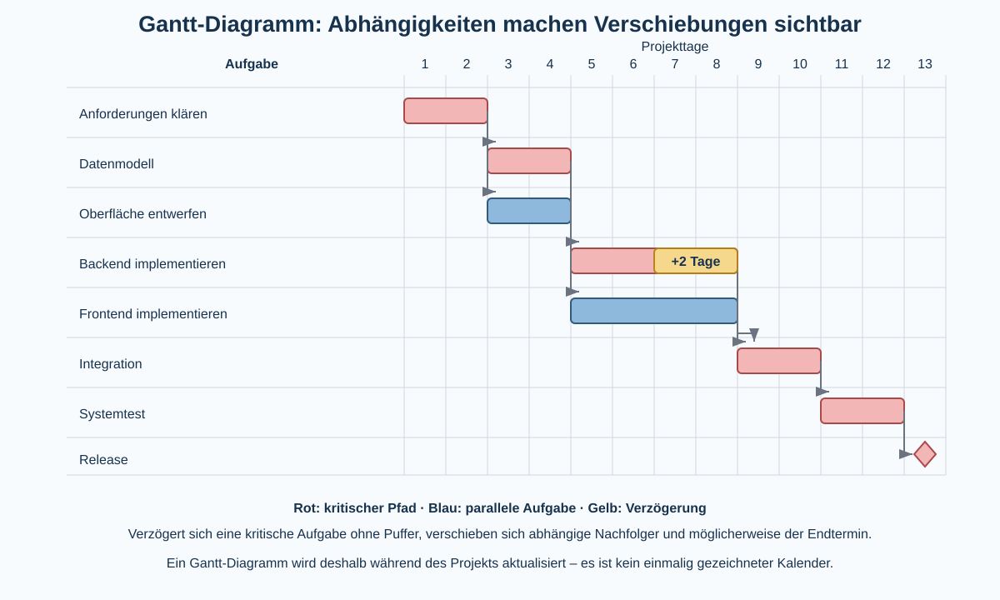

# 2 Softwareentwicklung und Projektmanagement

## Von einer Idee zu einem Softwaresystem

Software entsteht selten dadurch, dass sofort mit dem Programmieren begonnen wird. Zuerst muss verstanden werden, **welches Problem** gelöst werden soll, **wer** die Lösung benötigt und **welche Anforderungen** gelten. Anschließend wird die Lösung entworfen, in überschaubare Teile zerlegt, umgesetzt, getestet und weiterentwickelt.

Bei größeren Vorhaben kommt eine zweite Aufgabe hinzu: Die Arbeit muss geplant und koordiniert werden. Genau damit beschäftigt sich **Projektmanagement**.

Softwareentwicklung und Projektmanagement beantworten damit unterschiedliche, aber eng verbundene Fragen:

| Bereich | zentrale Frage |
|---|---|
| Anforderungsanalyse | Was wird tatsächlich benötigt? |
| System-/Softwareentwurf | Wie soll die Lösung aufgebaut sein? |
| Implementierung | Wie wird der Entwurf als Software umgesetzt? |
| Qualitätssicherung | Funktioniert die Lösung korrekt und erfüllt sie die Anforderungen? |
| Projektmanagement | Wer erledigt was, wann, mit welchen Ressourcen und Abhängigkeiten? |
| Betrieb/Weiterentwicklung | Wie wird die Lösung genutzt, gewartet und verbessert? |

> **Merke:** Programmieren ist ein wichtiger Teil der Softwareentwicklung – aber Softwareentwicklung besteht nicht nur aus Programmieren.

## Projekt und laufender Betrieb

Ein **Projekt** ist ein zeitlich begrenztes Vorhaben mit einem definierten Ziel. Es besitzt einen Anfang und ein geplantes Ende. Der laufende Betrieb eines bereits eingesetzten Systems ist dagegen eine dauerhafte Aufgabe.

Beispiel:

- **Projekt:** Eine neue Schulbibliothekssoftware entwickeln und einführen.
- **Betrieb:** Server überwachen, Benutzer verwalten, Fehler beheben und die Software aktualisieren.

Nach Projektabschluss verschwindet Software also nicht. Häufig beginnt anschließend eine lange Phase aus Betrieb, Wartung und Weiterentwicklung.

## Stakeholder und Projektziele

**Stakeholder** sind Personen oder Gruppen, die Anforderungen an ein System haben, von ihm betroffen sind oder Einfluss auf das Projekt besitzen.

Bei einer Schulbibliothekssoftware könnten beispielsweise Schülerinnen und Schüler, Bibliotheksmitarbeiter, Lehrkräfte, Schulleitung und Administratoren unterschiedliche Interessen besitzen.

Ein Projektziel sollte deshalb nicht nur „Wir programmieren eine Bibliotheks-App“ lauten. Sinnvoller ist eine überprüfbare Beschreibung dessen, was erreicht werden soll.

Beispiel:

> Die Anwendung soll Bücher und Exemplare verwalten, Ausleihen und Rückgaben erfassen und den aktuellen Ausleihstatus anzeigen. Sie soll im Schulnetz über einen Browser nutzbar sein.

## Anforderungen

Eine **Anforderung** beschreibt eine benötigte Eigenschaft oder Leistung eines Systems.

### Funktionale Anforderungen

Funktionale Anforderungen beschreiben, **was ein System tun soll**.

Beispiele:

- Benutzer können nach Büchern suchen.
- Mitarbeiter können eine Ausleihe erfassen.
- Das System zeigt an, ob ein Exemplar verfügbar ist.

### Nichtfunktionale Anforderungen

Nichtfunktionale Anforderungen beschreiben Eigenschaften und Randbedingungen, beispielsweise:

- Sicherheit,
- Geschwindigkeit,
- Bedienbarkeit,
- Zuverlässigkeit,
- Datenschutz,
- Wartbarkeit,
- unterstützte Geräte oder Browser.

Beispiel: „Eine Suchanfrage soll bei normaler Nutzung innerhalb von zwei Sekunden beantwortet werden.“ ist überprüfbarer als „Die Suche soll schnell sein.“

## Anforderungen priorisieren

Nicht alle Wünsche können immer gleichzeitig umgesetzt werden. Eine einfache Priorisierung ist:

- **MUSS:** ohne diese Anforderung ist die Lösung nicht sinnvoll nutzbar,
- **SOLL:** wichtig, aber notfalls verschiebbar,
- **KANN:** zusätzliche Verbesserung.

In professionellen Projekten existieren verschiedene Priorisierungsverfahren. Entscheidend ist die Grundidee: **Prioritäten müssen sichtbar sein**, damit bei begrenzter Zeit nicht zufällig entschieden wird.

## User Stories und Akzeptanzkriterien

Eine mögliche Form, Anforderungen aus Benutzersicht zu beschreiben, ist die **User Story**.

```text
Als Bibliotheksmitarbeiter
möchte ich ein ausgeliehenes Exemplar zurückbuchen,
damit es wieder als verfügbar angezeigt wird.
```

Eine User Story allein ist häufig noch nicht präzise genug. **Akzeptanzkriterien** beschreiben überprüfbare Bedingungen.

Beispiel:

- Nach der Rückgabe besitzt das Exemplar den Status `verfügbar`.
- Die aktive Ausleihe erhält ein Rückgabedatum.
- Das Exemplar erscheint wieder in der Liste verfügbarer Exemplare.

Damit entsteht unmittelbar eine Verbindung zwischen **Anforderung und Test**.

## Die Domäne verstehen

Die **Domäne** ist der fachliche Problembereich, in dem eine Software eingesetzt wird. Bei einer Bibliothekssoftware gehören beispielsweise Bücher, Exemplare, Ausleihen und Rückgaben zur Domäne.

Bevor Software sinnvoll zerlegt werden kann, muss man diese Fachwelt verstehen.

```text
Schulbibliothek
│
├── Buch
│   └── beschreibt Titel, Autor, ISBN ...
│
├── Exemplar
│   └── konkretes vorhandenes Buch
│
├── Benutzer
│
└── Ausleihe
    ├── Benutzer
    ├── Exemplar
    ├── Ausleihdatum
    └── Rückgabedatum
```

Die Unterscheidung zwischen **Buch** und **Exemplar** zeigt, warum Domänenwissen wichtig ist: Von demselben Buchtitel können mehrere physische Exemplare vorhanden sein und gleichzeitig unterschiedliche Ausleihzustände besitzen.

### Domain-driven Design als Ausblick

In größeren Softwaresystemen versucht **Domain-driven Design (DDD)**, die Struktur der Software eng an den fachlichen Begriffen und Regeln der Domäne auszurichten. Für Klasse 10 ist nicht die vollständige Methode wichtig, sondern die Grundidee:

> **Erst die Fachwelt verstehen, dann sinnvolle Softwarestrukturen daraus ableiten.**

## Zerlegen eines Problems

Große Probleme werden in kleinere, möglichst klar verantwortliche Teile zerlegt. Man spricht unter anderem von **Modulen**, **Komponenten** oder **Subsystemen**.

Eine Bibliotheksanwendung könnte beispielsweise enthalten:

```text
Benutzeroberfläche
        │
        ▼
Anwendungslogik
 ├── Suche
 ├── Ausleihe
 └── Rückgabe
        │
        ▼
Datenzugriff
        │
        ▼
Datenbank
```

Eine gute Zerlegung versucht, Verantwortlichkeiten klar zu trennen und unnötige Abhängigkeiten zu vermeiden.

## Schnittstellen

Eine **Schnittstelle** beschreibt, wie zwei Teile eines Systems miteinander kommunizieren oder welche Leistungen ein Teil für einen anderen bereitstellt.

Beispiel einer vereinfachten Schnittstelle:

```text
sucheBuch(suchtext) → Liste von Büchern
leiheAus(benutzerId, exemplarId) → Ergebnis
rueckgabe(ausleiheId) → Ergebnis
```

Eine Schnittstelle beschreibt das **Was** der Zusammenarbeit. Die interne Implementierung kann sich ändern, solange die vereinbarte Schnittstelle erhalten bleibt.

Schnittstellen können zwischen Funktionen, Klassen, Modulen, Programmen oder sogar Organisationen bestehen.

## Architektur

Die **Softwarearchitektur** beschreibt grundlegende Strukturen eines Softwaresystems: wichtige Komponenten, ihre Verantwortlichkeiten und Beziehungen.

Eine Architektur soll unter anderem helfen,

- Komplexität zu beherrschen,
- Änderungen zu erleichtern,
- Verantwortlichkeiten zu trennen,
- Sicherheit und Testbarkeit zu verbessern.

Es gibt nicht die eine richtige Architektur für alle Systeme. Eine kleine Anwendung benötigt andere Strukturen als ein weltweit verteilter Dienst.

## Iterativ und inkrementell entwickeln

Bei einem **inkrementellen** Vorgehen wird das System schrittweise um nutzbare Teile erweitert.

```text
Version 1: Bücher anzeigen
Version 2: Suche ergänzen
Version 3: Ausleihe ergänzen
Version 4: Rückgabe ergänzen
```

Bei einem **iterativen** Vorgehen wird ein bereits vorhandener Teil wiederholt verbessert.

```text
Suche V1 → testen → verbessern → Suche V2 → testen → verbessern
```

In der Praxis werden beide Ideen häufig kombiniert: In jedem Abschnitt entsteht ein weiteres Stück des Systems und bereits vorhandene Teile werden verbessert.

> **Merke:** **Inkrementell = mehr Funktionalität hinzufügen. Iterativ = vorhandene Lösung wiederholt verbessern.**

## Planorientiert und agil

Ein **planorientiertes Vorgehen** versucht, wesentliche Phasen und Ergebnisse früh zu planen. Ein vereinfachtes Wasserfallmodell stellt Phasen nacheinander dar.

Agile Vorgehensweisen gehen stärker davon aus, dass sich Anforderungen und Erkenntnisse während der Entwicklung verändern. Arbeit wird deshalb in kleinere Abschnitte zerlegt, regelmäßig überprüft und neu priorisiert.

**Agil bedeutet nicht ungeplant.** Auch agile Teams planen – jedoch häufiger und auf Grundlage des aktuellen Wissens.

## Scrum als Beispiel

**Scrum** ist ein Rahmenwerk für die Zusammenarbeit an komplexen Produkten. Vereinfacht gehören dazu:

- ein **Product Backlog** mit geordneten Anforderungen beziehungsweise Arbeit,
- zeitlich begrenzte **Sprints**,
- ein Sprintziel,
- regelmäßige Überprüfung des Ergebnisses,
- eine **Retrospektive** zur Verbesserung der Zusammenarbeit.

Scrum ist nicht gleichbedeutend mit Projektmanagement insgesamt und eignet sich nicht automatisch für jedes Vorhaben.

## Kanban als Beispiel

Ein **Kanban-Board** macht den Arbeitsfluss sichtbar.

```text
Offen        In Arbeit        Review/Test        Erledigt
─────        ─────────        ───────────        ────────
Ticket A     Ticket C         Ticket D           Ticket F
Ticket B     Ticket E
```

Ein wichtiges Prinzip ist die Begrenzung gleichzeitig begonnener Arbeit (**Work in Progress, WIP**). Viele halb fertige Aufgaben erzeugen häufig mehr Verzögerung als wenige konsequent abgeschlossene Aufgaben.

## Backlog, Ticket und Arbeitspaket

Diese Begriffe beschreiben verwandte, aber nicht identische Dinge:

| Begriff | Bedeutung |
|---|---|
| Backlog | geordnete Sammlung noch anstehender Arbeit |
| Ticket/Issue | einzelner dokumentierter Arbeitsgegenstand, Fehler oder Wunsch |
| Arbeitspaket | planbare abgegrenzte Aufgabe innerhalb eines Projekts |
| Meilenstein | wichtiger Termin beziehungsweise erreichtes Zwischenergebnis |

Ein gutes Ticket enthält genügend Informationen, damit die Aufgabe verstanden und später überprüft werden kann.

## Aufwand und Dauer sind nicht dasselbe

**Aufwand** beschreibt die benötigte Arbeitsmenge. **Dauer** beschreibt die Kalenderzeit zwischen Beginn und Ende.

Eine Aufgabe mit acht Stunden Aufwand muss nicht automatisch nach acht Kalenderstunden beendet sein. Wartezeiten, Abhängigkeiten, andere Aufgaben und verfügbare Personen beeinflussen die Dauer.

Ebenso lässt sich nicht jede Aufgabe beliebig beschleunigen, indem mehr Personen hinzugefügt werden. Manche Arbeiten müssen nacheinander erfolgen oder benötigen intensive Abstimmung.

## Gantt-Diagramme

Ein **Gantt-Diagramm** stellt Aufgaben auf einer Zeitachse dar. Balken zeigen, wann eine Aufgabe beginnen soll und wie lange sie dauert. Zusätzlich können Abhängigkeiten und Meilensteine dargestellt werden.



Ein Gantt-Diagramm beantwortet vor allem Fragen wie:

- Wann soll eine Aufgabe beginnen und enden?
- Welche Aufgaben können parallel stattfinden?
- Welche Aufgabe muss zuerst fertig sein?
- Wann werden wichtige Meilensteine erreicht?
- Welche Auswirkungen besitzt eine Verzögerung?

### Mit einem Gantt-Diagramm arbeiten

Ein Gantt-Plan ist **kein einmal gezeichneter Kalender**, der danach ignoriert wird. Während des Projekts wird er mit dem tatsächlichen Fortschritt verglichen und bei Bedarf aktualisiert.

Eine typische Arbeitsweise ist:

1. Arbeit in Aufgaben beziehungsweise Arbeitspakete zerlegen.
2. Dauer beziehungsweise Aufwand abschätzen.
3. Abhängigkeiten bestimmen.
4. Aufgaben zeitlich anordnen.
5. Meilensteine festlegen.
6. tatsächlichen Fortschritt eintragen.
7. Abweichungen analysieren.
8. Auswirkungen auf Nachfolger und Endtermin prüfen.
9. Plan und Maßnahmen aktualisieren.

## Abhängigkeiten zwischen Aufgaben

Aufgaben sind häufig voneinander abhängig. Eine **Vorgängeraufgabe** muss beispielsweise beendet sein, bevor eine **Nachfolgeraufgabe** beginnen kann.

Beispiel:

```text
Datenmodell
    ↓
Backend
    ↓
Integration
    ↓
Systemtest
    ↓
Release
```

Andere Arbeiten können parallel stattfinden:

```text
           ┌─ Datenmodell ─ Backend ─┐
Anforderung│                         ├─ Integration
           └─ UI-Entwurf ─ Frontend ─┘
```

Die Integration kann erst beginnen, wenn die dafür benötigten Teile bereitstehen.

## Was passiert, wenn sich eine Aufgabe verschiebt?

Angenommen, die Backend-Implementierung benötigt zwei Tage länger als geplant. Dann reicht es nicht, nur den Balken im Gantt-Diagramm zu verlängern.

Es muss geprüft werden:

1. Welche Aufgaben hängen vom Backend ab?
2. Können diese Aufgaben trotzdem teilweise beginnen?
3. Gibt es zeitlichen Puffer?
4. Verschiebt sich ein Meilenstein?
5. Verschiebt sich der Projektendtermin?
6. Können Ressourcen sinnvoll anders eingesetzt werden?
7. Muss Umfang oder Priorität verändert werden?

Eine Verzögerung einer Aufgabe verschiebt also **nicht automatisch das gesamte Projekt**. Entscheidend sind Abhängigkeiten und vorhandene Puffer.

## Puffer

Ein **Puffer** ist zeitlicher Spielraum. Besitzt eine Aufgabe beispielsweise zwei Tage Puffer, kann sie sich unter bestimmten Voraussetzungen um bis zu zwei Tage verzögern, ohne den geplanten Endtermin zu verändern.

Puffer ist keine „unnötige freie Zeit“. Er macht einen Plan robuster gegenüber Unsicherheiten.

## Kritischer Pfad

Der **kritische Pfad** ist vereinfacht die Folge voneinander abhängiger Aufgaben, bei denen eine Verzögerung ohne vorhandenen Puffer den Projektendtermin verschieben kann.

Im Gantt-Beispiel bilden Anforderungen, Datenmodell, Backend, Integration, Systemtest und Release einen solchen kritischen Ablauf. Wird das Backend später fertig und existiert dort kein Puffer, können auch Integration, Systemtest und Release später beginnen.

> **Merke:** Nicht die längste einzelne Aufgabe ist automatisch „kritisch“. Entscheidend ist die **Kette von Abhängigkeiten und ihr verfügbarer Puffer**.

## Frühester und spätester Zeitpunkt

In genauerer Netzplantechnik wird berechnet, wann eine Aufgabe **frühestens** beginnen kann und wann sie **spätestens** beginnen beziehungsweise enden darf, ohne den Endtermin zu gefährden.

Für Klasse 10 genügt die Grundidee:

```text
frühester möglicher Start
          │
          ├──── verfügbarer Puffer ────┤
                                       │
                              spätester Start
```

Ist kein Puffer vorhanden, liegt die Aufgabe typischerweise auf einem kritischen Pfad.

## Ressourcen und Ressourcenkonflikte

Zeitliche Parallelität bedeutet nicht automatisch, dass Aufgaben tatsächlich gleichzeitig bearbeitet werden können.

Beispiel: Frontend und Dokumentation könnten fachlich parallel stattfinden. Wenn aber dieselbe Person beide Aufgaben übernehmen soll, entsteht ein **Ressourcenkonflikt**.

Projektplanung muss deshalb sowohl **Abhängigkeiten** als auch **verfügbare Ressourcen** betrachten.

## Zeit, Umfang, Kosten/Ressourcen und Qualität

Projektentscheidungen beeinflussen sich gegenseitig. Häufig werden Zeit, Umfang und Kosten beziehungsweise Ressourcen als miteinander verbundene Größen betrachtet. Zusätzlich darf die gewünschte Qualität nicht ignoriert werden.

Beispiel: Der Release-Termin ist fest, aber eine wichtige Aufgabe verzögert sich. Mögliche Reaktionen könnten sein:

- weniger wichtige Funktionen auf eine spätere Version verschieben,
- Aufgaben anders verteilen,
- zusätzliche geeignete Ressourcen einsetzen,
- den Termin ändern,
- technische oder organisatorische Risiken neu bewerten.

„Einfach schneller arbeiten“ ist dagegen keine belastbare Projektplanung.

## Risiken im Projekt

Ein **Projektrisiko** ist ein mögliches zukünftiges Ereignis, das Ziele beeinflussen kann.

Beispiele:

- wichtige Technik steht verspätet zur Verfügung,
- eine externe Schnittstelle ändert sich,
- Aufwand wurde unterschätzt,
- eine Schlüsselperson fällt aus,
- Sicherheitsanforderungen werden zu spät erkannt.

Risiken sollten möglichst früh erkannt und bewertet werden. Für wichtige Risiken können Gegenmaßnahmen oder Alternativen vorbereitet werden.

## Gantt, Kanban und Backlog – unterschiedliche Werkzeuge

Die Werkzeuge beantworten unterschiedliche Fragen:

| Werkzeug | wichtigste Frage |
|---|---|
| Backlog | Welche Arbeit steht an und wie wichtig ist sie? |
| Ticket/Issue | Was genau soll bearbeitet oder behoben werden? |
| Kanban-Board | In welchem Bearbeitungszustand befindet sich die Arbeit? |
| Gantt-Diagramm | Wann findet Arbeit statt und welche zeitlichen Abhängigkeiten bestehen? |
| Meilenstein | Welches wichtige Zwischenergebnis soll bis wann erreicht sein? |

Sie können deshalb gemeinsam verwendet werden.

## Zusammenarbeit

Softwareprojekte können vor Ort, vollständig online oder **hybrid** stattfinden. Entscheidend ist, dass Informationen für alle Beteiligten auffindbar bleiben.

Typische Formen sind:

- direkte Gespräche und Besprechungen,
- Video- und Audiokonferenzen,
- Chat,
- Tickets/Issues,
- gemeinsames Wiki beziehungsweise Wissensplattform,
- Versionsverwaltung,
- Code Reviews,
- gemeinsame Dokumente.

Mündliche Absprachen sind schnell, aber später schwer nachvollziehbar. Wichtige Entscheidungen sollten deshalb dokumentiert werden.

## Dokumentation

Es gibt nicht nur „die Projektdokumentation“. Unterschiedliche Dokumentation richtet sich an unterschiedliche Zielgruppen.

| Dokumentation | Zweck |
|---|---|
| Anforderungen | beschreibt benötigte Eigenschaften |
| Architektur-/Entwurfsdokumentation | erklärt Aufbau und Entscheidungen |
| Benutzerdokumentation | erklärt Bedienung |
| Betriebsdokumentation | erklärt Installation, Konfiguration und Betrieb |
| Tickets | dokumentieren konkrete Arbeit, Fehler und Änderungen |
| Wiki/Confluence-artige Systeme | sammeln längerfristiges Teamwissen |
| Code-Dokumentation | erklärt Schnittstellen und nicht offensichtliche Zusammenhänge |

### Dokumentation im Code

Gute Namen und verständliche Struktur sind wichtiger als Kommentare zu jeder einzelnen Zeile. Kommentare sollten vor allem das **Warum** oder besondere Bedingungen erklären.

Für Programmiersprachen existieren außerdem Dokumentationssysteme wie **JavaDoc** für Java oder **TSDoc** für TypeScript. Aus strukturierten Kommentaren kann automatisch technische API-Dokumentation erzeugt werden.

## Versionsverwaltung mit Git

Eine Versionsverwaltung wie **Git** speichert nachvollziehbare Entwicklungsstände. Dadurch kann man Änderungen vergleichen, gemeinsam arbeiten und bei Bedarf auf ältere Stände zurückgreifen.

Wichtige Begriffe sind:

- **Repository:** verwalteter Projektbestand,
- **Commit:** gespeicherter zusammengehöriger Änderungsstand,
- **Branch:** Entwicklungszweig,
- **Merge:** Zusammenführen von Entwicklungsständen,
- **Pull Request/Merge Request:** vorgeschlagene Änderung zur Prüfung und Zusammenführung,
- **Code Review:** fachliche Prüfung von Änderungen durch andere Personen.

Versionsverwaltung ersetzt kein vollständiges Backup, verbessert aber die Nachvollziehbarkeit der Softwareentwicklung erheblich.

## Testen als Teil der Entwicklung

Tests prüfen nicht nur, ob ein Programm „irgendwie läuft“. Sie sollen systematisch untersuchen, ob Anforderungen erfüllt werden und Fehler in unterschiedlichen Situationen auftreten.

Ein guter **Testfall** enthält mindestens:

- Ausgangssituation/Voraussetzungen,
- Eingabe oder Aktion,
- erwartetes Ergebnis,
- tatsächliches Ergebnis,
- Bewertung bestanden/nicht bestanden.

## Normal-, Grenz- und Fehlerfälle

Angenommen, ein System akzeptiert eine Anzahl von `1` bis `20`.

Sinnvolle Tests wären beispielsweise:

| Test | Eingabe | Erwartung |
|---|---:|---|
| Normalfall | 10 | akzeptiert |
| untere Grenze | 1 | akzeptiert |
| knapp unter Grenze | 0 | abgelehnt |
| obere Grenze | 20 | akzeptiert |
| knapp über Grenze | 21 | abgelehnt |
| Fehleingabe | `abc` | kontrolliert abgelehnt |

Gerade an Grenzen treten häufig Fehler wie `<` statt `<=` auf.

## Blackbox- und Whitebox-Test

Beim **Blackbox-Test** wird das innere Programm nicht benötigt. Getestet wird anhand von Anforderungen, Eingaben und erwarteten Ausgaben.

Beim **Whitebox-Test** ist die innere Struktur des Programms bekannt. Tests können gezielt bestimmte Bedingungen, Zweige oder Ausführungspfade untersuchen.

Beide Sichtweisen ergänzen sich.

## Testebenen

Tests können auf unterschiedlichen Ebenen stattfinden:

```text
Unit-Test
    ↓
Integrationstest
    ↓
Systemtest
    ↓
Abnahmetest
```

**Unit-Test:** prüft eine kleine Einheit wie Funktion, Methode oder Klasse.

**Integrationstest:** prüft das Zusammenspiel mehrerer Komponenten.

**Systemtest:** prüft das vollständige System gegen Anforderungen.

**Abnahmetest:** prüft aus Sicht des Auftraggebers beziehungsweise Benutzers, ob vereinbarte Anforderungen erfüllt sind.

## Regressionstest

Ein **Regressionstest** prüft nach einer Änderung erneut bereits funktionierende Bereiche. Dadurch soll erkannt werden, ob eine neue Änderung unbeabsichtigt alte Funktionen beschädigt hat.

Automatisierte Tests sind dafür besonders nützlich, weil sie wiederholt ausgeführt werden können.

## Testabdeckung

**Testabdeckung** beschreibt, welcher Anteil bestimmter Programmstrukturen durch Tests ausgeführt beziehungsweise untersucht wurde.

Beispiele sind:

- **Anweisungsabdeckung:** Welche Anweisungen wurden ausgeführt?
- **Zweigabdeckung:** Wurden bei Entscheidungen die unterschiedlichen Zweige ausgeführt?
- **Pfadabdeckung:** Welche möglichen Ausführungspfade wurden durchlaufen?

Bei Schleifen und vielen Bedingungen kann die Anzahl möglicher Pfade sehr schnell wachsen. Vollständige Pfadabdeckung ist deshalb bei realen Programmen häufig nicht praktikabel.

> **Merke:** **100 % Testabdeckung bedeutet nicht 100 % Fehlerfreiheit.** Tests können nur Fehler entdecken, für die geeignete Situationen tatsächlich geprüft und korrekt bewertet werden.

## Fehler dokumentieren

Ein guter Fehlerbericht enthält beispielsweise:

- kurze eindeutige Beschreibung,
- verwendete Version,
- Voraussetzungen,
- Schritte zur Reproduktion,
- erwartetes Verhalten,
- tatsächliches Verhalten,
- gegebenenfalls relevante Logs oder Screenshots.

„Geht nicht“ ist dagegen kaum hilfreich.

## Continuous Integration als Ausblick

Bei **Continuous Integration (CI)** werden Änderungen regelmäßig zusammengeführt und automatisierte Prüfungen wie Build und Tests ausgeführt. Dadurch können Integrationsprobleme früh erkannt werden.

**Continuous Delivery/Deployment (CD)** erweitert diese Idee in Richtung automatisierter Bereitstellung. Die genaue Umsetzung ist ein fortgeschrittenes Thema; wichtig ist die Grundidee, wiederholbare technische Schritte möglichst zuverlässig zu automatisieren.

## Release, Deployment, Betrieb und Wartung

Ein **Release** bezeichnet eine definierte Softwareversion, die zur Nutzung vorgesehen ist. **Deployment** bezeichnet das Bereitstellen dieser Software in einer Zielumgebung.

Danach folgen Betrieb und Wartung:

- Fehler beheben,
- Sicherheitsupdates einspielen,
- Systeme überwachen,
- Anforderungen weiterentwickeln,
- Daten sichern,
- technische Schulden reduzieren.

Softwareentwicklung endet daher selten mit dem ersten funktionierenden Programm.

## Projektabschluss und Retrospektive

Am Ende eines Projekts sollte nicht nur gefragt werden, ob etwas präsentiert werden kann. Wichtig sind unter anderem:

- Welche Anforderungen wurden erfüllt?
- Welche Anforderungen bleiben offen?
- Welche bekannten Fehler existieren?
- Ist die Dokumentation ausreichend?
- Kann das System betrieben und weiterentwickelt werden?
- Was hat in der Zusammenarbeit funktioniert?
- Was sollte beim nächsten Vorhaben anders gemacht werden?

Eine **Retrospektive** betrachtet insbesondere die Arbeitsweise und sucht konkrete Verbesserungen für die Zukunft.

## Begriffe zum Nachschlagen

**Abhängigkeit:** Beziehung, bei der eine Aufgabe oder Komponente von einer anderen abhängt.

**Akzeptanzkriterium:** überprüfbare Bedingung dafür, wann eine Anforderung als erfüllt gilt.

**Anforderung:** benötigte Eigenschaft oder Leistung eines Systems.

**Architektur:** grundlegende Struktur eines Softwaresystems und seiner Komponenten.

**Backlog:** geordnete Sammlung anstehender Arbeit.

**Blackbox-Test:** Test aus Sicht von Eingaben, Ausgaben und Anforderungen ohne Nutzung der inneren Programmstruktur.

**Branch:** Entwicklungszweig in einer Versionsverwaltung.

**Commit:** gespeicherter zusammengehöriger Änderungsstand in einer Versionsverwaltung.

**Gantt-Diagramm:** zeitliche Balkendarstellung von Aufgaben, Dauer, Terminen und gegebenenfalls Abhängigkeiten.

**Inkrementell:** Vorgehen, bei dem die Lösung schrittweise um weitere nutzbare Bestandteile erweitert wird.

**Iterativ:** Vorgehen, bei dem eine Lösung wiederholt geprüft und verbessert wird.

**Kanban:** Methode zur Visualisierung und Steuerung von Arbeitsfluss.

**Kritischer Pfad:** Folge abhängiger Aufgaben, deren Verzögerung ohne Puffer den Projektendtermin beeinflussen kann.

**Meilenstein:** wichtiges Ereignis oder Zwischenergebnis in einem Projektplan.

**Projekt:** zeitlich begrenztes Vorhaben mit definiertem Ziel.

**Projektmanagement:** Planung, Koordination, Überwachung und Steuerung eines Projekts.

**Puffer:** zeitlicher Spielraum, bevor eine Verzögerung nachfolgende Termine beeinflusst.

**Regressionstest:** erneuter Test bestehender Funktionen nach Änderungen.

**Ressource:** für eine Aufgabe benötigte Person, Zeit, Technik oder anderes Mittel.

**Schnittstelle:** vereinbarter Übergang beziehungsweise Kommunikationspunkt zwischen Systemteilen.

**Stakeholder:** Person oder Gruppe, die Anforderungen, Interessen oder Einfluss bezüglich eines Systems oder Projekts besitzt.

**Testabdeckung:** Maß dafür, welche Teile beziehungsweise Strukturen eines Programms durch Tests ausgeführt oder geprüft wurden.

**User Story:** kurze Beschreibung eines Bedürfnisses aus Sicht einer Benutzerrolle.

**Versionsverwaltung:** System zur nachvollziehbaren Speicherung und Zusammenführung von Änderungen.

**Whitebox-Test:** Test unter Kenntnis und gezielter Berücksichtigung der inneren Programmstruktur.

→ Vorwissen: Klasse 8, **Algorithmen** und **Objektorientierte Modellierung**.  
→ Vertiefung aus Klasse 9: **Algorithmische Projekte**, insbesondere Anforderungen, Entwurf, Testen und Zusammenarbeit.  
→ Siehe auch Klasse 10, **Sicherheit in der Informationsverarbeitung** und **Webbasierte Anwendungen**.
