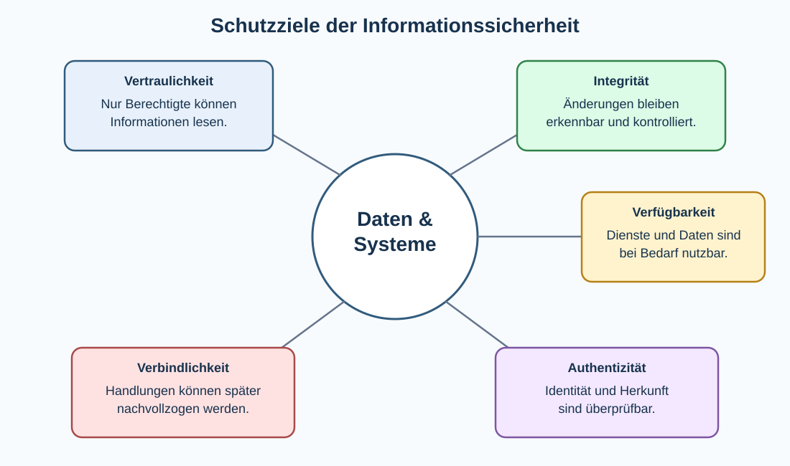

# 3 Sicherheit in der Informationsverarbeitung

## Warum Informationssicherheit?

Digitale Systeme speichern persönliche Nachrichten, Schul- und Unternehmensdaten, Fotos, Zugangsdaten, Zahlungsinformationen und viele weitere Informationen. Gleichzeitig steuern Computer reale Prozesse und stellen Dienste bereit, auf die Menschen angewiesen sind.

**Informationssicherheit** beschäftigt sich deshalb mit der Frage, wie Informationen und informationsverarbeitende Systeme vor unbeabsichtigten Fehlern, technischen Ausfällen und absichtlichen Angriffen geschützt werden können.

Sicherheit ist kein einzelnes Programm und keine einzelne Einstellung. Sie entsteht durch das Zusammenspiel von **Menschen, Technik und organisatorischen Regeln**.

> **Merke:** Informationssicherheit bedeutet nicht nur „Geheimnisse schützen“. Informationen müssen je nach Situation auch **richtig, verfügbar und echt beziehungsweise einer überprüfbaren Quelle zuordenbar** sein.

## Schutzziele der Informationssicherheit

Die klassischen drei Schutzziele sind **Vertraulichkeit, Integrität und Verfügbarkeit**. Für viele Anwendungen sind außerdem **Authentizität** und **Verbindlichkeit/Nachweisbarkeit** wichtig.



| Schutzziel | Leitfrage | Beispiel |
|---|---|---|
| Vertraulichkeit | Wer darf die Information lesen? | private Nachricht nur für Empfänger |
| Integrität | Wurde die Information unbemerkt verändert? | unveränderte Überweisung |
| Verfügbarkeit | Ist der Dienst bei Bedarf nutzbar? | erreichbarer Schulserver |
| Authentizität | Ist die Identität oder Herkunft echt? | stammt die Nachricht wirklich vom angegebenen Absender? |
| Verbindlichkeit/Nachweisbarkeit | Kann eine Handlung später zuverlässig zugeordnet werden? | digital signierter Vertrag |

### Vertraulichkeit

**Vertraulichkeit** schützt Informationen vor unberechtigtem Lesen. Maßnahmen sind beispielsweise Zugriffsrechte und Verschlüsselung.

### Integrität

**Integrität** bedeutet, dass Daten nicht unbemerkt oder unberechtigt verändert werden. Hashwerte, digitale Signaturen, Berechtigungen und Protokollierung können bei der Kontrolle der Integrität helfen.

### Verfügbarkeit

**Verfügbarkeit** bedeutet, dass Informationen und Dienste rechtzeitig nutzbar sind. Redundanz, Backups, Ersatzsysteme, Wartung und Schutz vor Überlastung unterstützen dieses Ziel.

### Authentizität

**Authentizität** bedeutet, dass die behauptete Identität oder Herkunft überprüfbar ist.

Beispiele:

- Ist die Webseite wirklich die Webseite der Bank?
- Stammt eine signierte Datei tatsächlich von der angegebenen Organisation?
- Meldet sich wirklich der Benutzer an, dessen Benutzername angegeben wurde?
- Stammt ein Softwareupdate wirklich vom Hersteller?

Authentizität ist nicht dasselbe wie Integrität. Eine Datei kann unverändert sein und trotzdem von einem falschen Absender stammen. Umgekehrt kann die Identität eines Kommunikationspartners echt sein, während übertragene Daten durch einen Fehler beschädigt wurden.

### Verbindlichkeit und Nachweisbarkeit

Bei bestimmten Vorgängen soll später nachvollziehbar sein, wer eine Handlung ausgeführt oder eine Erklärung abgegeben hat. Digitale Signaturen und geeignete Protokollierung können dabei helfen.

## Schutzbedarf und Risiko

Nicht jede Information benötigt denselben Schutz. Ein öffentliches Stundenplanmuster hat einen anderen Schutzbedarf als Passwörter oder medizinische Daten.

Eine einfache Risikobetrachtung fragt:

1. **Was soll geschützt werden?** – Werte beziehungsweise Assets.
2. **Wovor?** – Bedrohungen.
3. **Welche Schwachstellen gibt es?**
4. **Wie wahrscheinlich ist ein Schaden?**
5. **Wie groß wäre der mögliche Schaden?**
6. **Welche Schutzmaßnahme ist angemessen?**

Ein **Risiko** entsteht vereinfacht aus der Möglichkeit, dass eine Bedrohung eine Schwachstelle ausnutzt und dadurch Schaden verursacht.

## Bedrohung, Schwachstelle und Angriff

Diese Begriffe sollten unterschieden werden:

- **Bedrohung:** mögliche Ursache eines Schadens, etwa Schadsoftware, Feuer oder ein Angreifer.
- **Schwachstelle:** Sicherheitslücke oder Schwäche, beispielsweise ungepatchte Software oder ein leicht erratbares Passwort.
- **Angriff:** konkreter Versuch, eine Schwachstelle auszunutzen oder ein Schutzziel zu verletzen.
- **Schutzmaßnahme:** verringert Wahrscheinlichkeit oder Folgen eines Schadens.

Beispiel:

```text
Schwachstelle: wiederverwendetes schwaches Passwort
Bedrohung: gestohlene Zugangsdaten
Angriff: automatisierter Anmeldeversuch bei weiteren Diensten
Schaden: Kontoübernahme
Schutz: einzigartiges Passwort + MFA
```

## Mehrschichtige Sicherheit – Defense in Depth

Eine einzelne Schutzmaßnahme kann ausfallen oder umgangen werden. Deshalb werden häufig mehrere Schutzschichten kombiniert. Dieses Prinzip heißt **Defense in Depth**.

Beispiel für ein Benutzerkonto:

```text
starkes individuelles Passwort
        +
Mehr-Faktor-Authentisierung
        +
Login-Warnungen
        +
begrenzte Rechte
        +
aktuelle Software
        +
Backup wichtiger Daten
```

Fällt eine Schicht aus, können andere Schichten den Schaden begrenzen.

## Identifikation, Authentisierung und Autorisierung

Drei ähnlich klingende Begriffe beschreiben unterschiedliche Schritte.

**Identifikation:** Eine Person behauptet eine Identität, beispielsweise durch Eingabe eines Benutzernamens.

**Authentisierung:** Das System prüft einen Nachweis für diese Identität, beispielsweise ein Passwort, einen Sicherheitsschlüssel oder ein biometrisches Merkmal.

**Autorisierung:** Nach erfolgreicher Anmeldung wird geprüft, welche Aktionen diese Person ausführen darf.

```text
„Ich bin Benutzer Alex.“       → Identifikation
„Hier ist mein Nachweis.“      → Authentisierung
„Alex darf Datei X lesen.“     → Autorisierung
```

> **Merke:** **Wer bist du? → authentisieren. Was darfst du? → autorisieren.**

## Authentisierungsfaktoren

Authentisierungsverfahren werden häufig nach Faktoren unterschieden:

| Faktor | Grundidee | Beispiel |
|---|---|---|
| Wissen | etwas, das man weiß | Passwort, PIN |
| Besitz | etwas, das man besitzt | Sicherheitsschlüssel, Smartphone |
| biometrisches Merkmal | etwas Körperliches | Fingerabdruck, Gesichtserkennung |

**Mehr-Faktor-Authentisierung (MFA)** kombiniert unterschiedliche Faktoren. Zwei Passwörter wären deshalb keine echte Zwei-Faktor-Lösung – beide gehören zum Faktor Wissen.

## Passwörter und Passphrasen

Ein gutes Passwort ist vor allem **lang, einzigartig und nicht leicht zu erraten**. Jedes wichtige Konto sollte ein eigenes Passwort besitzen.

Ein Passwortmanager kann lange, zufällige und unterschiedliche Passwörter speichern. Dadurch muss man nicht für jeden Dienst ein leicht merkbares Passwort wiederverwenden.

Eine **Passphrase** besteht aus mehreren Wörtern beziehungsweise einer längeren Zeichenfolge und kann Länge mit Merkbarkeit verbinden.

Schwach sind beispielsweise häufige Wörter, Namen, Geburtsjahre, einfache Tastaturmuster und wiederverwendete Passwörter.

### Warum Passwortwiederverwendung gefährlich ist

Werden Zugangsdaten eines Dienstes gestohlen, probieren Angreifer dieselbe Kombination häufig automatisiert bei anderen Diensten aus. Dieses Vorgehen wird **Credential Stuffing** genannt.

## Phishing und Social Engineering

**Social Engineering** greift nicht zuerst eine technische Schwachstelle an, sondern versucht Menschen zu beeinflussen. **Phishing** ist eine häufige Form davon.

Angreifer können beispielsweise vortäuschen, eine Bank, ein Paketdienst, ein Kollege oder ein Administrator zu sein. Ziel kann sein, Passwörter, MFA-Codes, Zahlungsdaten oder die Ausführung einer Datei zu erreichen.

Warnsignale können sein:

- unerwarteter Zeitdruck,
- ungewöhnliche Zahlungs- oder Passwortaufforderungen,
- unerwartete Anhänge,
- abweichende Domainnamen,
- Aufforderung, Sicherheitsmechanismen zu umgehen,
- ungewöhnlicher Kommunikationsweg.

Sprachfehler allein sind dagegen kein zuverlässiges Erkennungsmerkmal.

### Phishing, Smishing und Vishing

- **Phishing:** häufig per E-Mail oder gefälschter Webseite,
- **Smishing:** Phishing über SMS beziehungsweise Textnachrichten,
- **Vishing:** Täuschung über Telefon-/Sprachanrufe.

## Schadsoftware

**Malware** ist ein Sammelbegriff für schädliche Software.

| Art | Grundidee |
|---|---|
| Virus | hängt sich an andere Dateien/Programme und verbreitet sich bei Ausführung |
| Wurm | verbreitet sich selbstständig über Systeme oder Netzwerke |
| Trojaner | tarnt schädliche Funktion als nützliche oder erwartete Software |
| Ransomware | verschlüsselt oder blockiert Daten/Systeme und fordert häufig Lösegeld |
| Spyware | sammelt heimlich Informationen |
| Keylogger | zeichnet Tastatureingaben auf |

Die Grenzen zwischen Kategorien können sich überschneiden; reale Schadsoftware kombiniert oft mehrere Techniken.

## Sicherheitsupdates und Schwachstellen

Software enthält Fehler. Manche Fehler ermöglichen Angriffe und werden als **Sicherheitslücken** beziehungsweise Schwachstellen bekannt. Hersteller stellen dafür häufig **Patches** beziehungsweise Sicherheitsupdates bereit.

Deshalb gehören aktuelle Betriebssysteme, Browser, Apps und Serverprogramme zu den wichtigsten Grundmaßnahmen.

Eine **Zero-Day-Schwachstelle** ist vereinfacht eine Sicherheitslücke, für die zum betrachteten Zeitpunkt noch kein allgemein verfügbarer Schutz beziehungsweise Patch vorhanden ist oder die den Verantwortlichen noch nicht ausreichend bekannt war.

## Berechtigungen und Least Privilege

Das Prinzip **Least Privilege** bedeutet: Ein Benutzer, Programm oder Dienst erhält nur die Rechte, die für seine Aufgabe tatsächlich notwendig sind.

Eine Taschenlampen-App benötigt beispielsweise normalerweise keinen Zugriff auf Kontakte. Ein Benutzerkonto für normale Arbeit sollte nicht ständig mit Administratorrechten arbeiten müssen.

Begrenzte Rechte reduzieren den möglichen Schaden bei Fehlern oder kompromittierten Konten.

## Verschlüsselung

**Verschlüsselung** verwandelt lesbare Daten mithilfe eines Schlüssels in eine Form, die ohne passenden Schlüssel nicht sinnvoll gelesen werden soll.

### Symmetrische Verschlüsselung

Bei **symmetrischer Verschlüsselung** verwenden Sender und Empfänger denselben geheimen Schlüssel zum Ver- und Entschlüsseln.

Vorteil ist die effiziente Verarbeitung großer Datenmengen. Die Herausforderung besteht darin, den gemeinsamen geheimen Schlüssel sicher auszutauschen.

### Asymmetrische Kryptografie

Bei **asymmetrischen Verfahren** gibt es ein zusammengehöriges Schlüsselpaar:

- **öffentlicher Schlüssel (Public Key)**,
- **privater Schlüssel (Private Key)**.

Der öffentliche Schlüssel darf bekannt sein. Der private Schlüssel muss geschützt werden.

Asymmetrische Kryptografie kann je nach Verfahren und Anwendung für Schlüsselaustausch, Verschlüsselung oder digitale Signaturen verwendet werden. Die vereinfachte Aussage „mit Public Key verschlüsseln, mit Private Key entschlüsseln“ beschreibt nur einen möglichen Anwendungsfall und darf nicht auf jedes asymmetrische Verfahren übertragen werden.

### Hybride Verschlüsselung

In vielen realen Systemen werden symmetrische und asymmetrische Verfahren kombiniert. Asymmetrische Verfahren helfen beispielsweise beim sicheren Aufbau beziehungsweise Schlüsselaustausch; anschließend werden große Datenmengen effizient symmetrisch geschützt.

## Hashfunktionen

Eine **kryptografische Hashfunktion** berechnet aus Daten einen Hashwert fester Länge. Kleine Änderungen der Eingabe führen bei geeigneten Funktionen zu stark veränderten Hashwerten.

Hashfunktionen werden unter anderem verwendet, um Veränderungen zu erkennen und Passwörter nicht im Klartext speichern zu müssen.

### Passwörter werden nicht einfach verschlüsselt gespeichert

Server sollten Passwörter normalerweise nicht so speichern, dass sie wieder entschlüsselt werden können. Stattdessen werden speziell geeignete Passwort-Hashverfahren mit **Salt** verwendet. Ein Salt ist ein zusätzlicher zufälliger Wert, der verhindert, dass gleiche Passwörter automatisch zu gleichen gespeicherten Werten führen.

## Digitale Signaturen

Eine **digitale Signatur** dient nicht dazu, den Inhalt geheim zu halten. Sie unterstützt vor allem **Integrität, Authentizität und Nachweisbarkeit**.

Vereinfacht:

1. Aus den Daten wird ein Hashwert gebildet.
2. Der Signierende erzeugt mit seinem privaten Schlüssel eine Signatur.
3. Andere können mit dem zugehörigen öffentlichen Schlüssel prüfen, ob die Signatur zu den Daten passt.

Wird die Datei nach dem Signieren verändert, schlägt die Prüfung fehl.

> **Merke:** **Verschlüsselung schützt vor allem Vertraulichkeit. Digitale Signaturen unterstützen Integrität und Authentizität.**

## Zertifikate und Vertrauensketten

Woher weiß ein Browser, welcher öffentliche Schlüssel wirklich zu einer bestimmten Webseite gehört? Dafür werden bei HTTPS **digitale Zertifikate** verwendet.

Ein Zertifikat verbindet unter anderem einen öffentlichen Schlüssel mit einer Identität beziehungsweise einem Domainnamen. Vertrauenswürdige Zertifizierungsstellen (**Certificate Authorities, CA**) signieren Zertifikate. Browser und Betriebssysteme besitzen Listen von Vertrauensankern, anhand derer eine **Zertifikatskette** geprüft werden kann.

Das bedeutet nicht, dass der Inhalt einer Webseite automatisch seriös ist. Ein gültiges HTTPS-Zertifikat bestätigt vor allem technische Aspekte der Verbindung und Domainzuordnung – nicht die Wahrheit aller Aussagen auf der Seite.

## HTTPS und TLS

**TLS (Transport Layer Security)** schützt Netzwerkkommunikation. HTTPS verwendet HTTP über TLS.

TLS unterstützt insbesondere:

- **Vertraulichkeit** durch Verschlüsselung,
- **Integrität** der übertragenen Daten,
- **Authentizität** der Servergegenstelle über Zertifikate.

Damit werden mehrere Schutzziele gleichzeitig angesprochen.

→ Siehe Kapitel 1, **Webbasierte Anwendungen**.

## Man-in-the-Middle-Angriff

Bei einem **Man-in-the-Middle-Angriff (MITM)** versucht ein Angreifer, sich zwischen Kommunikationspartner zu setzen und Kommunikation mitzulesen oder zu verändern.

Korrekt geprüfte TLS-Verbindungen erschweren solche Angriffe erheblich, weil der Client nicht nur verschlüsselt kommuniziert, sondern auch die Identität der Gegenstelle anhand des Zertifikats prüft.

Warnungen über ungültige Zertifikate sollten deshalb nicht gedankenlos ignoriert werden.

## Backups und Wiederherstellung

Ein **Backup** ist eine zusätzliche Sicherungskopie wichtiger Daten. Backups schützen unter anderem vor Hardwaredefekten, versehentlichem Löschen, Diebstahl und bestimmten Folgen von Ransomware.

Eine verbreitete Orientierung ist die **3-2-1-Regel**:

- mindestens **3** Kopien der wichtigen Daten,
- auf mindestens **2** unterschiedlichen Speicherarten beziehungsweise unabhängigen Speicherorten,
- davon mindestens **1** Kopie räumlich beziehungsweise logisch getrennt.

Die genaue Umsetzung hängt vom Schutzbedarf ab.

### Backup ist nicht Synchronisation

Ein synchronisierter Cloud-Ordner ist nicht automatisch ein vollständiges Backup. Wird eine Datei versehentlich gelöscht oder verschlüsselt, kann diese Änderung ebenfalls synchronisiert werden. Versionierung und getrennte Sicherungen können deshalb wichtig sein.

### Wiederherstellung testen

Ein Backup ist nur nützlich, wenn die Daten tatsächlich wiederhergestellt werden können. Deshalb gehört ein **Restore-Test** zu einer guten Backupstrategie.

## Verfügbarkeit: Redundanz und Ausfallsicherheit

Für wichtige Dienste reicht ein Backup allein nicht aus. Wenn ein Dienst jederzeit erreichbar sein muss, können **Redundanz** und Ersatzsysteme notwendig sein.

Beispiele:

- mehrere Server,
- mehrere Netzwerkverbindungen,
- redundante Datenträger,
- unterbrechungsfreie Stromversorgung,
- geografisch getrennte Systeme.

Redundanz ersetzt wiederum kein Backup: Ein versehentlich gelöschter Datensatz kann auf mehrere redundante Systeme gleichzeitig repliziert werden.

## Denial of Service

Bei einem **Denial-of-Service-Angriff (DoS)** soll ein Dienst für legitime Benutzer nicht oder schlechter verfügbar sein. Bei einem **Distributed Denial of Service (DDoS)** beteiligen sich viele Systeme an der Überlastung.

Damit richtet sich der Angriff vor allem gegen das Schutzziel **Verfügbarkeit**.

Ein Beispiel aus Kapitel 1 ist der SYN-Flood, bei dem sehr viele TCP-Verbindungsaufbauten begonnen werden, um Ressourcen zu beanspruchen.

## Netzwerk- und Gerätesicherheit

Weitere Schutzmaßnahmen können sein:

- Firewall-Regeln,
- Trennung von Netzbereichen,
- sichere WLAN-Konfiguration,
- Deaktivierung unnötiger Dienste,
- verschlüsselte Verbindungen,
- Gerätesperre und Datenträgerverschlüsselung,
- Protokollierung sicherheitsrelevanter Ereignisse.

Eine **Firewall** entscheidet anhand von Regeln, welcher Netzwerkverkehr erlaubt oder blockiert wird. Sie ist eine Schutzschicht, aber kein vollständiger Ersatz für sichere Software, Updates oder Authentisierung.

## Tracking, Datenschutz und Informationssicherheit

**Datenschutz** und **Informationssicherheit** hängen zusammen, sind aber nicht identisch.

Informationssicherheit schützt Informationen und Systeme hinsichtlich ihrer Schutzziele. Datenschutz beschäftigt sich insbesondere mit dem Schutz personenbezogener Daten und den Rechten der betroffenen Menschen.

**Tracking** bezeichnet das Wiedererkennen und Auswerten von Nutzung über Zeitpunkte, Webseiten, Apps oder Dienste hinweg. Techniken können beispielsweise Cookies, Konten, Gerätekennungen oder Fingerprinting sein.

Datensparsamkeit, geeignete Browser- und App-Einstellungen sowie bewusste Berechtigungen können die Menge unnötig preisgegebener Informationen verringern.

## Protokollierung und Monitoring

Sicherheitsvorfälle müssen häufig erst erkannt werden. Systeme können deshalb Ereignisse in **Logs** protokollieren, beispielsweise Anmeldungen, Fehlversuche, Systemfehler oder administrative Änderungen.

**Monitoring** beobachtet Systeme und kann bei ungewöhnlichen Zuständen Warnungen auslösen.

Protokollierung muss selbst geschützt werden: Ein Angreifer sollte Spuren nicht einfach löschen oder verändern können. Gleichzeitig können Logs personenbezogene oder sensible Daten enthalten und dürfen nicht grenzenlos gesammelt werden.

## Sicherheitsvorfall: Was tun?

Wenn ein Sicherheitsproblem vermutet wird, ist planvolles Vorgehen wichtiger als hektisches Ausprobieren. Je nach Situation gehören dazu:

1. Vorfall erkennen und melden,
2. Schaden begrenzen,
3. betroffene Systeme und Konten untersuchen,
4. Ursache beheben,
5. sichere Daten wiederherstellen,
6. Passwörter beziehungsweise Schlüssel gegebenenfalls ersetzen,
7. aus dem Vorfall lernen und Schutzmaßnahmen verbessern.

In Organisationen wird dieses Vorgehen als **Incident Response** bezeichnet.

## Mensch, Technik und Organisation

Viele Sicherheitsprobleme entstehen nicht ausschließlich durch Technik. Beispiele sind:

- falsche Berechtigungen,
- gemeinsam verwendete Konten,
- fehlende Updates,
- unklare Verantwortlichkeiten,
- ungetestete Backups,
- unachtsamer Umgang mit Phishing,
- unsichere Standardkonfigurationen.

Deshalb gehören Schulung, klare Prozesse und Verantwortlichkeiten ebenso zur Informationssicherheit wie Verschlüsselung oder Firewalls.

## Kein System ist absolut sicher

Sicherheitsmaßnahmen reduzieren Risiken, beseitigen sie aber nicht vollständig. Neue Schwachstellen können entdeckt werden, Menschen machen Fehler und Schutzmaßnahmen können falsch konfiguriert sein.

Gute Informationssicherheit ist deshalb ein **fortlaufender Prozess**:

```text
Risiken erkennen
      ↓
Schutzmaßnahmen auswählen
      ↓
umsetzen
      ↓
überwachen und testen
      ↓
verbessern
      └──────────────↺
```

## Begriffe zum Nachschlagen

**Angriff:** gezielter Versuch, ein System oder ein Schutzziel zu beeinträchtigen.

**Authentisierung:** Prüfung eines Nachweises für eine behauptete Identität.

**Authentizität:** Eigenschaft, dass Identität oder Herkunft überprüfbar und echt ist.

**Autorisierung:** Festlegung beziehungsweise Prüfung, welche Aktionen eine Identität ausführen darf.

**Backup:** zusätzliche Sicherungskopie zur Wiederherstellung von Daten.

**Bedrohung:** mögliche Ursache eines Schadens.

**Certificate Authority (CA):** Stelle, die digitale Zertifikate ausstellt beziehungsweise signiert und damit Zuordnungen kryptografisch bestätigt.

**Credential Stuffing:** automatisierter Versuch, gestohlene Benutzername-Passwort-Kombinationen bei weiteren Diensten zu verwenden.

**Defense in Depth:** Schutzprinzip mit mehreren voneinander ergänzenden Sicherheitsschichten.

**Digitale Signatur:** kryptografischer Nachweis zur Prüfung von Integrität und Authentizität signierter Daten.

**DoS/DDoS:** Angriff mit dem Ziel, einen Dienst zu überlasten oder seine Verfügbarkeit zu beeinträchtigen.

**Hashfunktion:** Funktion, die aus Daten einen Prüfwert fester Länge berechnet.

**Identifikation:** Angabe beziehungsweise Behauptung einer Identität.

**Informationssicherheit:** Schutz von Informationen und informationsverarbeitenden Systemen.

**Integrität:** Schutz vor unbemerkter oder unberechtigter Veränderung.

**Least Privilege:** Prinzip, nur die tatsächlich benötigten Berechtigungen zu vergeben.

**Malware:** Sammelbegriff für schädliche Software.

**Mehr-Faktor-Authentisierung (MFA):** Authentisierung mit Nachweisen aus mehreren unterschiedlichen Faktoren.

**Phishing:** Täuschungsversuch, um Menschen zur Preisgabe von Informationen oder zu schädlichen Handlungen zu bewegen.

**Redundanz:** mehrfach vorhandene Komponenten oder Ressourcen zur Erhöhung der Ausfallsicherheit.

**Risiko:** Möglichkeit eines Schadens durch das Zusammentreffen von Bedrohungen, Schwachstellen und Auswirkungen.

**Salt:** zufälliger Zusatzwert bei der Passwortspeicherung, der gleiche Passwörter kryptografisch voneinander unterscheidbar macht.

**Schwachstelle:** Schwäche eines Systems, Prozesses oder einer Konfiguration, die ausgenutzt werden kann.

**Social Engineering:** Beeinflussung oder Täuschung von Menschen mit dem Ziel, Sicherheitsmechanismen zu umgehen.

**TLS:** kryptografisches Protokoll zum Schutz von Netzwerkkommunikation.

**Verfügbarkeit:** Eigenschaft, dass Daten und Dienste bei Bedarf nutzbar sind.

**Verbindlichkeit/Nachweisbarkeit:** Eigenschaft, dass Handlungen oder Erklärungen später zuverlässig nachvollzogen beziehungsweise zugeordnet werden können.

**Vertraulichkeit:** Schutz von Informationen vor unberechtigtem Lesen.

**Zero-Day-Schwachstelle:** neuartige beziehungsweise noch nicht ausreichend geschützte Sicherheitslücke, für die zum betrachteten Zeitpunkt häufig noch kein allgemein verfügbarer Patch existiert.

**Zertifikat:** digital signierte Datenstruktur, die unter anderem einen öffentlichen Schlüssel einer Identität beziehungsweise Domain zuordnet.

→ Siehe Kapitel 1, **Webbasierte Anwendungen**, insbesondere Client/Server, HTTPS, TLS und TCP.  
→ Siehe Klasse 9, **Computergrafik, Manipulation und Authentizität**, zur Authentizität digitaler Medien.
