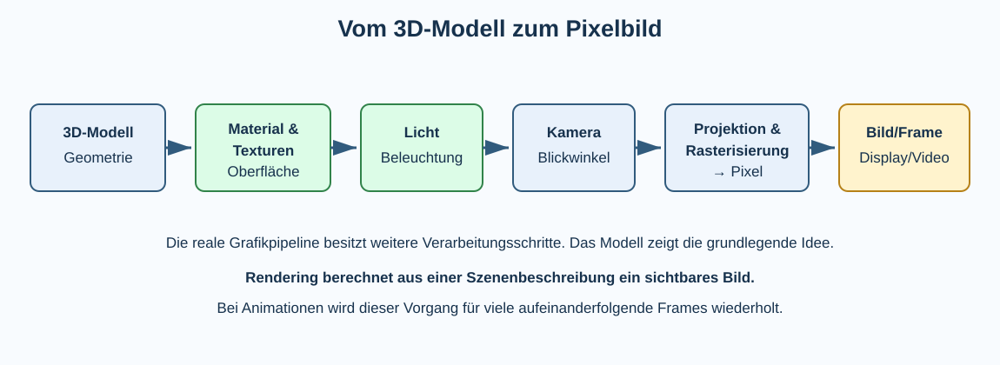

# 5 Computergrafik, Video, 3D und Streaming

## Von Pixelbildern zu komplexen Medien

Aus den vorherigen Klassen sind Pixel, Raster- und Vektorgrafik, Bildformate, Ebenen sowie Manipulation und Authentizität bekannt. Klasse 10 betrachtet deshalb nicht noch einmal dieselben Grundlagen, sondern die Frage, **wie bewegte und dreidimensionale Medien technisch erzeugt, gespeichert, komprimiert und übertragen werden**.

Digitale Medien verbinden mehrere Bereiche der Informatik:

- Datenrepräsentation,
- Algorithmen,
- parallele Berechnungen,
- Speicher,
- Netzwerke,
- Kompression,
- Grafik- und Medienhardware.

## Vom Einzelbild zum Video

Ein digitales Video besteht vereinfacht aus einer Folge von **Frames**, also Einzelbildern. Werden sie schnell hintereinander dargestellt, nimmt der Mensch eine Bewegung wahr.

Die **Bildrate** wird in `fps` – frames per second – angegeben.

| Bildrate | typische Einordnung |
|---:|---|
| 24 fps | häufig im Film |
| 25/30 fps | häufig bei Video/TV je nach System |
| 50/60 fps | flüssigere Bewegungsdarstellung |
| höhere Raten | Spezialanwendungen, Spiele, Zeitlupe |

Eine höhere Bildrate benötigt bei sonst gleichen Bedingungen mehr Verarbeitung und potentiell mehr Daten.

## Rohdatenmenge eines Bildes

Für ein unkomprimiertes RGB-Bild mit 24 Bit pro Pixel kann näherungsweise gerechnet werden:

```text
Breite × Höhe × 24 Bit
```

Beispiel Full HD:

```text
1920 × 1080 × 24 Bit
= 49 766 400 Bit
≈ 6,22 MB pro Bild
```

## Rohdatenmenge eines Videos

Bei 30 Bildern pro Sekunde entstehen ohne Kompression ungefähr:

```text
6,22 MB × 30
≈ 186,6 MB pro Sekunde
```

Eine Minute läge damit bereits bei mehr als 11 GB – **ohne Ton und ohne weitere Daten**.

Diese Rechnung zeigt, warum Videokompression unverzichtbar ist.

> **Merke:** Auflösung, Farbtiefe und Bildrate bestimmen die theoretische Rohdatenmenge. Die tatsächliche Dateigröße hängt zusätzlich stark von Kompression und Inhalt ab.

## Datenrate und Bitrate

Die **Bitrate** gibt an, wie viele Bits pro Zeiteinheit übertragen oder gespeichert werden, häufig in `kbit/s` oder `Mbit/s`.

Beispiel:

```text
Video: 5 Mbit/s
Dauer: 10 Minuten = 600 s

5 Mbit/s × 600 s = 3000 Mbit
≈ 375 MB
```

Das ist eine Näherung; Ton, Container-Overhead und variable Bitraten können die tatsächliche Größe verändern.

## Warum Videokompression funktioniert

Videos enthalten viele Wiederholungen. Benachbarte Pixel ähneln sich häufig, und aufeinanderfolgende Frames unterscheiden sich oft nur in bestimmten Bereichen.

Videokompression nutzt deshalb unter anderem zwei Arten von Ähnlichkeit:

- **räumliche Redundanz:** benachbarte Bildbereiche sind ähnlich,
- **zeitliche Redundanz:** aufeinanderfolgende Frames sind ähnlich.

Statt jedes Bild vollständig unabhängig zu speichern, kann ein Codec beispielsweise ein vollständigeres Referenzbild und für folgende Frames vor allem Veränderungen beschreiben.

## I-, P- und B-Frames als Grundidee

Viele Videocodecs verwenden unterschiedliche Frame-Typen. Vereinfacht:

- **I-Frame (Intra Frame):** kann weitgehend ohne andere Frames dekodiert werden,
- **P-Frame (Predicted Frame):** nutzt Informationen aus anderen, typischerweise vorherigen Referenzbildern,
- **B-Frame (Bidirectional Frame):** kann Informationen aus mehreren zeitlichen Richtungen beziehungsweise Referenzen nutzen.

Die genaue Arbeitsweise hängt vom Codec ab. Für das Grundverständnis genügt:

> Nicht jeder Frame muss vollständig gespeichert werden. Viele Frames können aus bereits bekannten Bildinformationen und Veränderungen rekonstruiert werden.

## Codec und Container sind nicht dasselbe

Diese Begriffe werden häufig verwechselt.

Ein **Codec** beschreibt, wie Audio- oder Videodaten codiert und decodiert beziehungsweise komprimiert werden.

Ein **Containerformat** bündelt verschiedene Datenströme und Zusatzinformationen in einer Datei.

Ein Container kann beispielsweise enthalten:

```text
Video
Audio Deutsch
Audio Englisch
Untertitel
Kapitelinformationen
Metadaten
```

Beispiele für Container sind MP4, Matroska/MKV oder WebM. Innerhalb eines Containers können – abhängig vom Format – unterschiedliche Codecs verwendet werden.

> **Merke:** **Codec = Wie werden Mediendaten codiert? Container = Wie werden verschiedene Datenströme gemeinsam verpackt?**

## Verlustfreie und verlustbehaftete Kompression

Bei **verlustfreier Kompression** lassen sich die ursprünglichen Daten vollständig rekonstruieren. Bei **verlustbehafteter Kompression** werden Informationen entfernt beziehungsweise vereinfacht, um deutlich kleinere Datenmengen zu erreichen.

Für Fotos, Audio und Video ist verlustbehaftete Kompression oft sinnvoll, weil sehr große Datenmengen reduziert werden müssen und Wahrnehmungseigenschaften des Menschen ausgenutzt werden können.

Zu starke Kompression kann jedoch sicht- oder hörbare **Artefakte** erzeugen.

## Auflösung ist nicht gleich Qualität

Ein Video mit höherer Auflösung ist nicht automatisch sichtbar besser. Qualität hängt unter anderem ab von:

- Qualität des Ausgangsmaterials,
- Auflösung,
- Bitrate,
- Codec,
- Kompressionseinstellungen,
- Bildrate,
- Displaygröße und Betrachtungsabstand,
- Bewegung und Detailgrad der Szene.

Ein stark komprimiertes 4K-Video kann deshalb schlechter aussehen als ein gut codiertes Video mit geringerer Auflösung.

## Chroma Subsampling als Ausblick

Das menschliche Sehen nimmt Helligkeitsdetails stärker wahr als feine Farbunterschiede. Viele Video- und Bildverfahren speichern Farbinformationen deshalb mit geringerer räumlicher Auflösung als Helligkeitsinformationen. Dieses Verfahren wird **Chroma Subsampling** genannt.

Bezeichnungen wie `4:4:4`, `4:2:2` oder `4:2:0` beschreiben unterschiedliche Abtastungen der Farbinformationen. Für Klasse 10 genügt die Grundidee: **Farbe kann stärker reduziert werden als Helligkeitsdetail, ohne dass dies sofort stark auffällt.**

## Streaming

Beim **Streaming** wird ein Medium abgespielt, während weitere Daten über das Netzwerk eintreffen. Die vollständige Datei muss nicht vorher heruntergeladen sein.

Dazu benötigt der Player einen **Puffer**. Er speichert einen kleinen Teil der kommenden Mediendaten zwischen. Schwankt die Netzwerkgeschwindigkeit kurz, kann aus dem Puffer weiter abgespielt werden.

Ist der Puffer leer, muss die Wiedergabe warten – es kommt zum **Buffering**.

## Adaptive Bitrate Streaming

Netzwerkverbindungen sind nicht immer gleich schnell. Deshalb werden Videos häufig in mehreren Qualitätsstufen bereitgestellt.

```text
hohe Bandbreite  →  hohe Qualitätsstufe
        ↓
Bandbreite sinkt
        ↓
niedrigere Qualitätsstufe
        ↓
Bandbreite steigt
        ↓
wieder höhere Qualitätsstufe
```

Der Player wählt während der Wiedergabe passende Segmente. Dieses Prinzip heißt **Adaptive Bitrate Streaming (ABR)**.

Ziel ist ein Kompromiss zwischen Bildqualität und möglichst unterbrechungsfreier Wiedergabe.

## Latenz und Live-Streaming

Bei Live-Übertragungen ist neben der Datenrate die **Latenz** wichtig. Sie beschreibt die Verzögerung zwischen Ereignis und Wiedergabe beim Empfänger.

Puffer verbessern die Stabilität, erhöhen aber häufig die Latenz. Live-Systeme müssen deshalb zwischen Robustheit und geringer Verzögerung abwägen.

## 3D-Grafik

Ein 3D-Bild wird nicht einfach als fertige Pixelmenge entworfen. Zunächst wird eine **Szene** beschrieben.

Typische Bestandteile sind:

- 3D-Modelle,
- Positionen und Transformationen,
- Materialien,
- Texturen,
- Lichtquellen,
- Kamera,
- Animationen.

Aus dieser Szenenbeschreibung berechnet ein Renderingverfahren ein zweidimensionales Bild.



## 3D-Modelle: Punkte, Kanten und Flächen

Viele 3D-Modelle werden als **Mesh** beschrieben. Ein Mesh besteht aus Punkten (**Vertices**) und daraus gebildeten Flächen, häufig Dreiecken.

Warum Dreiecke? Drei nicht auf einer Linie liegende Punkte bestimmen eindeutig eine Ebene. Dreiecke lassen sich deshalb mathematisch gut verarbeiten und zu komplexen Oberflächen zusammensetzen.

Ein detailliertes Modell kann aus sehr vielen Dreiecken bestehen. Mehr Geometrie ermöglicht feinere Formen, benötigt aber mehr Speicher und Rechenleistung.

## Koordinaten und Transformationen

Ein Punkt in einer 3D-Szene kann beispielsweise Koordinaten `(x, y, z)` besitzen.

Objekte werden durch **Transformationen** verändert:

- **Translation:** verschieben,
- **Rotation:** drehen,
- **Skalierung:** vergrößern oder verkleinern.

Statt jeden Punkt einzeln neu zu zeichnen, können mathematische Transformationen auf das gesamte Modell angewendet werden.

## Materialien und Texturen

Die Geometrie beschreibt die Form. Wie eine Oberfläche aussieht, wird zusätzlich durch **Materialeigenschaften** und **Texturen** beeinflusst.

Eine Textur kann beispielsweise ein zweidimensionales Bild sein, das auf die Oberfläche eines 3D-Modells abgebildet wird. Materialien beschreiben darüber hinaus Eigenschaften wie Farbe, Rauheit oder Reflexionsverhalten.

## Licht und Schatten

Damit eine 3D-Szene räumlich wirkt, muss berechnet werden, wie Licht mit Oberflächen interagiert. Dazu gehören unter anderem:

- Richtung und Stärke von Lichtquellen,
- Orientierung einer Oberfläche,
- Materialeigenschaften,
- Schatten,
- Reflexionen.

Realistische Beleuchtung kann einen großen Teil des Rechenaufwands ausmachen.

## Kamera und Projektion

Eine virtuelle **Kamera** legt fest, aus welcher Position und Richtung die Szene betrachtet wird.

Durch eine **Projektion** werden 3D-Koordinaten auf die zweidimensionale Bildfläche abgebildet. Bei perspektivischer Projektion erscheinen weiter entfernte Objekte kleiner – ähnlich wie bei einer realen Kamera.

## Rasterisierung

Bei der **Rasterisierung** wird bestimmt, welche Pixel von den geometrischen Flächen eines 3D-Modells bedeckt werden und welche Werte diese Pixel erhalten sollen.

Vereinfacht:

```text
3D-Dreiecke
     ↓
Projektion auf Bildschirm
     ↓
welche Pixel liegen im Dreieck?
     ↓
Farbe, Textur, Beleuchtung berechnen
     ↓
fertiger Frame
```

Rasterisierung ist besonders wichtig für Echtzeitanwendungen wie Computerspiele.

## Z-Buffer und Sichtbarkeit

In einer 3D-Szene können mehrere Objekte aus Kamerasicht hintereinanderliegen. Ein **Z-Buffer** speichert für Pixel Tiefeninformationen und hilft zu entscheiden, welche Oberfläche vorne liegt und sichtbar sein soll.

Ohne eine solche Sichtbarkeitsprüfung könnten weiter entfernte Flächen fälschlich über näheren Flächen gezeichnet werden.

## GPU und Parallelisierung

Eine **GPU (Graphics Processing Unit)** ist für viele parallele Berechnungen ausgelegt. Beim Rendern müssen ähnliche Operationen für sehr viele Vertices und Pixel ausgeführt werden. Diese Arbeit lässt sich gut parallelisieren.

GPUs werden deshalb nicht nur für Grafik, sondern auch für andere stark parallelisierbare Berechnungen eingesetzt.

## Shader als Ausblick

Ein **Shader** ist ein kleines Programm, das innerhalb der Grafikpipeline bestimmte Berechnungen durchführt. Shader können beispielsweise Positionen von Vertices verarbeiten oder Farben und Beleuchtung für Pixel beziehungsweise Fragmente berechnen.

Damit wird sichtbar: Moderne Computergrafik besteht nicht nur aus Bilddateien – sie ist auch **Programmierung auf einer spezialisierten parallelen Rechenarchitektur**.

## Rasterisierung und Raytracing

Bei der Rasterisierung wird vereinfacht von geometrischen Flächen zur Bildfläche gearbeitet. **Raytracing** verfolgt dagegen modellhaft Lichtstrahlen beziehungsweise Sehstrahlen durch eine Szene und berechnet deren Wechselwirkungen.

Raytracing kann Reflexionen, Schatten und Beleuchtung sehr realistisch modellieren, ist aber rechenintensiv. Moderne Systeme kombinieren deshalb teilweise Rasterisierung und Raytracing.

## Animation

Animation verändert Eigenschaften einer Szene über die Zeit, beispielsweise:

- Position,
- Rotation,
- Form,
- Kameraposition,
- Materialparameter.

Bei einer **Keyframe-Animation** werden wichtige Zustände zu bestimmten Zeitpunkten festgelegt. Zwischenwerte können interpoliert werden.

Das Wort „Keyframe“ wird auch bei Videokompression verwendet, dort jedoch in einem anderen Zusammenhang. Der Kontext ist daher wichtig.

## Rendering in Echtzeit und Offline-Rendering

**Echtzeit-Rendering** muss Bilder schnell genug berechnen, damit Benutzer unmittelbar reagieren können – beispielsweise in Spielen oder interaktiven 3D-Anwendungen.

Beim **Offline-Rendering** darf ein einzelnes Bild deutlich länger dauern. Filmproduktionen können dadurch aufwendigere Beleuchtungs- und Qualitätstechniken verwenden.

Die Grenze verschiebt sich mit leistungsfähigerer Hardware ständig.

## Medienverarbeitung als Pipeline

Bei einer Videoproduktion können viele Schritte hintereinanderliegen:

```text
Aufnahme
  ↓
Decodieren/Import
  ↓
Schnitt und Bearbeitung
  ↓
Effekte / Farbkorrektur / Ton
  ↓
Rendering
  ↓
Codierung
  ↓
Containerdatei
  ↓
Übertragung/Streaming
  ↓
Decodierung beim Empfänger
  ↓
Anzeige und Ton
```

Jeder Schritt kann Daten verändern und benötigt Rechenleistung, Speicher oder Netzwerkbandbreite.

## Transcoding

**Transcoding** bedeutet, Mediendaten von einer Codierung beziehungsweise Qualitätsstufe in eine andere umzuwandeln.

Ein Streamingdienst kann beispielsweise hochgeladenes Ausgangsmaterial in mehrere Varianten umwandeln:

```text
Original
├── 1080p / hohe Bitrate
├── 720p / mittlere Bitrate
└── 480p / niedrige Bitrate
```

Diese Varianten ermöglichen später adaptives Streaming.

## Hardwarebeschleunigung

Viele Geräte besitzen spezialisierte Hardware zum Codieren und Decodieren verbreiteter Videoformate. Dadurch können Videos energieeffizienter verarbeitet werden als bei reiner allgemeiner CPU-Berechnung.

Das ist besonders bei Smartphones, Laptops und Streaminggeräten wichtig, weil Leistung und Energieverbrauch gleichzeitig berücksichtigt werden müssen.

## Qualität, Dateigröße und Rechenaufwand

Bei digitalen Medien bestehen typische Zielkonflikte:

| Ziel | mögliche Folge |
|---|---|
| höhere Auflösung | mehr Daten und Rechenaufwand |
| höhere Bildrate | mehr Frames müssen verarbeitet werden |
| geringere Dateigröße | stärkere Kompression kann Qualität reduzieren |
| geringe Streaminglatenz | weniger Puffer gegen Netzschwankungen |
| realistischere 3D-Beleuchtung | höherer Rechenaufwand |
| energiesparende Wiedergabe | Hardware/Codec-Unterstützung wird wichtiger |

Optimierung bedeutet daher meistens, einen sinnvollen **Kompromiss** für den Anwendungsfall zu finden.

## Authentizität wird nicht wiederholt

Die Prüfung manipulierter und synthetischer Bilder, Metadaten, Rückwärtssuche, Deepfakes, Hashwerte, digitale Signaturen und Provenienz wurden in Klasse 9 ausführlich behandelt.

Für Videos gelten viele dieser Grundideen ebenfalls. Klasse 10 konzentriert sich deshalb bewusst auf **technische Medienverarbeitung, 3D-Grafik, Kompression und Streaming**, statt das Klasse-9-Kapitel zu wiederholen.

→ Vorwissen: Klasse 9, **Computergrafik, Manipulation und Authentizität**.

## Begriffe zum Nachschlagen

**Adaptive Bitrate Streaming (ABR):** automatische Auswahl unterschiedlicher Medienqualitäten entsprechend der verfügbaren Übertragungsbedingungen.

**Bildrate/fps:** Anzahl dargestellter Frames pro Sekunde.

**Bitrate:** Datenmenge pro Zeiteinheit bei Speicherung oder Übertragung.

**Codec:** Verfahren beziehungsweise Implementierung zum Codieren und Decodieren von Audio- oder Videodaten.

**Container:** Dateistruktur, die mehrere Medienströme und Metadaten zusammenfassen kann.

**Frame:** einzelnes Bild einer Video- oder Animationsfolge.

**GPU:** Prozessorarchitektur für stark parallele Berechnungen, insbesondere Grafikverarbeitung.

**Latenz:** zeitliche Verzögerung zwischen Ereignis, Übertragung, Verarbeitung und Wahrnehmung.

**Mesh:** 3D-Geometrie aus Vertices und Flächen.

**Puffer:** Zwischenspeicher, der Schwankungen bei Verarbeitung oder Übertragung ausgleichen kann.

**Rasterisierung:** Umwandlung projizierter geometrischer Flächen in Bildpunkte beziehungsweise Fragmente.

**Raytracing:** Renderingverfahren, das Strahlen durch eine virtuelle Szene verfolgt.

**Rendering:** Berechnung eines Bildes oder einer Bildfolge aus einer Szenen- beziehungsweise Mediendarstellung.

**Shader:** Programm für bestimmte Berechnungen innerhalb einer Grafikpipeline.

**Textur:** Bild- beziehungsweise Dateninformation, die einer Oberfläche zugeordnet wird.

**Transcoding:** Umwandlung von Mediendaten in eine andere Codierung oder Qualitätsvariante.

**Vertex:** Punkt einer 3D-Geometrie.

**Z-Buffer:** Speicher für Tiefenwerte zur Bestimmung sichtbarer Oberflächen.

→ Vorwissen: Klasse 7/8, **Computergrafik**.  
→ Vertiefung aus Klasse 9: **Computergrafik, Manipulation und Authentizität**.
