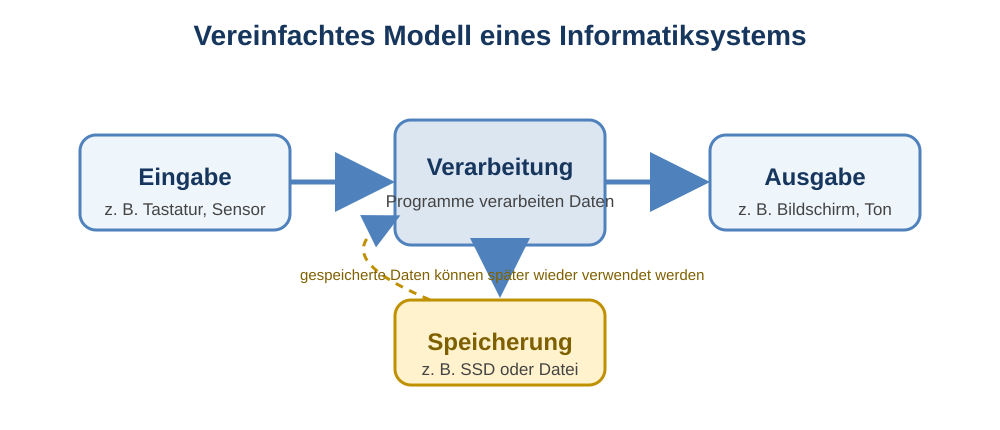

# 1 Informatik und Computer

## Was ist Informatik?

**Informatik** beschäftigt sich damit, wie Informationen dargestellt, gespeichert, verarbeitet und übertragen werden können. Dabei geht es nicht nur um klassische Computer. Auch Smartphones, Spielekonsolen, Fahrkartenautomaten, Navigationsgeräte, Smartwatches und viele Maschinen enthalten Informatiksysteme.

Informatik verbindet Ideen und Verfahren mit technischen Systemen. Menschen beschreiben ein Problem und entwickeln Regeln oder Programme, mit denen ein Informatiksystem Daten verarbeitet.

> **Merke:** Informatik ist mehr als die Bedienung eines Computers. Sie untersucht Informationen, Daten, Algorithmen und Informatiksysteme.

## Warum wurden Rechenmaschinen und Computer entwickelt?

Menschen mussten schon lange vor elektronischen Computern rechnen, Informationen sammeln und große Datenmengen verwalten. Mit zunehmender Menge und Komplexität wurden Hilfsmittel entwickelt, die solche Arbeiten schneller und zuverlässiger erledigen konnten.

Einige wichtige Stationen sind:

| Person / Entwicklung | Grundidee und Bedeutung |
|---|---|
| Blaise Pascal | entwickelte im 17. Jahrhundert eine mechanische Rechenmaschine für Additionen und Subtraktionen |
| Gottfried Wilhelm Leibniz | entwickelte Rechenmaschinen weiter und beschäftigte sich intensiv mit dem Dualsystem |
| Charles Babbage | entwarf im 19. Jahrhundert eine programmierbare mechanische Rechenmaschine |
| Ada Lovelace | beschrieb Verfahren für Babbages Maschine und gilt als wichtige Pionierin des Programmierens |
| Herman Hollerith | nutzte Lochkarten zur maschinellen Verarbeitung großer Datenmengen |
| Konrad Zuse | entwickelte mit der Z3 einen frühen programmgesteuerten Rechner |
| John von Neumann | prägte ein grundlegendes Rechnermodell, bei dem Programme und Daten im Speicher liegen |

Die Entwicklung verlief nicht in einem einzigen Schritt. Viele Personen verbesserten vorhandene Ideen oder lösten neue Probleme mit den technischen Möglichkeiten ihrer Zeit.

## Vom Rechnen zur digitalen Welt

Moderne Informatiksysteme werden längst nicht nur zum Rechnen eingesetzt. Drei Entwicklungen begegnen uns im Alltag besonders häufig.

### Digitalisierung

Bei der **Digitalisierung** werden Informationen oder Abläufe so dargestellt, dass Informatiksysteme sie verarbeiten können. Beispiele sind digitale Fotos, elektronische Fahrkarten, Musikdateien oder ein digitales Klassenbuch.

### Automatisierung

Bei der **Automatisierung** führt ein System Arbeitsschritte nach festgelegten Regeln selbstständig aus. Eine Waschmaschine steuert beispielsweise ihr Waschprogramm automatisch. Auch eine Rechtschreibprüfung oder eine automatische Lichtsteuerung sind Beispiele.

### Vernetzung

Bei der **Vernetzung** tauschen Informatiksysteme Daten miteinander aus. Ein Smartphone kann beispielsweise Daten mit einer Smartwatch, einem WLAN-Router oder einem Cloud-Dienst austauschen.

Diese Entwicklungen können gemeinsam auftreten. Eine Smartwatch erfasst Messwerte digital, verarbeitet sie automatisch und überträgt sie anschließend an ein Smartphone.

## Was ist ein Informatiksystem?

Ein **Informatiksystem** ist ein System zur Verarbeitung von Informationen. Dazu wirken mehrere Bestandteile zusammen:

- **Hardware** – körperliche Bestandteile wie Prozessor, Speicher, Tastatur, Bildschirm oder Sensoren,
- **Software** – Programme und zugehörige Daten,
- **Daten** – Informationen in einer Form, die das System verarbeiten kann,
- **Menschen und Nutzung** – Menschen geben Ziele vor, bedienen Systeme oder verwenden deren Ergebnisse.

Ein Smartphone ist deshalb ebenso ein Informatiksystem wie ein Notebook. Auch ein Fahrkartenautomat, ein Roboter oder eine moderne Waschmaschine kann ein Informatiksystem enthalten.

## Hardware und Software

**Hardware** kann man anfassen. Dazu gehören beispielsweise Prozessor, Arbeitsspeicher, SSD, Bildschirm, Tastatur, Kamera oder Mikrofon.

**Software** bezeichnet Programme und Daten, die auf der Hardware ausgeführt beziehungsweise verarbeitet werden.

Für den Einstieg lassen sich Programme grob unterscheiden:

- **Betriebssysteme** verwalten das Gerät und stellen grundlegende Funktionen bereit.
- **Anwendungsprogramme** unterstützen konkrete Aufgaben, beispielsweise Textverarbeitung, Bildbearbeitung oder Webbrowser.
- **Werkzeuge** helfen bei bestimmten technischen oder fachlichen Aufgaben.

Hardware und Software benötigen einander. Eine Textverarbeitung kann ohne geeignete Hardware nicht ausgeführt werden. Ein Computer ohne passende Software kann viele gewünschte Aufgaben nicht erfüllen.

> **Merke:** Ein nutzbares Informatiksystem entsteht durch das Zusammenspiel von Hardware, Software, Daten und Menschen.

## Ein vereinfachtes Modell

Viele Informatiksysteme lassen sich zunächst mit einem einfachen Blockbild beschreiben:

Eine Tastatur kann beispielsweise Eingaben liefern, ein Prozessor verarbeitet Daten, ein Bildschirm gibt Ergebnisse aus und eine SSD speichert Daten dauerhaft. Gespeicherte Daten können später wieder eingelesen und erneut verarbeitet werden. Dieses Modell wird im Kapitel zum EVA(S)-Prinzip genauer erklärt.

## Software und Lizenzen

Software darf nicht automatisch beliebig kopiert, verändert oder weitergegeben werden. Eine **Lizenz** legt fest, was erlaubt ist.

**Proprietäre Software** wird nach den Bedingungen des jeweiligen Rechteinhabers genutzt. Der Quelltext ist normalerweise nicht frei zugänglich.

Bei **Open-Source-Software** ist der Quelltext unter einer entsprechenden Lizenz zugänglich. Die Lizenz legt fest, unter welchen Bedingungen die Software genutzt, untersucht, verändert oder weitergegeben werden darf.

Dabei gilt:

> **Kostenlos bedeutet nicht automatisch Open Source.** Ebenso kann Open-Source-Software gegen Geld angeboten werden.

## Beispiele aus dem Alltag

| Informatiksystem | mögliche Eingaben | Verarbeitung | mögliche Ausgabe |
|---|---|---|---|
| Smartphone | Touchscreen, Mikrofon, Kamera | Apps und Betriebssystem verarbeiten Daten | Bildschirm, Lautsprecher |
| Fahrkartenautomat | Touchscreen, Kartenzahlung | Tarif und Zahlung werden verarbeitet | Fahrkarte, Anzeige |
| Smartwatch | Sensoren, Tasten | Messwerte werden ausgewertet | Display, Vibration |
| Spielekonsole | Controller | Spielprogramm berechnet den Spielzustand | Bild und Ton |

## Begriffe zum Nachschlagen

**Automatisierung:** selbstständiges Ausführen von Arbeitsschritten nach vorgegebenen Regeln.

**Digitalisierung:** Überführen von Informationen oder Abläufen in eine digital verarbeitbare Form.

**Hardware:** körperliche Bestandteile eines Informatiksystems.

**Informatik:** Wissenschaft von der systematischen Darstellung, Speicherung, Verarbeitung und Übertragung von Informationen.

**Informatiksystem:** System, in dem Hardware, Software und Daten zur Informationsverarbeitung zusammenwirken.

**Software:** Programme und Daten eines Informatiksystems.

**Vernetzung:** Verbindung von Informatiksystemen zum Austausch von Daten.
