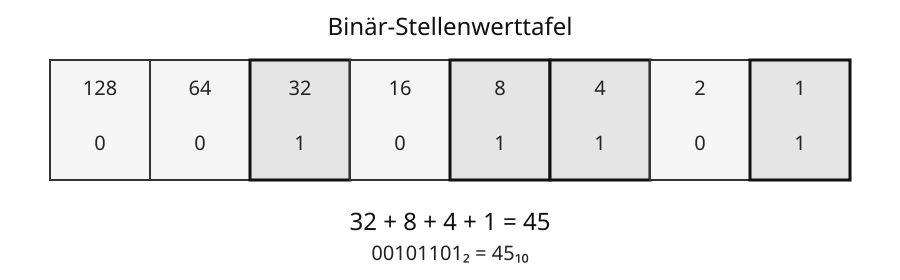

# 3 Das Binärsystem

## Zwei Ziffern reichen aus

Das **Binärsystem** oder **Dualsystem** verwendet nur die Ziffern 0 und 1. Computer können damit Daten darstellen, weil technische Bauteile zwei unterscheidbare Zustände besonders zuverlässig verarbeiten können.

Unser gewohntes **Dezimalsystem** verwendet die Ziffern 0 bis 9. Das Binärsystem verwendet nur 0 und 1. Trotzdem kann man mit beiden Systemen beliebig große ganze Zahlen darstellen.

## Stellenwerte verstehen

Bei einer Zahl hängt der Wert einer Ziffer davon ab, **an welcher Stelle** sie steht.

Im Dezimalsystem bedeutet die Zahl `352`:

| Stelle | Hunderter | Zehner | Einer |
|---|---:|---:|---:|
| Stellenwert | 100 | 10 | 1 |
| Ziffer | 3 | 5 | 2 |

Also:

```text
352 = 3 · 100 + 5 · 10 + 2 · 1
```

Im Binärsystem funktioniert das genauso. Der Unterschied ist nur: Die Stellenwerte sind nicht `1, 10, 100, 1000, ...`, sondern `1, 2, 4, 8, 16, 32, ...`.

Von rechts nach links verdoppelt sich also jeder Stellenwert:

```text
... 128   64   32   16   8   4   2   1
```



Für die Binärzahl `00101101₂` gilt:

| Stellenwert | 128 | 64 | 32 | 16 | 8 | 4 | 2 | 1 |
|---|---:|---:|---:|---:|---:|---:|---:|---:|
| Ziffer | 0 | 0 | 1 | 0 | 1 | 1 | 0 | 1 |

Nur die Stellen mit einer `1` zählen mit:

```text
32 + 8 + 4 + 1 = 45
```

Damit gilt:

```text
00101101₂ = 45₁₀
```

> **Merke:** Eine `1` bedeutet: Dieser Stellenwert wird mitgezählt. Eine `0` bedeutet: Dieser Stellenwert wird nicht mitgezählt.

## Binärzahl in Dezimalzahl umwandeln

Um eine Binärzahl in eine Dezimalzahl umzuwandeln, gehst du so vor:

1. Schreibe die passenden Stellenwerte über die Binärzahl.
2. Markiere alle Stellen, an denen eine `1` steht.
3. Addiere genau diese Stellenwerte.

Beispiel `1101₂`:

| Stellenwert | 8 | 4 | 2 | 1 |
|---|---:|---:|---:|---:|
| Ziffer | 1 | 1 | 0 | 1 |

Also:

```text
8 + 4 + 1 = 13
```

Damit gilt:

```text
1101₂ = 13₁₀
```

## Dezimalzahl in Binärzahl umwandeln – mit Stellenwerten

Bei kleinen Zahlen kann man überlegen, aus welchen Zweierpotenzen die Zahl zusammengesetzt ist.

Beispiel `13₁₀`:

```text
13 = 8 + 4 + 1
```

Daraus folgt:

```text
8  4  2  1
1  1  0  1
```

Also:

```text
13₁₀ = 1101₂
```

Diese Methode ist für kleine Zahlen sehr anschaulich. Für größere Zahlen gibt es ein systematisches Verfahren: die **fortgesetzte Division durch 2**.

## Dezimalzahl in Binärzahl umwandeln – Division durch 2

Teile die Dezimalzahl wiederholt durch 2. Notiere bei jeder Division den **Rest**. Da durch 2 geteilt wird, kann der Rest nur `0` oder `1` sein.

Beispiel: `45₁₀` soll in eine Binärzahl umgewandelt werden.

| Rechnung | Ergebnis | Rest |
|---|---:|---:|
| 45 : 2 | 22 | 1 |
| 22 : 2 | 11 | 0 |
| 11 : 2 | 5 | 1 |
| 5 : 2 | 2 | 1 |
| 2 : 2 | 1 | 0 |
| 1 : 2 | 0 | 1 |

Jetzt werden die Reste **von unten nach oben** gelesen:

```text
101101
```

Damit gilt:

```text
45₁₀ = 101101₂
```

Warum funktioniert das? Bei jeder Division durch 2 wird entschieden, ob die Zahl gerade oder ungerade ist. Der Rest zeigt deshalb jeweils die nächste Binärstelle von rechts nach links.

> **Merke:** Bei der Division-durch-2-Methode werden die Reste von **unten nach oben** gelesen.

## Kontrolle durch Rückumwandlung

Eine Umrechnung kann leicht überprüft werden, indem man die erhaltene Binärzahl wieder in eine Dezimalzahl umwandelt.

Für `101101₂`:

| Stellenwert | 32 | 16 | 8 | 4 | 2 | 1 |
|---|---:|---:|---:|---:|---:|---:|
| Ziffer | 1 | 0 | 1 | 1 | 0 | 1 |

Also:

```text
32 + 8 + 4 + 1 = 45
```

Die Umrechnung stimmt.

## Führende Nullen

`1101₂` und `00001101₂` besitzen denselben Zahlenwert. Zusätzliche Nullen links verändern den Wert nicht. In Informatiksystemen werden trotzdem oft feste Bitlängen verwendet, beispielsweise 8 Bit.

## Warum ist das wichtig?

Binärzahlen sind nicht nur zum Rechnen da. Bitfolgen können je nach Codierung Zahlen, Buchstaben, Farben, Töne oder andere Daten darstellen. Die gleiche Folge aus Nullen und Einsen kann deshalb unterschiedliche Bedeutungen haben, wenn eine andere Codierung verwendet wird.

> **Merke:** Im Binärsystem sind die Stellenwerte von rechts nach links `1, 2, 4, 8, 16, 32, ...`. Jede Stelle ist doppelt so viel wert wie die Stelle rechts daneben.

## Begriffe zum Nachschlagen

**Binärsystem/Dualsystem:** Stellenwertsystem mit den Ziffern 0 und 1.

**Dezimalsystem:** Stellenwertsystem mit den Ziffern 0 bis 9.

**Stellenwert:** Wert, den eine Position innerhalb einer Zahl besitzt.

**Zweierpotenz:** Zahl der Form 1, 2, 4, 8, 16, 32, 64, …

**Rest:** Wert, der bei einer Division übrig bleibt. Bei der Division durch 2 ist der Rest immer 0 oder 1.

→ Siehe auch **Kapitel 2: Informationen und Daten** und **Kapitel 8: Speicher und Datenmengen**.
