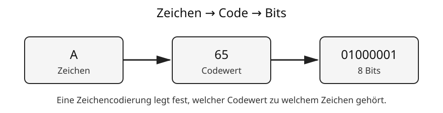

# 4 Texte im Computer

## Zeichen müssen codiert werden

Computer speichern Buchstaben nicht als kleine Bilder eines Buchstabens. Jedem Zeichen wird nach einer vereinbarten **Zeichencodierung** ein Zahlenwert zugeordnet. Dieser Zahlenwert kann anschließend binär gespeichert werden.

Vereinfacht entsteht folgende Kette:



```text
Zeichen → Codewert → Codierung als Bytes → Speicherung
```

Ein Text ist deshalb letztlich eine Folge von Zahlen beziehungsweise Bytes, die nach vereinbarten Regeln wieder als Zeichen interpretiert werden.

> **Merke:** Eine Textdatei speichert Zeichen nicht so, wie sie gedruckt aussehen, sondern in einer vereinbarten digitalen Codierung.

## Zeichen, Codepunkt und Byte sind nicht dasselbe

Diese Begriffe sollte man unterscheiden:

**Zeichen:** das gemeinte Symbol, beispielsweise `A`, `ä`, `€` oder `中`.

**Codepunkt:** eine eindeutige Nummer, die einem Zeichen in einem Zeichensatz zugeordnet ist.

**Bytes:** die tatsächlich gespeicherten Zahlenwerte, mit denen der Codepunkt nach einer bestimmten Codierung dargestellt wird.

Damit ergibt sich vereinfacht:

```text
Zeichen
  ↓
Unicode-Codepunkt
  ↓ UTF-8
ein oder mehrere Bytes
```

## Warum braucht man Standards?

Wenn zwei Systeme dieselben Daten unterschiedlich deuten, entstehen falsche Zeichen. Deshalb werden standardisierte Zeichencodierungen verwendet.

Stell dir vor, Computer A würde den Zahlenwert `65` als `A` verstehen, Computer B aber als `Z`. Ein Textaustausch wäre kaum möglich.

Standards sorgen dafür, dass unterschiedliche Programme und Geräte dieselben Zeichen möglichst gleich interpretieren.

## ASCII

Ein historisch wichtiger Standard ist **ASCII**. Er enthält unter anderem:

- lateinische Groß- und Kleinbuchstaben,
- Ziffern,
- Satzzeichen,
- Steuerzeichen.

Beispiele aus ASCII:

| Zeichen | Dezimalwert | Binärdarstellung des Wertes |
|---|---:|---|
| `A` | 65 | `01000001` |
| `B` | 66 | `01000010` |
| `a` | 97 | `01100001` |
| `0` | 48 | `00110000` |

ASCII war für frühe englischsprachige Computersysteme sehr nützlich, reicht aber für die Schriftsysteme und Sonderzeichen der Welt nicht aus.

## Unicode

**Unicode** verfolgt deshalb ein viel umfassenderes Ziel: Zeichen aus sehr vielen Sprachen und Zeichensystemen erhalten eindeutige **Codepunkte**.

Ein Codepunkt wird häufig in einer Schreibweise wie dieser angegeben:

```text
U+0041
```

`U+0041` bezeichnet den Buchstaben `A`.

Unicode enthält nicht nur lateinische Buchstaben, sondern beispielsweise auch griechische, kyrillische, arabische und ostasiatische Schriftzeichen sowie viele Symbole und Emoji.

> **Wichtig:** Unicode ist nicht einfach „eine Tabelle mit 256 Zeichen“. Der mögliche Zeichenvorrat ist wesentlich größer.

## UTF-8

Damit Unicode-Codepunkte in Dateien und Netzwerken gespeichert beziehungsweise übertragen werden können, braucht man eine konkrete Codierung. Eine sehr verbreitete ist **UTF-8**.

UTF-8 verwendet für ein Zeichen je nach Codepunkt unterschiedlich viele Bytes.

Das hat einen wichtigen Vorteil: Die klassischen ASCII-Zeichen werden in UTF-8 mit denselben einzelnen Bytewerten dargestellt wie in ASCII. Gleichzeitig kann UTF-8 sehr viel mehr Zeichen darstellen.

Deshalb ist UTF-8 heute besonders im Web und bei Textdateien weit verbreitet.

## Warum benötigt nicht jedes Zeichen gleich viel Speicher?

Bei UTF-8 kann ein Zeichen aus einem, zwei, drei oder vier Bytes bestehen.

Deshalb gilt nicht allgemein:

```text
1 Zeichen = 1 Byte
```

Für viele einfache lateinische Zeichen trifft das in UTF-8 zwar zu, für andere Zeichen nicht.

Das ist auch ein Grund, warum die Dateigröße eines Textes nicht allein aus der sichtbaren Zeichenzahl bestimmt werden kann.

## Was passiert bei einer falschen Zeichencodierung?

Wenn gespeicherte Bytes mit der falschen Codierung interpretiert werden, können unverständliche Zeichenfolgen entstehen.

Typisch sind Darstellungen, bei denen beispielsweise Umlaute plötzlich als mehrere merkwürdige Zeichen erscheinen.

Das bedeutet nicht unbedingt, dass die ursprünglichen Bytes beschädigt wurden. Häufig wurden sie nur mit der falschen Regel interpretiert.

Vereinfacht:

```text
richtige Bytes + richtige Codierung → richtiger Text
richtige Bytes + falsche Codierung  → falsche Zeichen
```

## Zeilenumbrüche und Steuerzeichen

Nicht jedes gespeicherte Zeichen ist als sichtbarer Buchstabe zu erkennen. Texte enthalten auch Steuerinformationen, beispielsweise für einen Zeilenumbruch.

Historisch und zwischen Betriebssystemen existieren unterschiedliche Konventionen für Zeilenenden. Moderne Programme können viele davon automatisch verarbeiten, bei Programmcode oder Datenaustausch können Unterschiede aber weiterhin auffallen.

## Zeichen, Schriftart und Darstellung

Die Codierung legt fest, **welches Zeichen** gemeint ist. Eine Schriftart legt dagegen fest, **wie dieses Zeichen aussieht**.

Beispielsweise bleibt der gespeicherte Buchstabe `A` derselbe, auch wenn er in verschiedenen Schriftarten unterschiedlich dargestellt wird.

```text
Zeichen/Codepunkt → Bedeutung des Zeichens
Schriftart        → grafische Form des Zeichens
```

Eine Schriftart muss außerdem eine passende grafische Darstellung, eine sogenannte Glyphe, für das Zeichen besitzen. Fehlt sie, kann ein Ersatzsymbol erscheinen.

## Textdatei und formatiertes Dokument

Eine **reine Textdatei** speichert im Wesentlichen Zeichen und einfache Steuerzeichen. Sie besitzt normalerweise keine eingebetteten Schriftarten, frei positionierten Bilder oder komplexe Seitengestaltung.

Typische Endung:

```text
.txt
```

Ein Dokument einer Textverarbeitung kann dagegen zusätzlich speichern:

- Schriftarten und Schriftgrößen,
- Überschriften,
- Farben,
- Tabellen,
- Bilder,
- Seitenränder,
- Kopf- und Fußzeilen,
- weitere Dokumentinformationen.

Beispiele sind `.odt` und `.docx`.

> **Merke:** Eine DOCX-Datei und eine TXT-Datei können denselben sichtbaren Text enthalten, sind intern aber sehr unterschiedlich aufgebaut.

## Dateiendung und tatsächliches Format

Die Dateiendung gibt einen Hinweis darauf, welches Format eine Datei besitzt. Sie ist aber nur ein Teil des Dateinamens.

Wenn man beispielsweise

```text
bericht.txt
```

in

```text
bericht.docx
```

umbenennt, wird aus der Textdatei dadurch **keine echte DOCX-Datei**. Das Dateiformat muss von einem geeigneten Programm erzeugt beziehungsweise konvertiert werden.

## Text als strukturierte Daten

Reiner Text kann auch verwendet werden, um strukturierte Daten zu speichern.

Beispiele sind Konfigurationsdateien, Programmcode oder Datenformate wie CSV und JSON. Die Zeichen bleiben Text, ihre Anordnung folgt aber zusätzlichen Regeln.

Beispiel CSV-artig:

```text
Name;Klasse;Alter
Lena;7a;13
Ali;7b;12
```

Dadurch kann ein Programm erkennen, welche Werte zusammengehören.

Ausführlicher wird die strukturierte Speicherung von Daten in späteren Klassen bei Datenbanken behandelt.

## Text suchen, kopieren und verarbeiten

Ein Vorteil digital codierter Texte besteht darin, dass Programme mit den Zeichen arbeiten können.

Sie können beispielsweise:

- Wörter suchen,
- Text sortieren,
- Zeichen ersetzen,
- Rechtschreibung prüfen,
- Inhalte kopieren,
- Text automatisch analysieren.

Dafür ist entscheidend, dass der Text tatsächlich als Zeichen gespeichert ist. Ein Foto einer Buchseite enthält zunächst Bildpixel und nicht automatisch den darin sichtbaren Text als Zeichen.

## Dateigröße

Die Größe eines Textes hängt unter anderem ab von:

- Anzahl der Zeichen,
- verwendeter Zeichencodierung,
- Art der Zeichen,
- zusätzlicher Formatierung,
- eingebetteten Bildern oder anderen Medien,
- Kompression des Dateiformats.

Eine reine Textdatei kann deshalb wesentlich kleiner sein als ein formatiertes Dokument mit demselben Text und mehreren Bildern.

## Begriffe zum Nachschlagen

**ASCII:** ältere standardisierte Zeichencodierung mit einem begrenzten Zeichenvorrat.

**Codepunkt:** eindeutige Nummer eines Zeichens im Unicode-Standard.

**Glyph:** grafische Darstellung eines Zeichens in einer Schriftart.

**Reine Textdatei:** Datei, die hauptsächlich codierte Zeichen ohne komplexe Dokumentformatierung speichert.

**Unicode:** Standard zur eindeutigen Zuordnung sehr vieler Zeichen aus unterschiedlichen Schriftsystemen.

**UTF-8:** weit verbreitete Codierung von Unicode-Codepunkten als Folge von ein bis vier Bytes.

**Zeichencodierung:** Regel, nach der Zeichen beziehungsweise Codepunkte als Zahlenwerte oder Bytefolgen dargestellt werden.

→ Siehe auch **Kapitel 2: Informationen und Daten**, **Kapitel 3: Das Binärsystem**, **Kapitel 8: Speicher und Datenmengen** und **Kapitel 9: Dateien, Ordner und Pfade**.