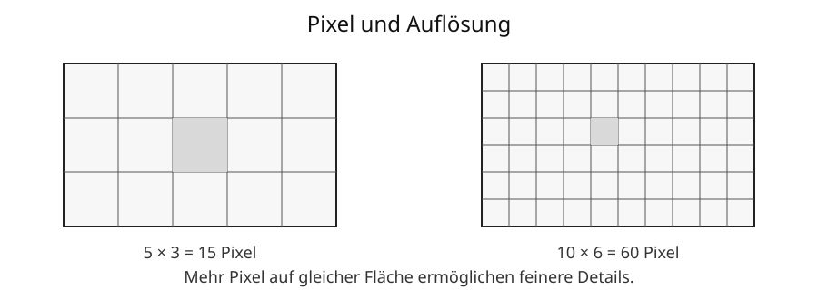

# 5 Bilder im Computer

## Wie wird aus einem Bild eine Datei?

Ein digitales Bild muss so beschrieben werden, dass ein Computer es speichern, verarbeiten und wieder darstellen kann. Dafür gibt es zwei wichtige Grundideen:

- **Rastergrafiken** beschreiben ein Bild durch viele einzelne Bildpunkte.
- **Vektorgrafiken** beschreiben grafische Objekte wie Linien, Kreise und Flächen.

Fotos werden meist als Rastergrafiken gespeichert. Logos, Symbole und technische Zeichnungen eignen sich häufig gut als Vektorgrafiken.

## Bilder aus Pixeln

Ein digitales Rasterbild besteht aus vielen kleinen Bildpunkten, den **Pixeln**. Jeder Pixel besitzt einen Farbwert.

Stark vereinfacht könnte ein winziges Schwarz-Weiß-Bild so aufgebaut sein:

```text
Pixelreihe 1: weiß weiß schwarz schwarz
Pixelreihe 2: weiß schwarz weiß schwarz
Pixelreihe 3: schwarz weiß weiß schwarz
```

In einer echten Bilddatei werden dafür Zahlenwerte gespeichert. Ein Bildbearbeitungsprogramm deutet diese Werte und zeigt daraus das Bild an.

Betrachtet man ein ausreichend fein aufgelöstes Bild aus normaler Entfernung, nimmt das Auge die einzelnen Pixel meist nicht getrennt wahr.

## Auflösung

Die **Auflösung** eines Rasterbildes wird häufig durch die Pixelzahl in Breite und Höhe angegeben.

Beispiel:

```text
1920 × 1080 Pixel
```

Die Gesamtzahl der Pixel beträgt:

```text
1920 × 1080 = 2 073 600 Pixel
```

Das sind ungefähr 2,1 Millionen Pixel beziehungsweise 2,1 Megapixel.



Bekannte Bezeichnungen sind beispielsweise:

| Bezeichnung | typische Auflösung |
|---|---:|
| HD | 1280 × 720 |
| Full HD | 1920 × 1080 |
| UHD / 4K UHD | 3840 × 2160 |

> **Wichtig:** Mehr Pixel ermöglichen mehr Bilddetails, garantieren aber nicht automatisch ein besseres Bild. Kamera, Objektiv, Licht, Kompression und Darstellung spielen ebenfalls eine Rolle.

## Bildgröße und Seitenverhältnis

Die Pixelmaße bestimmen auch das **Seitenverhältnis**.

Ein Bild mit `1920 × 1080` Pixel besitzt das Verhältnis:

```text
1920 : 1080 = 16 : 9
```

Wird ein Bild beim Skalieren nur in der Breite verändert, aber nicht passend in der Höhe, kann es verzerrt erscheinen.

Deshalb sollte beim normalen Vergrößern oder Verkleinern das Seitenverhältnis erhalten bleiben.

## Pixeldichte

Die **Pixeldichte** beschreibt, wie viele Pixel auf einer bestimmten Strecke dargestellt werden.

Bei Bildschirmen wird häufig **ppi** verwendet:

```text
ppi = pixels per inch
```

Je mehr Pixel auf derselben Fläche liegen, desto kleiner sind die einzelnen Pixel und desto feiner kann die Darstellung wirken.

Beim Drucken begegnet häufig **dpi**:

```text
dpi = dots per inch
```

Druckpunkte eines Druckers und Pixel eines Bildes sind technisch nicht dasselbe. Die Begriffe werden im Alltag trotzdem manchmal verwechselt.

## Farben als Zahlen

Ein Computer speichert die Farbe eines Pixels als Zahlenwerte. Bei Bildschirmen ist das **RGB-Farbmodell** sehr verbreitet.

```text
R = Rot
G = Grün
B = Blau
```

Bei 8 Bit pro Farbkanal kann jeder Kanal beispielsweise Werte von 0 bis 255 annehmen.

Beispiele:

| Farbe | R | G | B |
|---|---:|---:|---:|
| Schwarz | 0 | 0 | 0 |
| Weiß | 255 | 255 | 255 |
| Rot | 255 | 0 | 0 |
| Grün | 0 | 255 | 0 |
| Blau | 0 | 0 | 255 |
| Gelb | 255 | 255 | 0 |

Die Mischung geschieht bei Bildschirmen durch Licht. Rot, Grün und Blau werden deshalb als **additive Grundfarben** bezeichnet.

## Farbtiefe

Die **Farbtiefe** gibt vereinfacht an, wie viele Bits für die Farbinformation verwendet werden.

Bei 24-Bit-RGB werden typischerweise drei Kanäle mit je 8 Bit verwendet:

```text
8 Bit Rot + 8 Bit Grün + 8 Bit Blau = 24 Bit
```

Damit sind theoretisch

```text
2^24 = 16 777 216
```

verschiedene RGB-Wertkombinationen möglich.

Mehr Farbtiefe kann feinere Farbabstufungen ermöglichen, benötigt bei unkomprimierter Speicherung aber auch mehr Daten.

## Transparenz und Alpha-Kanal

Manche Bildformate können zusätzlich speichern, wie durchsichtig ein Pixel sein soll. Dafür kann ein **Alpha-Kanal** verwendet werden.

So kann beispielsweise ein Logo einen transparenten Hintergrund besitzen und auf unterschiedlichen Hintergründen verwendet werden.

JPEG unterstützt keine normale Alpha-Transparenz. PNG kann Transparenz speichern.

## Wie groß wäre ein unkomprimiertes Rasterbild?

Für ein einfaches RGB-Rasterbild ohne Kompression kann man überschlagen:

```text
Breite × Höhe × Byte pro Pixel
```

Beispiel:

```text
1000 × 1000 Pixel
3 Byte pro Pixel
```

also:

```text
1000 × 1000 × 3 = 3 000 000 Byte
```

Das sind ungefähr 3 MB in dezimaler Schreibweise.

Eine echte Bilddatei kann durch Dateikopf, Metadaten und vor allem Kompression eine andere Größe besitzen.

→ Datenmengen werden in **Kapitel 8: Speicher und Datenmengen** genauer erklärt.

## Kompression

Bilddateien können sehr groß werden. Deshalb verwenden viele Bildformate **Kompression**.

### Verlustfreie Kompression

Bei verlustfreier Kompression lassen sich die ursprünglichen digitalen Bilddaten vollständig wiederherstellen.

Das ist beispielsweise sinnvoll für:

- Grafiken mit klaren Kanten,
- Screenshots,
- Bilder, die ohne zusätzliche Qualitätsverluste gespeichert werden sollen.

PNG verwendet verlustfreie Kompression.

### Verlustbehaftete Kompression

Bei verlustbehafteter Kompression werden Bildinformationen dauerhaft vereinfacht oder entfernt, um kleinere Dateien zu erreichen.

JPEG verwendet typischerweise verlustbehaftete Kompression und eignet sich besonders für Fotos.

Bei zu starker Kompression können sichtbare Fehler entstehen, zum Beispiel blockartige Strukturen oder unsaubere Kanten.

> **Merke:** Eine stark komprimierte JPEG-Datei wird nicht wieder zum ursprünglichen Bild, nur weil sie später als PNG gespeichert wird. Bereits verlorene Bildinformation kommt dadurch nicht zurück.

## Wichtige Rasterformate

| Format | typische Eigenschaften und Verwendung |
|---|---|
| JPEG/JPG | Fotos, verlustbehaftete Kompression, keine normale Transparenz |
| PNG | verlustfreie Kompression, Transparenz möglich, gut für Screenshots und Grafiken |
| GIF | begrenzter Farbvorrat, einfache Animationen möglich |
| WebP | modernes Webformat, unterstützt je nach Variante verlustfreie oder verlustbehaftete Kompression und Transparenz |

Welches Format geeignet ist, hängt vom Zweck ab. Es gibt kein Format, das für jede Bildart automatisch das beste ist.

## Raster- und Vektorgrafik

Eine **Rastergrafik** speichert ein festes Raster aus Pixeln.

Eine **Vektorgrafik** beschreibt dagegen Objekte mathematisch, beispielsweise:

- eine Linie von Punkt A zu Punkt B,
- einen Kreis mit Mittelpunkt und Radius,
- ein Rechteck mit Position, Breite und Höhe,
- eine Fläche mit einer bestimmten Farbe.

Beim Vergrößern kann die Darstellung dieser Formen für die neue Größe erneut berechnet werden. Deshalb entstehen nicht die typischen großen quadratischen Pixel eines stark vergrößerten Rasterbildes.

| Rastergrafik | Vektorgrafik |
|---|---|
| besteht aus Pixeln | besteht aus beschriebenen Formen |
| besonders geeignet für Fotos | besonders geeignet für Logos, Symbole und Diagramme |
| besitzt eine feste Pixelauflösung | kann meist ohne Pixelbildung skaliert werden |
| einzelne Pixel können direkt bearbeitet werden | Objekte können getrennt verändert werden |
| Beispiele: JPEG, PNG | Beispiel: SVG |

Vektorgrafik bedeutet allerdings nicht, dass jede beliebige Grafik automatisch klein oder einfach ist. Sehr komplexe Vektorgrafiken können aus sehr vielen Objekten bestehen.

## SVG

**SVG** bedeutet **Scalable Vector Graphics**. Es ist ein verbreitetes Vektorgrafikformat und wird unter anderem im Web verwendet.

Eine Besonderheit: SVG-Dateien können ihre Formen als Text in einer XML-basierten Struktur beschreiben. Programme können diese Angaben lesen und daraus die Grafik zeichnen.

Viele didaktische Grafiken in diesem Nachschlagewerk werden deshalb als SVG verwendet: Linien und Beschriftungen bleiben auch beim Vergrößern scharf.

## Skalieren ist nicht dasselbe wie neue Details erzeugen

Bei einer Vektorgrafik können geometrische Formen für eine größere Darstellung neu berechnet werden.

Bei einem Rasterbild sind dagegen nur die vorhandenen Pixelinformationen bekannt. Wird ein kleines Rasterbild stark vergrößert, muss ein Programm zusätzliche Pixel aus den vorhandenen Werten berechnen. Dadurch entstehen aber nicht automatisch echte neue Bilddetails.

> **Merke:** Ein unscharfes kleines Foto erhält nicht einfach neue echte Details, nur weil seine Pixelzahl nachträglich vergrößert wird.

## Bildbearbeitung

Digitale Bilder lassen sich vielfältig bearbeiten, beispielsweise:

- zuschneiden,
- drehen,
- Größe ändern,
- Helligkeit und Kontrast verändern,
- Farben anpassen,
- Bereiche retuschieren,
- Text oder Formen ergänzen,
- mehrere Ebenen kombinieren.

Bei der Bearbeitung sollte man möglichst eine geeignete Ausgangsdatei behalten. Wiederholtes Speichern mit verlustbehafteter Kompression kann die Qualität weiter verschlechtern.

## Metadaten in Bildern

Bilddateien können neben den sichtbaren Pixeln weitere Informationen enthalten. Solche beschreibenden Daten heißen **Metadaten**.

Bei Fotos können dazu beispielsweise gehören:

- Aufnahmezeit,
- Kameramodell,
- Bildausrichtung,
- technische Aufnahmeparameter,
- unter Umständen Standortdaten.

Vor dem Veröffentlichen eines Fotos kann deshalb relevant sein, welche Metadaten die Datei enthält.

→ Zum verantwortungsvollen Umgang mit persönlichen Daten siehe **Kapitel 12**.

## Bilddatei, Bildschirm und Ausdruck

Dasselbe Bild kann auf verschiedenen Geräten unterschiedlich wirken. Gründe sind beispielsweise:

- unterschiedliche Bildschirmgröße,
- Pixeldichte,
- Helligkeit,
- Farbdarstellung,
- Druckverfahren,
- Papier.

Die Pixelzahl einer Datei ist deshalb nur eine von mehreren Größen, die die sichtbare Darstellung beeinflussen.

## Begriffe zum Nachschlagen

**Alpha-Kanal:** zusätzliche Information zur Transparenz von Pixeln.

**Auflösung:** bei Rasterbildern häufig Anzahl der Pixel in Breite und Höhe.

**Farbtiefe:** Anzahl der Bits, die zur Darstellung von Farbinformationen verwendet werden.

**Kompression:** Verfahren zur Verringerung der benötigten Datenmenge.

**Metadaten:** Daten, die andere Daten beschreiben, beispielsweise Aufnahmezeit eines Fotos.

**Pixel:** einzelner Bildpunkt eines Rasterbildes.

**Pixeldichte:** Anzahl von Pixeln auf einer bestimmten Strecke, häufig in ppi angegeben.

**Rastergrafik:** Bild, das aus einem Raster einzelner Pixel aufgebaut ist.

**RGB:** additives Farbmodell aus Rot, Grün und Blau.

**SVG:** verbreitetes Vektorgrafikformat; Abkürzung für Scalable Vector Graphics.

**Vektorgrafik:** Grafik, deren Elemente durch mathematisch beschriebene Formen dargestellt werden.

→ Siehe auch **Kapitel 2: Informationen und Daten**, **Kapitel 8: Speicher und Datenmengen**, **Kapitel 12: Daten verantwortungsvoll nutzen** und später das Kapitel **Computergrafik**.