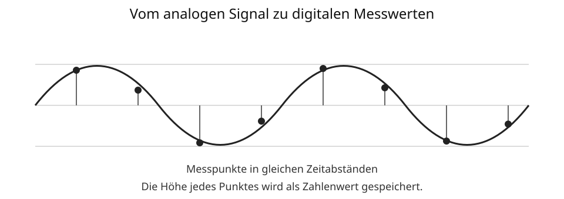

# 6 Audio im Computer

## Vom Schall zu digitalen Daten

Schall entsteht durch Schwingungen. Ein Mikrofon wandelt Schall zunächst in ein elektrisches Signal um. Damit ein Computer dieses Signal speichern und verarbeiten kann, wird es **digitalisiert**.

Dazu wird das Signal in sehr kurzen Zeitabständen gemessen. Jeder Messung wird ein Zahlenwert zugeordnet.



```text
Schall → Mikrofon → Messwerte → digitale Audiodaten
```

## Abtastrate

Die **Abtastrate** gibt an, wie oft das Signal pro Sekunde gemessen wird. Sie wird in Hertz angegeben. Eine höhere Abtastrate bedeutet mehr Messpunkte pro Sekunde und damit auch mehr zu speichernde Daten.

## Auflösung der Messwerte

Neben der Anzahl der Messungen ist wichtig, wie genau jeder einzelne Messwert gespeichert werden kann. Mehr mögliche Zahlenwerte erlauben eine feinere Abstufung, benötigen aber mehr Bits.

## Kanäle

Eine Monoaufnahme besitzt einen Audiokanal. Bei Stereo werden zwei Kanäle gespeichert, meist für links und rechts. Mehr Kanäle erhöhen ebenfalls die Datenmenge.

## Audiodateien und Kompression

Unkomprimierte Audiodaten können sehr groß sein. Deshalb werden häufig komprimierte Formate eingesetzt.

**Verlustfreie Kompression** verkleinert die Datenmenge, ohne Audiodaten dauerhaft zu entfernen. **Verlustbehaftete Kompression** entfernt Informationen, die für die Wahrnehmung als weniger wichtig eingeschätzt werden. Dadurch können Dateien deutlich kleiner werden.

Typische Dateiformate sind beispielsweise WAV, FLAC, MP3 oder AAC. Ein Dateiformat allein sagt jedoch nicht immer alles über Qualität und Kompression einer konkreten Datei aus.

## Datenmenge

Die benötigte Datenmenge wird unter anderem beeinflusst durch:

- Dauer der Aufnahme,
- Abtastrate,
- Genauigkeit der einzelnen Messwerte,
- Anzahl der Kanäle,
- verwendete Kompression.

> **Merke:** Digitales Audio besteht aus Zahlenwerten, die den zeitlichen Verlauf eines Tons ausreichend genau beschreiben.

## Begriffe zum Nachschlagen

**Abtastrate:** Anzahl der Messungen eines Signals pro Sekunde.

**Audiokanal:** getrennte Tonspur innerhalb einer Aufnahme, beispielsweise links oder rechts bei Stereo.

**Digitalisierung:** Umwandlung eines analogen Signals in digitale Daten.

**Kompression:** Verringerung der benötigten Datenmenge.

**Sampling/Abtastung:** regelmäßiges Messen eines analogen Signals.

→ Siehe auch **Kapitel 2: Informationen und Daten** und **Kapitel 8: Speicher und Datenmengen**.
