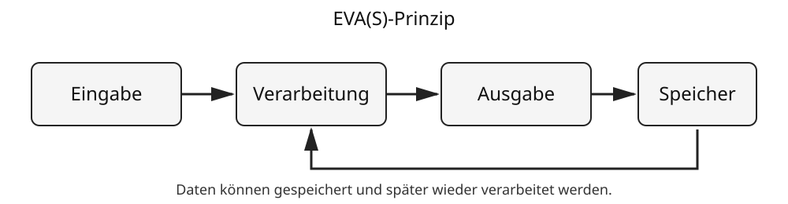

# 7 EVA(S)-Prinzip

## Ein Modell für Informationsverarbeitung

Viele Informatiksysteme lassen sich mit dem **EVA-Prinzip** beschreiben. Die drei Grundschritte sind:

```text
Eingabe → Verarbeitung → Ausgabe
```

Wird die **Speicherung** ausdrücklich einbezogen, spricht man häufig vom **EVA(S)-Prinzip**.



Die Grafik zeigt den grundlegenden Zusammenhang: Daten gelangen in ein System, werden nach festgelegten Regeln verarbeitet und Ergebnisse werden ausgegeben. Daten können außerdem gespeichert und später erneut verwendet werden.

> **Merke:** EVA(S) beschreibt nicht, wie ein Gerät aussieht, sondern welche Rolle Daten bei seiner Informationsverarbeitung spielen.

## E – Eingabe

Bei der **Eingabe** gelangen Daten in ein Informatiksystem.

Eingaben können bewusst durch Menschen erfolgen, beispielsweise mit:

- Tastatur,
- Maus,
- Touchscreen,
- Mikrofon,
- Kamera.

Daten können aber auch automatisch durch Sensoren erfasst werden:

- Temperatursensor,
- Helligkeitssensor,
- Bewegungssensor,
- Beschleunigungssensor,
- GPS-Empfänger beziehungsweise Positionsbestimmungssystem.

Eine Eingabe muss also nicht bedeuten, dass jemand auf eine Taste drückt.

## V – Verarbeitung

Bei der **Verarbeitung** werden Daten nach Regeln bearbeitet.

Ein System kann beispielsweise:

- rechnen,
- vergleichen,
- sortieren,
- suchen,
- filtern,
- Daten umwandeln,
- Entscheidungen nach programmierten Bedingungen treffen.

Beispiele:

```text
Temperatur < 0 °C?
```

oder

```text
Preis × Anzahl = Gesamtpreis
```

Die Verarbeitung wird durch Programme beziehungsweise festgelegte Algorithmen bestimmt.

## A – Ausgabe

Bei der **Ausgabe** stellt das System ein Ergebnis bereit oder bewirkt etwas in seiner Umgebung.

Ausgabegeräte sind beispielsweise:

- Bildschirm,
- Lautsprecher,
- Drucker,
- Kontrollleuchte,
- Motor.

Eine Ausgabe muss deshalb nicht sichtbar sein. Ein Warnton ist ebenso eine Ausgabe wie die Bewegung eines Motors.

## S – Speicherung

Daten können während oder nach einer Verarbeitung gespeichert werden.

Beispiele:

- ein Spiel speichert den Spielstand,
- eine Kamera speichert ein Foto,
- ein Browser speichert eine heruntergeladene Datei,
- eine Wetterstation speichert Messwerte,
- eine App speichert Einstellungen.

Dabei kann die Speicherung kurzzeitig oder dauerhaft erfolgen.

Der **Arbeitsspeicher (RAM)** stellt Daten für laufende Verarbeitung bereit. SSDs, Speicherkarten und andere dauerhafte Speicher behalten Daten auch nach dem Ausschalten.

→ Speicherarten und Datenmengen werden in **Kapitel 8** ausführlicher erklärt.

## Beispiel 1: Taschenrechner

Eine einfache Rechnung zeigt EVA besonders deutlich.

Der Nutzer gibt ein:

```text
7 + 5
```

| Schritt | Vorgang |
|---|---|
| Eingabe | `7`, `+` und `5` werden eingegeben |
| Verarbeitung | der Rechner führt die Addition aus |
| Ausgabe | `12` erscheint auf dem Display |
| Speicherung | je nach Rechner kann das Ergebnis zwischengespeichert werden |

Das Ergebnis `12` kann anschließend selbst wieder Eingabe für die nächste Rechnung sein.

## Beispiel 2: Smartphone-Kamera

Beim Fotografieren laufen mehrere Schritte ab.

| Schritt | Beispiel |
|---|---|
| Eingabe | Kamerasensor erfasst Licht; Nutzer betätigt den Auslöser |
| Verarbeitung | Bilddaten werden berechnet und beispielsweise korrigiert oder komprimiert |
| Ausgabe | Foto wird auf dem Bildschirm angezeigt |
| Speicherung | Bilddatei wird im Gerätespeicher abgelegt |

Hier erkennt man: Eine einzige Anwendung kann mehrere Eingaben besitzen. Der Sensor liefert Bilddaten, während der Nutzer über den Touchscreen einen Befehl gibt.

## Beispiel 3: Suchfunktion

Du suchst auf deinem Gerät nach einer Datei mit dem Namen `Referat`.

| Schritt | Beispiel |
|---|---|
| Eingabe | Suchwort `Referat` |
| Verarbeitung | Dateinamen und eventuell Inhalte werden durchsucht und verglichen |
| Ausgabe | passende Treffer werden angezeigt |
| Speicherung | die durchsuchten Dateien und ihre Metadaten liegen auf einem Speicher |

Die gespeicherten Daten sind hier eine wichtige Grundlage für die Verarbeitung.

## Beispiel 4: Automatische Lampe

Eine Lampe mit Bewegungs- und Helligkeitssensor kann ebenfalls mit EVA beschrieben werden.

```text
Bewegung + Helligkeit
        ↓
Prüfung der Bedingungen
        ↓
Lampe ein oder aus
```

| Schritt | Beispiel |
|---|---|
| Eingabe | Sensoren melden Bewegung und Helligkeit |
| Verarbeitung | System prüft: Bewegung erkannt UND dunkel genug? |
| Ausgabe | Lampe wird eingeschaltet oder bleibt aus |
| Speicherung | beispielsweise eingestellte Helligkeitsgrenze |

Damit wird deutlich, dass EVA(S) nicht nur für klassische PCs gilt.

## Beispiel 5: Musikstreaming

Auch ein vernetztes System lässt sich teilweise mit EVA(S) untersuchen.

| Schritt | Beispiel |
|---|---|
| Eingabe | Nutzer wählt ein Musikstück aus; Audiodaten kommen über das Netzwerk an |
| Verarbeitung | Daten werden empfangen, decodiert und für die Wiedergabe vorbereitet |
| Ausgabe | Lautsprecher erzeugt Schall |
| Speicherung | Teile der Daten können zwischengespeichert werden |

Das Netzwerk selbst wird durch EVA(S) jedoch nur sehr grob beschrieben. Für die genaue Kommunikation braucht man weitere Modelle und Protokolle, die in späteren Klassen behandelt werden.

## Ein Gerät kann gleichzeitig Eingabe und Ausgabe sein

Die Einteilung bezieht sich auf die **Funktion in einem bestimmten Vorgang**.

Ein **Touchscreen** ist beispielsweise:

- Ausgabe, wenn er ein Bild darstellt,
- Eingabe, wenn er Berührungen erfasst.

Ein Netzwerkanschluss kann Daten empfangen und senden. Er kann damit je nach Betrachtungsrichtung Eingabe und Ausgabe ermöglichen.

> **Merke:** Entscheidend ist nicht nur das Bauteil, sondern welche Rolle es im betrachteten Ablauf spielt.

## Ausgabe kann wieder Eingabe werden

In größeren Systemen sind mehrere Verarbeitungsschritte miteinander verbunden.

```text
System A: Eingabe → Verarbeitung → Ausgabe
                                  ↓
System B:                     Eingabe → Verarbeitung → Ausgabe
```

Die Ausgabe eines Systems kann also zur Eingabe eines anderen Systems werden.

Beispiel: Ein Temperatursensor liefert einen Messwert. Ein Steuerungsprogramm verwendet diesen Wert als Eingabe und entscheidet anschließend, ob eine Heizung eingeschaltet wird.

## Speicherung ist nicht immer der letzte Schritt

Das `S` in EVA(S) bedeutet nicht, dass Speicherung immer erst nach der Ausgabe stattfindet.

Gespeicherte Daten können an verschiedenen Stellen verwendet werden:

```text
gespeicherte Datei → Verarbeitung → Anzeige
```

oder

```text
Eingabe → Speicherung → spätere Verarbeitung
```

Beispiel: Eine Kamera speichert ein Foto. Tage später wird dieselbe Datei geöffnet und erneut verarbeitet, etwa beim Drehen oder Zuschneiden.

## EVA(S) als Denkmodell

Das Modell hilft besonders bei Fragen wie:

- Welche Daten gelangen in das System?
- Woher kommen diese Daten?
- Was geschieht mit ihnen?
- Welches Ergebnis entsteht?
- Wo werden Daten gespeichert?
- Welches Gerät übernimmt welche Rolle?

Damit kann man ein unbekanntes Informatiksystem zunächst in verständliche Teile zerlegen.

## Das Modell hat Grenzen

EVA(S) ist bewusst eine **Vereinfachung**.

Moderne Informatiksysteme können beispielsweise:

- viele Eingaben gleichzeitig verarbeiten,
- ständig Daten senden und empfangen,
- mehrere Programme parallel ausführen,
- aus vielen miteinander verbundenen Geräten bestehen,
- Verarbeitung auf verschiedene Rechner verteilen.

Ein Onlinespiel lässt sich deshalb nicht vollständig erklären, indem man nur vier Kästen mit E, V, A und S zeichnet. EVA(S) hilft beim Einstieg, für genauere Beschreibungen benötigt man weitere Modelle.

## EVA(S) und Fehleranalyse

Das Modell kann auch helfen, eine Störung einzugrenzen.

Beispiel: Bei einer Videokonferenz hört die andere Person dich nicht.

Mögliche Fragen nach EVA(S):

- **Eingabe:** Funktioniert das Mikrofon?
- **Verarbeitung:** Darf die Anwendung auf das Mikrofon zugreifen? Wird das Signal verarbeitet?
- **Ausgabe/Übertragung:** Werden die Daten an die Gegenstelle gesendet?
- **Speicherung:** Ist für diesen Fehler überhaupt Speicherung relevant?

EVA(S) löst den Fehler nicht automatisch, hilft aber, systematisch über den Datenweg nachzudenken.

## Begriffe zum Nachschlagen

**Ausgabe:** Bereitstellung eines Verarbeitungsergebnisses oder Wirkung eines Systems auf seine Umgebung.

**Eingabe:** Übernahme von Daten in ein Informatiksystem.

**EVA-Prinzip:** Modell der Informationsverarbeitung aus Eingabe, Verarbeitung und Ausgabe.

**EVA(S):** Erweiterung des EVA-Modells, bei der Speicherung ausdrücklich berücksichtigt wird.

**Sensor:** Bauteil beziehungsweise Gerät, das Eigenschaften der Umgebung erfasst und Messdaten bereitstellt.

**Speicherung:** Aufbewahrung von Daten zur späteren Verwendung.

**Verarbeitung:** Bearbeitung von Daten nach festgelegten Regeln.

→ Siehe auch **Kapitel 1: Informatik und Computer**, **Kapitel 2: Informationen und Daten**, **Kapitel 8: Speicher und Datenmengen** und das Kapitel **Mobile Endgeräte**.