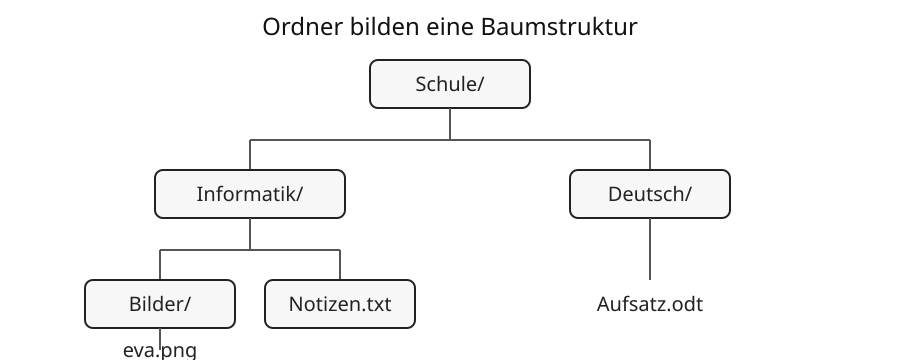

# 9 Dateien, Ordner und Pfade

## Dateien speichern Daten

Eine **Datei** ist eine zusammengehörige Menge gespeicherter Daten. Sie kann beispielsweise Text, ein Bild, Musik, ein Video oder Programmdaten enthalten.

Dateien besitzen einen Namen. Häufig endet der Name mit einer **Dateiendung** wie `.txt`, `.pdf`, `.png` oder `.mp3`. Die Endung gibt einen Hinweis auf das verwendete Dateiformat.

> **Wichtig:** Eine Dateiendung umzubenennen wandelt den Inhalt nicht automatisch in ein anderes Dateiformat um.

## Ordner schaffen Struktur

**Ordner** beziehungsweise **Verzeichnisse** helfen, Dateien und weitere Ordner zu strukturieren. Dadurch entsteht eine Baumstruktur. Ein übergeordneter Ordner kann mehrere Unterordner und Dateien enthalten. Dateien stehen am Ende eines solchen Pfades.



Im Beispiel ist `Schule` der oberste Ordner. Darin liegen die Ordner `Informatik` und `Deutsch`. Im Ordner `Informatik` befinden sich wiederum der Unterordner `Bilder` und die Datei `Notizen.txt`. Die Datei `eva.png` liegt im Unterordner `Bilder`.

## Pfade

Ein **Pfad** beschreibt den Weg zu einer Datei oder einem Verzeichnis.

Ein absoluter Pfad beginnt an einem festgelegten Ausgangspunkt des Dateisystems. Ein relativer Pfad beschreibt den Weg ausgehend vom aktuellen Verzeichnis.

Beispiel für einen relativen Pfad:

```text
Bilder/eva.png
```

Welches Trennzeichen verwendet wird, hängt vom Betriebssystem und vom jeweiligen Kontext ab. Unter Linux und macOS ist `/` üblich; Windows verwendet in vielen Darstellungen `\`.

## Sinnvolle Dateinamen

Gute Dateinamen helfen beim Wiederfinden. Sie sollten den Inhalt verständlich beschreiben und möglichst nach einem einheitlichen Schema aufgebaut sein.

Ein gut lesbarer Dateiname kann zum Beispiel so aussehen:

```text
2026-09-03_Referat_Binaersystem.odt
```

Der Name enthält das Datum, das Thema und die Dateiendung. Dadurch lässt sich die Datei auch später noch leicht zuordnen.

### Leerzeichen

Leerzeichen sind in modernen Betriebssystemen meist erlaubt. Sie können aber in Befehlszeilen, Internetadressen, Programmen oder beim Austausch zwischen verschiedenen Systemen zusätzliche Schwierigkeiten verursachen.

Für Dateien, die auf unterschiedlichen Geräten oder in verschiedenen Programmen verwendet werden sollen, sind **Unterstriche `_`** oder **Bindestriche `-`** oft robuster:

```text
Referat_Binaersystem.odt
Referat-Binaersystem.odt
```

### Sonderzeichen

Welche Zeichen erlaubt sind, hängt vom Betriebssystem und vom Dateisystem ab. Deshalb sollten Dateinamen möglichst ohne Zeichen auskommen, die eine besondere technische Bedeutung besitzen.

Besonders problematisch sind beispielsweise:

```text
/  \  :  *  ?  "  <  >  |
```

Unter Windows dürfen mehrere dieser Zeichen nicht in normalen Datei- oder Ordnernamen verwendet werden. `/` und `\` werden außerdem häufig als Bestandteile von Pfaden verwendet.

Umlaute wie `ä`, `ö`, `ü` und das `ß` funktionieren auf modernen Systemen normalerweise. Beim Datenaustausch mit älteren Geräten, speziellen Programmen oder Internetdiensten kann eine Schreibweise wie `ae`, `oe`, `ue` oder `ss` jedoch kompatibler sein.

### Reservierte Namen

Einige Betriebssysteme besitzen **reservierte Namen**, die eine besondere Bedeutung haben und deshalb nicht als normale Dateinamen verwendet werden können.

Unter Windows gehören dazu beispielsweise:

```text
CON  PRN  AUX  NUL
COM1 ... COM9
LPT1 ... LPT9
```

Auch Namen wie `CON.txt` sind dort problematisch, weil der reservierte Grundname erhalten bleibt.

### Groß- und Kleinschreibung

Betriebssysteme behandeln Groß- und Kleinschreibung nicht immer gleich. Auf einem System können `Foto.png` und `foto.png` als unterschiedliche Dateien gelten, auf einem anderen nicht.

Für einen zuverlässigen Austausch sollte man sich deshalb nicht darauf verlassen, Dateien nur durch Groß- und Kleinschreibung zu unterscheiden.

Ungünstig wäre beispielsweise:

```text
Referat.odt
referat.odt
```

Besser sind eindeutig unterschiedliche Namen.

### Punkte am Anfang oder Ende

Ein Punkt besitzt in Dateinamen häufig eine besondere Bedeutung. Er trennt meist den eigentlichen Namen von der Dateiendung:

```text
bericht.pdf
```

Unter Unix-ähnlichen Systemen kennzeichnet ein Punkt am Anfang häufig eine versteckte Datei, zum Beispiel `.config`. Unter Windows sind Namen, die mit einem Leerzeichen oder Punkt enden, problematisch beziehungsweise nicht als normale Dateinamen zulässig.

### Ein bewährtes Namensschema

Für schulische Dateien ist beispielsweise folgendes Schema gut geeignet:

```text
Datum_Thema_Version.Dateiendung
```

Beispiele:

```text
2026-09-03_Binaersystem_V1.odt
2026-09-10_Binaersystem_V2.odt
2026-09-15_Binaersystem_Abgabe.pdf
```

So ist sofort erkennbar, welche Datei neuer ist und welchen Stand sie enthält.

> **Merke:** Für möglichst kompatible Dateinamen sind Buchstaben, Ziffern, Bindestriche und Unterstriche eine gute Wahl. Vermeide technische Sonderzeichen, reservierte Namen und Unterschiede, die nur aus Groß- und Kleinschreibung bestehen.

Ungünstig sind Namen wie `neu2_final_finalwirklich.docx`, weil ihre Bedeutung später kaum noch nachvollziehbar ist.

## Kopieren, Verschieben und Löschen

Beim **Kopieren** entsteht eine zusätzliche Datei. Beim **Verschieben** ändert sich ihr Speicherort. Beim Löschen wird eine Datei je nach System zunächst in einen Papierkorb verschoben oder unmittelbar entfernt.

Vor wichtigen Änderungen sind Sicherungskopien sinnvoll.

## Dateiformat und Programm

Ein Dateiformat beschreibt, wie Daten innerhalb einer Datei organisiert sind. Programme müssen das Format verstehen, um die Datei korrekt zu öffnen oder zu bearbeiten. Manche Formate sind offen dokumentiert, andere hängen stärker von bestimmten Programmen ab.

> **Merke:** Eine gute Ordnerstruktur und verständliche Dateinamen sparen Zeit und verhindern Verwechslungen.

## Begriffe zum Nachschlagen

**Datei:** zusammengehörige gespeicherte Datenmenge.

**Dateiendung:** Teil des Dateinamens, der häufig auf das Format hinweist.

**Dateiformat:** festgelegte Struktur zur Speicherung bestimmter Daten.

**Ordner/Verzeichnis:** Struktur zum Gruppieren von Dateien und weiteren Verzeichnissen.

**Pfad:** Beschreibung des Speicherorts einer Datei oder eines Verzeichnisses.

**Reservierter Name:** vom Betriebssystem für eine besondere technische Bedeutung vorgesehener Name, der nicht frei als normaler Dateiname verwendet werden kann.

→ Siehe auch **Kapitel 8: Speicher und Datenmengen** und **Kapitel 13: Werkzeuge**.
