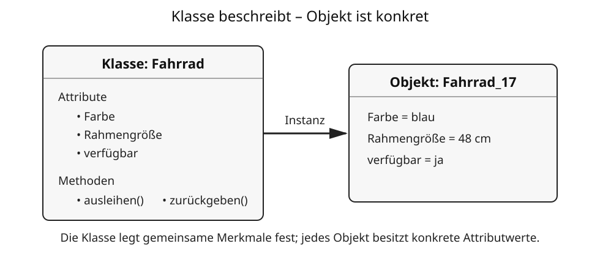

# 11 Objekte, Attribute, Klassen und Methoden

## Wirklichkeit vereinfacht beschreiben

In der Informatik werden Ausschnitte der Wirklichkeit häufig durch **Modelle** beschrieben. Ein Modell enthält nur Eigenschaften, die für eine bestimmte Aufgabe wichtig sind.

Ein Fahrrad kann beispielsweise als Objekt betrachtet werden. Für eine Fahrradverwaltung könnten Farbe, Rahmennummer und Größe wichtig sein. Das Material der Klingel wäre vielleicht unwichtig.

## Objekte

Ein **Objekt** ist ein konkretes einzelnes Element, über das Daten gespeichert oder verarbeitet werden.

Beispiel:

```text
Objekt: Fahrrad_17
Farbe: blau
Rahmengröße: 48 cm
verfügbar: ja
```

## Attribute und Attributwerte

Ein **Attribut** beschreibt eine Eigenschaft eines Objekts. Der **Attributwert** ist der konkrete Wert dieser Eigenschaft.

| Attribut | Attributwert |
|---|---|
| Farbe | blau |
| Rahmengröße | 48 cm |
| verfügbar | ja |

## Klassen

Objekte mit gemeinsamen Merkmalen können zu einer **Klasse** zusammengefasst werden. Die Klasse beschreibt, welche Attribute und möglichen Verhaltensweisen ihre Objekte besitzen.



```text
Klasse: Fahrrad
  Attribute:
    Farbe
    Rahmengröße
    verfügbar
```

`Fahrrad_17` wäre dann ein konkretes Objekt beziehungsweise eine Instanz dieser Klasse.

## Methoden

Eine **Methode** beschreibt eine Aktion, die im Zusammenhang mit einem Objekt ausgeführt werden kann. Bei einem digitalen Fahrradverleih könnten beispielsweise `ausleihen()` oder `zurückgeben()` sinnvolle Methoden sein.

Methoden können Attributwerte verändern. Nach `ausleihen()` könnte sich beispielsweise `verfügbar` von `ja` auf `nein` ändern.

## Modelle hängen vom Zweck ab

Dasselbe reale Ding kann in verschiedenen Informatiksystemen unterschiedlich modelliert werden. Eine Werkstatt benötigt andere Fahrraddaten als ein Verleihsystem.

> **Merke:** Ein Modell bildet nicht die gesamte Wirklichkeit ab. Es wählt die für eine Aufgabe wichtigen Merkmale aus.

## Begriffe zum Nachschlagen

**Attribut:** beschriebene Eigenschaft eines Objekts.

**Attributwert:** konkreter Wert eines Attributes.

**Klasse:** gemeinsame Beschreibung gleichartiger Objekte.

**Methode:** mögliche Aktion beziehungsweise Operation eines Objekts.

**Modell:** vereinfachte Darstellung eines Ausschnitts der Wirklichkeit.

**Objekt:** konkretes Element mit Eigenschaften und gegebenenfalls Verhalten.
