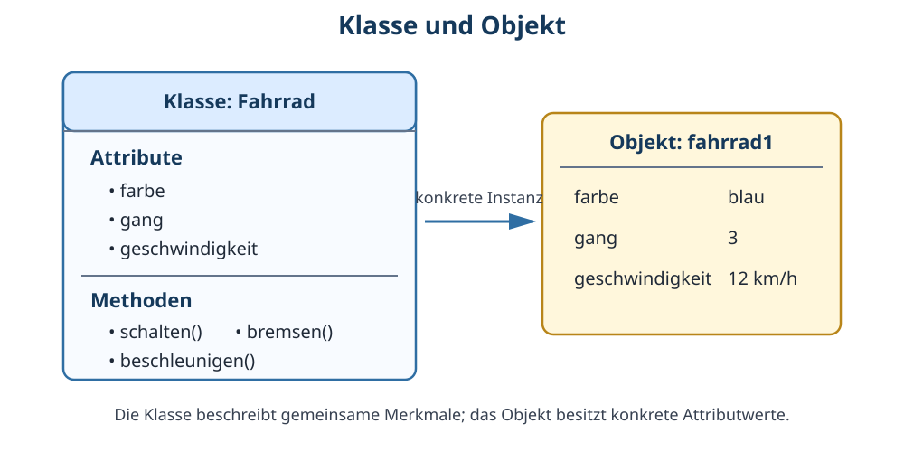

# 1 Objektorientierte Modellierung

## Vorwissen aus Klasse 7

In Klasse 7 wurden bereits **Objekte, Attribute, Klassen und Methoden** eingeführt. Dort ging es vor allem darum, diese Begriffe kennenzulernen und einfache Modelle zu verstehen.

In Klasse 8 wird dieses Vorwissen weitergeführt: Wir betrachten genauer, **warum Modelle benötigt werden**, wie Klassen aufgebaut sind, wie sich Objekte unterscheiden und wie Beziehungen zwischen Objekten beschrieben werden.

→ Zum Wiederholen siehe **Nachschlagewerk Klasse 7, Kapitel 11: Objekte, Attribute, Klassen und Methoden**.

## Warum Informatiker Modelle verwenden

Die Wirklichkeit ist meist zu umfangreich, um jedes Detail in einem Programm abzubilden. Deshalb wird für eine bestimmte Aufgabe ein vereinfachtes Modell erstellt.

Beispiel Schulbibliothek: Ein echtes Buch besitzt Papierart, Gewicht, Druckfarbe, Geruch, kleine Beschädigungen und sehr viele weitere Eigenschaften. Für ein Ausleihprogramm interessieren dagegen vielleicht nur:

- Titel,
- Autor,
- ISBN,
- Ausleihstatus,
- ausleihende Person.

Das Modell enthält also **nicht alles, was wahr ist**, sondern das, was für den Zweck wichtig ist.

> **Merke:** Ein Modell ist eine zweckbezogene Vereinfachung. Ein gutes Modell enthält nicht möglichst viele, sondern die passenden Informationen.

## Objektorientierte Sicht

Bei der **objektorientierten Modellierung** wird ein betrachteter Bereich als Zusammenspiel von Objekten beschrieben.

Ein Objekt besitzt typischerweise:

1. eine **Identität** – es ist ein bestimmtes Objekt,
2. einen **Zustand** – beschrieben durch aktuelle Attributwerte,
3. ein **Verhalten** – beschrieben durch mögliche Methoden.

Beispiel: `fahrrad1` ist ein bestimmtes Fahrrad. Sein Zustand könnte `farbe = blau`, `gang = 3` und `geschwindigkeit = 12 km/h` sein. Durch Methoden wie `schalten()` oder `bremsen()` kann sich dieser Zustand verändern.

## Klasse und Objekt

Eine **Klasse** beschreibt gemeinsame Merkmale und Verhaltensmöglichkeiten gleichartiger Objekte. Ein **Objekt** ist eine konkrete Ausprägung einer Klasse.



Die Klasse `Fahrrad` kann beispielsweise festlegen:

```text
Klasse Fahrrad

Attribute:
- farbe
- gang
- geschwindigkeit

Methoden:
- schalten()
- beschleunigen()
- bremsen()
```

Konkrete Objekte besitzen dann eigene Werte:

| Objekt | farbe | gang | geschwindigkeit |
|---|---|---:|---:|
| `fahrrad1` | blau | 3 | 12 km/h |
| `fahrrad2` | rot | 1 | 0 km/h |

Beide Objekte gehören zur Klasse `Fahrrad`, sind aber nicht dasselbe Objekt.

### Klasse ist nicht dasselbe wie Objekt

Die Klasse ist die **Beschreibung der gemeinsamen Struktur**. Das Objekt ist eine **konkrete Instanz** dieser Beschreibung.

Ein Vergleich aus dem Alltag kann helfen:

- Klasse → Bauplan beziehungsweise Typbeschreibung,
- Objekt → konkretes nach dieser Beschreibung betrachtetes Exemplar.

Der Vergleich ist nicht perfekt, verdeutlicht aber den Unterschied.

## Attribute und Attributwerte

Ein **Attribut** beschreibt eine Eigenschaft, die Objekte einer Klasse besitzen können. Der **Attributwert** ist der konkrete Wert bei einem bestimmten Objekt.

Beispiel:

```text
Attribut: farbe
Attributwert von fahrrad1: blau
Attributwert von fahrrad2: rot
```

Attribute besitzen in Programmen häufig einen **Datentyp**. Beispiele:

| Attribut | möglicher Datentyp | Beispielwert |
|---|---|---|
| `farbe` | Text/String | `"blau"` |
| `gang` | ganze Zahl/Integer | `3` |
| `geschwindigkeit` | Zahl | `12.5` |
| `lichtAn` | Wahrheitswert/Boolean | `true` |

Datentypen helfen festzulegen, welche Werte sinnvoll gespeichert und welche Operationen damit durchgeführt werden können.

## Der Zustand eines Objekts

Die Gesamtheit der aktuellen Attributwerte beschreibt den **Zustand** eines Objekts.

Beispiel:

```text
fahrrad1:
farbe = blau
gang = 3
geschwindigkeit = 12
lichtAn = true
```

Ändert sich ein Attributwert, ändert sich der Zustand des Objekts.

## Methoden beschreiben Verhalten

Eine **Methode** beschreibt eine Operation, die zu einem Objekt beziehungsweise seiner Klasse gehört.

Beispiel `schalten(neuerGang)`:

```text
Methode schalten(neuerGang)
    gang := neuerGang
Ende
```

Die Methode verändert den Zustand des Fahrrads.

Eine Methode kann:

- Attributwerte lesen,
- Attributwerte verändern,
- Berechnungen durchführen,
- Entscheidungen treffen,
- andere Methoden aufrufen,
- ein Ergebnis zurückgeben.

### Parameter

Methoden benötigen manchmal zusätzliche Informationen. Diese werden als **Parameter** übergeben.

```text
beschleunigen(betrag)
```

`betrag` ist ein Parameter. Dadurch kann dieselbe Methode mit verschiedenen Werten verwendet werden.

### Rückgabewert

Eine Methode kann ein Ergebnis zurückgeben.

```text
istInBewegung()
    Rückgabe geschwindigkeit > 0
```

Der Rückgabewert könnte hier `wahr` oder `falsch` sein.

## Konstruktor – ein Objekt erhält Anfangswerte

Beim Erzeugen eines neuen Objekts müssen häufig Anfangswerte festgelegt werden. Viele Programmiersprachen verwenden dafür einen **Konstruktor**.

Vereinfacht:

```text
neues Fahrrad("blau")
```

Dadurch könnte ein neues Fahrradobjekt entstehen, dessen Farbe von Anfang an `blau` ist.

Die genaue Schreibweise hängt von der Programmiersprache ab. Entscheidend ist die Idee: **Ein neu erzeugtes Objekt erhält einen definierten Anfangszustand.**

## Beziehungen zwischen Objekten

Objekte existieren in Modellen selten völlig unabhängig voneinander.

Beispiel Schule:

```text
Schueler ─ gehört zu ─ Schulklasse
```

Ein Objekt `lena` der Klasse `Schueler` kann mit einem Objekt `klasse8a` der Klasse `Schulklasse` verbunden sein.

Weitere Beispiele:

- ein `Buch` ist an einen `Benutzer` ausgeliehen,
- ein `Auto` besitzt `Rad`-Objekte,
- eine `Bestellung` enthält mehrere `Artikel`,
- eine `Mannschaft` besteht aus mehreren `Spieler`-Objekten.

Solche Beziehungen helfen, größere Systeme in verständliche Teile zu zerlegen.

## Kardinalitäten – wie viele Objekte gehören zusammen?

Bei Beziehungen ist häufig wichtig, **wie viele** Objekte beteiligt sein können.

Beispiele:

- Eine Schulklasse hat viele Schüler.
- Ein Schüler gehört in einem vereinfachten Modell genau einer Schulklasse an.
- Ein Kunde kann mehrere Bestellungen besitzen.

Häufige Angaben sind:

| Angabe | Bedeutung |
|---|---|
| `1` | genau ein Objekt |
| `0..1` | kein oder ein Objekt |
| `*` beziehungsweise `0..*` | beliebig viele, auch keines |
| `1..*` | mindestens ein Objekt |

Solche Mengenangaben nennt man **Kardinalitäten** beziehungsweise Multiplizitäten.

## Assoziation, Aggregation und Komposition – kurze Einordnung

Nicht jede Beziehung ist gleich stark. Für Klasse 8 genügt zunächst folgende Einordnung:

**Assoziation:** allgemeine Beziehung zwischen Objekten.  
Beispiel: Ein Schüler **besucht** einen Kurs.

**Aggregation:** ein Objekt besteht aus anderen Objekten, die grundsätzlich auch unabhängig betrachtet werden können.  
Beispiel: Eine Mannschaft besteht aus Spielern; ein Spieler kann grundsätzlich auch ohne diese konkrete Mannschaft existieren.

**Komposition:** besonders starke Teil-Ganzes-Beziehung. Ein Teil gehört im Modell fest zum Ganzen.  
Beispiel: Ein Hausmodell enthält Zimmer, die in diesem Modell als feste Bestandteile dieses Hauses betrachtet werden.

Die genaue Unterscheidung kann je nach Modellierungszweck unterschiedlich sinnvoll sein. Wichtig ist zunächst, Beziehungen bewusst zu beschreiben statt nur einzelne Klassen nebeneinanderzustellen.

## Abstraktion

Bei der **Abstraktion** werden unwichtige Einzelheiten weggelassen und wichtige Gemeinsamkeiten hervorgehoben.

Für ein Schulbibliotheksprogramm kann bei einem Buch wichtig sein:

```text
Buch
- titel
- autor
- isbn
- ausgeliehen
```

Nicht benötigt werden vielleicht Papierdicke oder Druckmaschinentyp.

Für eine Druckerei könnte dagegen gerade die Papierart wichtig sein. Ein Modell ist also immer vom **Zweck** abhängig.

## Kapselung – Daten nicht beliebig verändern

In objektorientierten Programmen soll häufig nicht jeder Programmteil beliebig auf alle inneren Daten eines Objekts zugreifen. Stattdessen stellt ein Objekt geeignete Methoden bereit.

Beispiel Bankkonto:

Ungünstige Vorstellung:

```text
kontostand := -1000000
```

Besser kann das Objekt eine Methode anbieten:

```text
abheben(betrag)
```

Die Methode kann vorher prüfen, ob die gewünschte Änderung zulässig ist.

Dieses Zusammenfassen von Daten und dazugehörigem Verhalten sowie das kontrollierte Verbergen innerer Details gehört zur Idee der **Kapselung**.

> **Merke:** Ein Objekt soll möglichst selbst darauf achten können, dass sein Zustand sinnvoll verändert wird.

## Sichtbarkeit – kurze Einordnung

Viele objektorientierte Programmiersprachen unterscheiden, welche Bestandteile einer Klasse von außen sichtbar sind. Häufig begegnen Begriffe wie:

- `public` – von außen zugänglich,
- `private` – nur innerhalb der Klasse zugänglich.

Die genaue Bedeutung hängt von der Programmiersprache ab. Die Grundidee ist jedoch wichtig: Nicht jedes interne Detail muss Teil der öffentlich nutzbaren Schnittstelle sein.

## Vererbung – Gemeinsamkeiten wiederverwenden

Klassen können gemeinsame Eigenschaften besitzen.

Beispiel:

```text
Fahrzeug
- geschwindigkeit
- beschleunigen()

Fahrrad ist ein Fahrzeug
Auto ist ein Fahrzeug
```

Bei **Vererbung** kann eine speziellere Klasse Merkmale einer allgemeineren Klasse übernehmen und ergänzen.

Dabei sollte Vererbung nur verwendet werden, wenn tatsächlich eine sinnvolle **Ist-ein-Beziehung** besteht:

- Fahrrad **ist ein** Fahrzeug → plausibel,
- Motor **ist ein** Auto → falsch; ein Motor ist Teil eines Autos.

Für Klasse 8 reicht es, die Grundidee zu kennen. Umfangreiche Vererbungshierarchien sind noch nicht erforderlich.

## Objektorientiertes Modell und Programmcode

Ein Modell ist noch nicht automatisch ein fertiges Programm. Es hilft zunächst, die Struktur des Problems zu verstehen.

Vereinfacht kann der Weg so aussehen:

```text
Problem aus der Wirklichkeit
        ↓
wichtige Objekte erkennen
        ↓
Klassen bilden
        ↓
Attribute und Methoden festlegen
        ↓
Beziehungen beschreiben
        ↓
Modell prüfen
        ↓
später in Programmcode umsetzen
```

Die konkrete Syntax hängt anschließend von der verwendeten Programmiersprache ab.

## Beispiel: Schulbibliothek modellieren

Ein mögliches vereinfachtes Modell enthält:

### Klasse Buch

```text
Attribute:
- titel: Text
- autor: Text
- isbn: Text
- ausgeliehen: Wahrheitswert

Methoden:
- ausleihen()
- zurueckgeben()
```

### Klasse Benutzer

```text
Attribute:
- name: Text
- benutzerNummer: Zahl

Methoden:
- anzeigen()
```

### Beziehung

Ein Benutzer kann mehrere Bücher ausgeliehen haben. Ein Buch ist zu einem Zeitpunkt entweder nicht ausgeliehen oder einem Benutzer zugeordnet.

Dieses Modell ist bewusst vereinfacht. Ein echtes Bibliothekssystem müsste beispielsweise Vormerkungen, mehrere Exemplare eines Titels, Fristen und Benutzerrechte berücksichtigen.

Gerade daran erkennt man den Zweck von Modellen: Man beginnt mit den **für die Aufgabe benötigten Strukturen** und erweitert sie bei Bedarf.

## Typische Modellierungsfehler

### Klasse und Objekt verwechseln

`Fahrrad` ist eine Klasse, `fahrrad1` ein konkretes Objekt.

### Attribut und Wert verwechseln

`farbe` ist das Attribut, `blau` ein möglicher Wert.

### Methode als gespeicherte Eigenschaft behandeln

`geschwindigkeit` ist ein Zustand; `beschleunigen()` beschreibt Verhalten.

### Zu viele Details aufnehmen

Ein Modell wird unübersichtlich, wenn Informationen enthalten sind, die für seinen Zweck keine Rolle spielen.

### Beziehungen vergessen

Einzelne Klassen können korrekt aussehen und trotzdem kein brauchbares Gesamtmodell bilden, wenn ihre Zusammenhänge fehlen.

## Begriffe zum Nachschlagen

**Abstraktion:** bewusstes Weglassen unwichtiger Einzelheiten und Hervorheben wichtiger Eigenschaften.

**Assoziation:** allgemeine Beziehung zwischen Objekten beziehungsweise Klassen.

**Attribut:** benannte Eigenschaft eines Objekts.

**Attributwert:** konkreter Wert eines Attributes bei einem Objekt.

**Instanz:** anderes Wort für ein konkretes Objekt einer Klasse.

**Kapselung:** Zusammenfassen von Daten und Verhalten sowie kontrollierter Zugriff auf innere Details eines Objekts.

**Kardinalität:** Angabe, wie viele Objekte an einer Beziehung beteiligt sein können.

**Klasse:** gemeinsame Beschreibung gleichartiger Objekte mit Attributen und Methoden.

**Komposition:** starke Teil-Ganzes-Beziehung in einem objektorientierten Modell.

**Konstruktor:** besondere Operation zur Erzeugung beziehungsweise Initialisierung eines neuen Objekts.

**Methode:** Operation beziehungsweise Verhalten, das einer Klasse oder einem Objekt zugeordnet ist.

**Objekt:** konkrete Instanz einer Klasse mit eigener Identität und eigenem Zustand.

**Parameter:** Wert, der einer Methode beim Aufruf übergeben wird.

**Rückgabewert:** Ergebnis, das eine Methode an den aufrufenden Programmteil zurückgeben kann.

**Vererbung:** Beziehung, bei der eine speziellere Klasse Eigenschaften und Verhalten einer allgemeineren Klasse übernehmen kann.

**Zustand:** Gesamtheit der aktuellen Attributwerte eines Objekts.

→ Weiterführung: **Kapitel 2 Algorithmen** zeigt, wie Abläufe und Verarbeitung beschrieben werden. In späteren Klassen werden Modelle, Datenstrukturen und Softwareentwurf weiter vertieft.