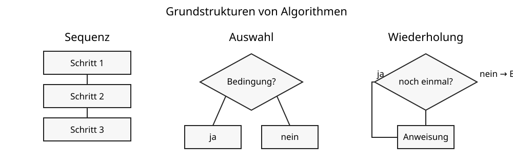

# 2 Algorithmen

## Was ist ein Algorithmus?

Ein **Algorithmus** ist eine eindeutige Handlungsvorschrift zur Lösung einer Aufgabe. Er besteht aus einzelnen Schritten, die in einer festgelegten Weise ausgeführt werden.

Alltagsanleitungen können ähnlich aufgebaut sein, aber Informatikalgorithmen müssen so eindeutig formuliert sein, dass ihre Schritte zuverlässig ausgeführt werden können.

## Grundstrukturen

Viele Algorithmen lassen sich aus drei grundlegenden Strukturen zusammensetzen.



### Sequenz

Anweisungen werden nacheinander ausgeführt.

```text
Schritt A
Schritt B
Schritt C
```

### Auswahl

Bei einer **Auswahl** entscheidet eine Bedingung, ob eine Anweisung ausgeführt wird oder welcher von mehreren möglichen Wegen gewählt wird.

Eine Auswahl kann **ohne SONST-Zweig** formuliert werden:

```text
WENN Bedingung
    DANN Anweisung A
```

Ist die Bedingung wahr, wird `Anweisung A` ausgeführt. Ist sie falsch, wird diese Anweisung übersprungen und der Algorithmus läuft danach weiter.

Eine Auswahl kann auch **mit SONST-Zweig** formuliert werden:

```text
WENN Bedingung
    DANN Anweisung A
SONST
    Anweisung B
```

> **Merke:** Ein `SONST` ist nicht bei jeder Auswahl notwendig. Es wird gebraucht, wenn auch für den Fall „Bedingung ist falsch“ eine eigene Anweisung ausgeführt werden soll.

### Wiederholung

Eine **Wiederholung** oder **Schleife** führt eine oder mehrere Anweisungen mehrfach aus. Welche Schleifenart geeignet ist, hängt davon ab, wann geprüft wird und ob die Anzahl der Wiederholungen vorher bekannt ist.

#### Kopfgesteuerte Schleife

Bei einer **kopfgesteuerten Schleife** wird die Bedingung **vor** jedem Schleifendurchlauf geprüft.

```text
SOLANGE Bedingung gilt
    wiederhole Anweisung
```

Ist die Bedingung bereits am Anfang falsch, wird die Schleife kein einziges Mal ausgeführt.

#### Fußgesteuerte Schleife

Bei einer **fußgesteuerten Schleife** wird die Bedingung **nach** dem Schleifendurchlauf geprüft. Deshalb wird der Schleifenrumpf mindestens einmal ausgeführt.

```text
WIEDERHOLE
    Anweisung
SOLANGE Bedingung gilt
```

#### Zählschleife

Eine **Zählschleife** verwendet man, wenn die Anzahl der Wiederholungen vorher bekannt ist.

```text
FÜR i VON 1 BIS 5
    Anweisung
```

#### Bedingte Wiederholung

Bei einer **bedingten Wiederholung** ist die Anzahl der Durchläufe vorher nicht unbedingt bekannt. Die Schleife endet erst, wenn eine bestimmte Bedingung erfüllt oder nicht mehr erfüllt ist.

#### Endlosschleife

Eine **Endlosschleife** besitzt keine wirksame Abbruchbedingung und läuft deshalb unbegrenzt weiter, solange das Programm nicht von außen beendet wird.

Endlosschleifen können beabsichtigt sein, zum Beispiel bei einem eingebetteten System, das dauerhaft auf Sensordaten reagieren soll. Sie können aber auch unbeabsichtigt entstehen, wenn sich eine Abbruchbedingung niemals ändert.

| Schleifenart | Prüfung | Mindestens ein Durchlauf? | Typischer Einsatz |
|---|---|---:|---|
| kopfgesteuert | vor dem Durchlauf | nein | solange eine Bedingung gilt |
| fußgesteuert | nach dem Durchlauf | ja | etwas mindestens einmal ausführen |
| Zählschleife | über Zähler/Anzahl | abhängig von der Anzahl | bekannte Wiederholungszahl |
| bedingte Wiederholung | über Bedingung | abhängig von der Form | unbekannte Wiederholungszahl |
| Endlosschleife | keine wirksame Beendigung | ja | dauerhafte Prozesse oder Programmfehler |

## Verschachtelungen

Grundstrukturen können **ineinander verschachtelt** werden. Das bedeutet: Innerhalb einer Auswahl oder Schleife befindet sich eine weitere Auswahl oder Schleife.

### Verschachtelte Bedingungen

```text
WENN alter >= 18
    DANN
        WENN fuehrerscheinVorhanden
            DANN zeige "Fahren erlaubt"
```

### Bedingung innerhalb einer Schleife

```text
FÜR i VON 1 BIS 10
    WENN i ist gerade
        DANN zeige i
```

### Verschachtelte Schleifen

```text
FÜR zeile VON 1 BIS 3
    FÜR spalte VON 1 BIS 4
        setze Punkt
```

Die innere Schleife läuft viermal für jede der drei Zeilen. Insgesamt wird `setze Punkt` also `3 · 4 = 12` Mal ausgeführt.

> **Merke:** Bei verschachtelten Schleifen wird die innere Schleife für jeden Durchlauf der äußeren Schleife erneut vollständig ausgeführt.

## Bedingungen

Eine **Bedingung** ist ein Ausdruck, dessen Ergebnis wahr oder falsch ist. Beispiele sind `zahl > 10`, `tuerOffen` oder `farbe == rot`. Bedingungen ermöglichen Entscheidungen und steuern Wiederholungen.

## Variablen

### Wozu braucht man Variablen?

Eine **Variable** ist ein benannter Speicherplatz für einen Wert, den ein Algorithmus während seiner Ausführung benötigt. Der Name ermöglicht es, später wieder auf diesen Wert zuzugreifen.

Variablen werden beispielsweise verwendet, um:

- einen Zwischenwert einer Berechnung zu speichern,
- Punkte oder Durchläufe zu zählen,
- eine Eingabe zu merken,
- einen Messwert aufzubewahren,
- einen Zustand wie `tuerOffen` zu speichern,
- Ergebnisse später erneut zu verwenden.

Beispiel: Ein Spiel muss sich den aktuellen Punktestand merken. Statt an jeder Stelle des Algorithmus eine feste Zahl einzutragen, wird der Wert in der Variablen `punkte` gespeichert.

### Zuweisung

Mit einer **Zuweisung** erhält eine Variable einen Wert. In Pseudocode wird dafür häufig `:=` verwendet:

```text
punkte := 0
```

Das bedeutet: **Der Variablen `punkte` wird der Wert 0 zugewiesen.**

Eine Zuweisung ist nicht dasselbe wie ein mathematisches Gleichheitszeichen. Das wird besonders deutlich bei:

```text
punkte := punkte + 1
```

Der Computer liest zuerst den bisherigen Wert von `punkte`, addiert 1 und speichert das Ergebnis anschließend wieder in `punkte`.

Angenommen, `punkte` besitzt vorher den Wert 4:

```text
punkte := punkte + 1
          4      + 1
punkte := 5
```

In der Mathematik wäre `punkte = punkte + 1` als Gleichung unmöglich. In einem Programm beschreibt die Anweisung dagegen eine **Änderung des gespeicherten Wertes**.

Programmiersprachen verwenden für Zuweisungen unterschiedliche Schreibweisen. Häufig findet man beispielsweise `=`, während in Pseudocode und algorithmischen Darstellungen `:=` besonders deutlich zwischen Zuweisung und Vergleich unterscheidet.

> **Merke:** `:=` bedeutet „bekommt den Wert“. Rechts wird zuerst berechnet, anschließend wird das Ergebnis links gespeichert.

### Datentypen

Variablen besitzen in vielen Programmiersprachen einen **Datentyp**. Der Datentyp beschreibt, welche Art von Wert gespeichert wird und welche Operationen damit sinnvoll oder erlaubt sind.

Typische Datentypen sind:

| Datentyp | Bedeutung | Beispiel |
|---|---|---|
| Ganzzahl | ganze Zahlen ohne Nachkommastellen | `alter := 14` |
| Gleitkommazahl/Dezimalzahl | Zahlen mit Nachkommastellen | `temperatur := 21.5` |
| Zeichen | einzelnes Zeichen | `taste := 'A'` |
| Zeichenkette/Text | Folge von Zeichen | `name := "Mia"` |
| Wahrheitswert/Boolean | wahr oder falsch | `tuerOffen := wahr` |

Die genauen Namen der Datentypen unterscheiden sich zwischen Programmiersprachen, beispielsweise `int`, `float`, `string` oder `boolean`.

### Warum sind Datentypen wichtig?

Der Datentyp hilft dem Computer und dem Programmierer zu verstehen, **wie ein gespeicherter Wert behandelt werden soll**.

Mit Zahlen kann beispielsweise gerechnet werden:

```text
alter := 14
alter := alter + 1
```

Bei Text bedeutet ein `+` in manchen Programmiersprachen dagegen, Texte aneinanderzufügen:

```text
vorname := "Mia"
nachname := "Schulze"
```

Ein Wahrheitswert kann direkt für eine Bedingung verwendet werden:

```text
tuerOffen := wahr

WENN tuerOffen
    DANN zeige "Tür schließen"
```

Datentypen helfen außerdem dabei, Fehler zu erkennen. Die Anweisung „addiere 5 zu einem Namen“ ergibt normalerweise keinen sinnvollen Zahlenwert.

### Deklaration und Initialisierung

In manchen Programmiersprachen muss eine Variable zuerst **deklariert** werden. Dabei werden ihr beispielsweise ein Name und ein Datentyp zugeordnet.

Sinngemäß:

```text
Ganzzahl punkte
```

Erhält die Variable ihren ersten Wert, spricht man von **Initialisierung**:

```text
punkte := 0
```

Andere Programmiersprachen erkennen den Datentyp automatisch aus dem zugewiesenen Wert. Deshalb sieht die konkrete Schreibweise je nach Sprache unterschiedlich aus.

### Gute Variablennamen

Ein Variablenname sollte erkennen lassen, was gespeichert wird.

Gut verständlich sind beispielsweise:

```text
punkte
anzahlSchueler
maxTemperatur
tuerOffen
```

Namen wie `x`, `a1` oder `wert2` können bei kurzen mathematischen Beispielen sinnvoll sein, sind in größeren Algorithmen aber oft schwer verständlich.

> **Merke:** Eine Variable verbindet einen verständlichen Namen mit einem gespeicherten Wert. Ihr Datentyp beschreibt, welche Art von Daten dieser Wert darstellt.

## Algorithmen darstellen

Algorithmen können als Text, Pseudocode, Struktogramm, Ablaufdiagramm oder Programmcode dargestellt werden. Eine gute Darstellung macht Reihenfolge, Entscheidungen und Wiederholungen eindeutig erkennbar.

## Testen

Ein Algorithmus sollte mit unterschiedlichen Eingaben getestet werden. Besonders wichtig sind Grenzfälle und ungewöhnliche Situationen. Ein einzelnes erfolgreiches Beispiel beweist noch nicht, dass ein Algorithmus immer korrekt arbeitet.

> **Merke:** Programmieren bedeutet nicht nur Befehle zu schreiben. Zuerst muss klar sein, welches Verfahren das Problem löst.

## Begriffe zum Nachschlagen

**Algorithmus:** eindeutige Handlungsvorschrift zur Lösung einer Aufgabe.

**Auswahl:** Entscheidung darüber, ob eine Anweisung ausgeführt wird oder welcher von mehreren Abläufen gewählt wird.

**Bedingung:** Ausdruck mit dem Ergebnis wahr oder falsch.

**Datentyp:** Festlegung beziehungsweise Beschreibung der Art eines gespeicherten Wertes und der möglichen Operationen damit.

**Deklaration:** Bekanntmachen einer Variablen, häufig mit Name und Datentyp.

**Endlosschleife:** Schleife ohne wirksame Beendigung.

**Initialisierung:** erstmalige Vergabe eines Wertes an eine Variable.

**Variable:** benannter Speicherplatz für einen Wert, auf den ein Algorithmus über den Variablennamen zugreifen kann.

**Verschachtelung:** Einbetten einer Kontrollstruktur in eine andere Kontrollstruktur.

**Wiederholung/Schleife:** mehrfache Ausführung von Anweisungen.

**Zählschleife:** Schleife für eine vorher bekannte Anzahl von Wiederholungen.

**Zuweisung:** Speichern eines Wertes in einer Variablen; in Pseudocode häufig mit `:=` dargestellt.

→ Siehe auch **Kapitel 3: Robot Karol**.
