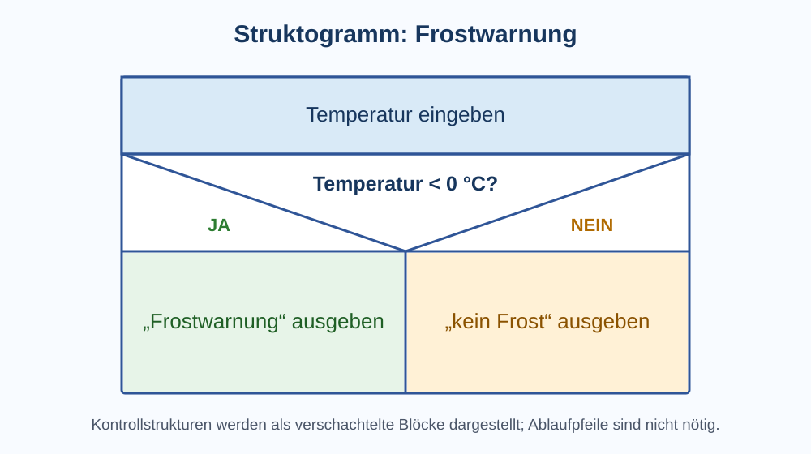
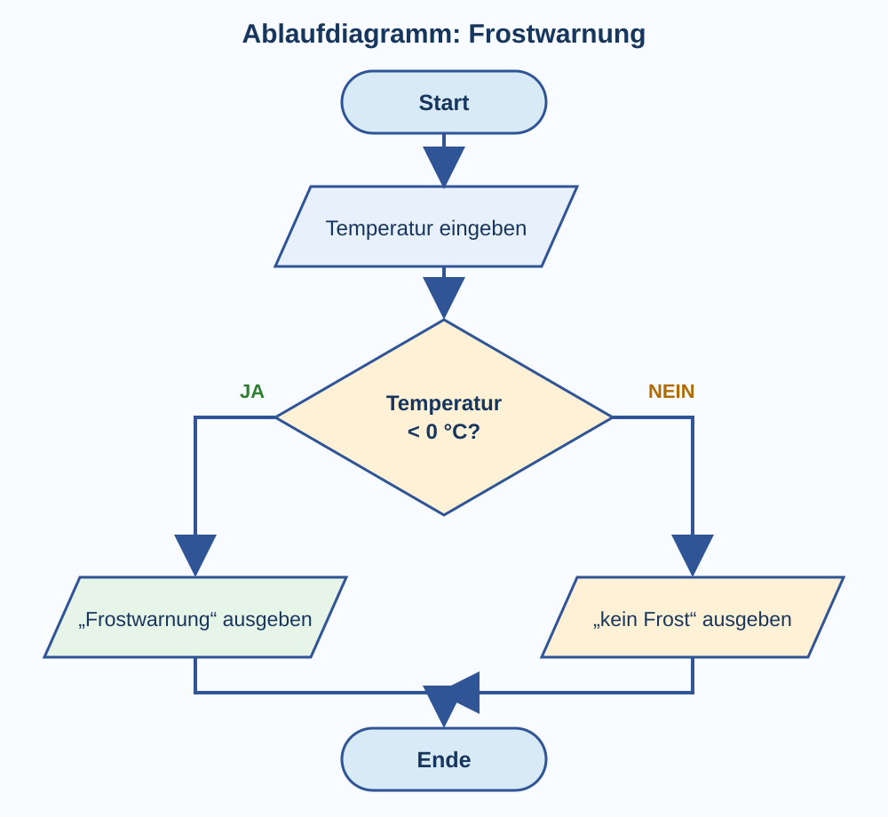

# 2 Algorithmen

## Was ist ein Algorithmus?

Ein **Algorithmus** ist eine eindeutige Handlungsvorschrift zur Lösung einer Aufgabe. Er besteht aus einzelnen Schritten, die in einer festgelegten Weise ausgeführt werden.

Alltagsanleitungen können ähnlich aufgebaut sein, aber Informatikalgorithmen müssen so eindeutig formuliert sein, dass ihre Schritte zuverlässig ausgeführt werden können.

## Grundstrukturen

Viele Algorithmen lassen sich aus drei grundlegenden Strukturen zusammensetzen.


### Sequenz

Anweisungen werden nacheinander ausgeführt.

```text
Schritt A
Schritt B
Schritt C
```

### Auswahl

Bei einer **Auswahl** entscheidet eine Bedingung, ob eine Anweisung ausgeführt wird oder welcher von mehreren möglichen Wegen gewählt wird.

Eine Auswahl kann **ohne SONST-Zweig** formuliert werden:

```text
WENN Bedingung
    DANN Anweisung A
```

Eine Auswahl kann auch **mit SONST-Zweig** formuliert werden:

```text
WENN Bedingung
    DANN Anweisung A
SONST
    Anweisung B
```

> **Merke:** Ein `SONST` ist nicht bei jeder Auswahl notwendig.

### Wiederholung

Eine **Wiederholung** oder **Schleife** führt eine oder mehrere Anweisungen mehrfach aus.

#### Kopfgesteuerte Schleife

Die Bedingung wird vor jedem Durchlauf geprüft. Die Schleife kann deshalb auch kein einziges Mal ausgeführt werden.

```text
SOLANGE Bedingung gilt
    wiederhole Anweisung
```

#### Fußgesteuerte Schleife

Die Bedingung wird nach dem Schleifendurchlauf geprüft. Der Schleifenrumpf wird deshalb mindestens einmal ausgeführt.

```text
WIEDERHOLE
    Anweisung
SOLANGE Bedingung gilt
```

#### Zählschleife

Eine Zählschleife eignet sich, wenn die Anzahl der Wiederholungen vorher bekannt ist.

```text
FÜR i VON 1 BIS 5
    Anweisung
```

#### Bedingte Wiederholung und Endlosschleife

Bei einer bedingten Wiederholung hängt das Ende von einer Bedingung ab. Eine Endlosschleife besitzt keine wirksame Abbruchbedingung und läuft weiter, bis das Programm von außen beendet wird.

| Schleifenart | Prüfung | Mindestens ein Durchlauf? | Typischer Einsatz |
|---|---|---:|---|
| kopfgesteuert | vor dem Durchlauf | nein | solange eine Bedingung gilt |
| fußgesteuert | nach dem Durchlauf | ja | etwas mindestens einmal ausführen |
| Zählschleife | über Zähler/Anzahl | abhängig von der Anzahl | bekannte Wiederholungszahl |
| bedingte Wiederholung | über Bedingung | abhängig von der Form | unbekannte Wiederholungszahl |
| Endlosschleife | keine wirksame Beendigung | ja | dauerhafte Prozesse oder Programmfehler |

## Verschachtelungen

Grundstrukturen können **ineinander verschachtelt** werden.

```text
FÜR zeile VON 1 BIS 3
    FÜR spalte VON 1 BIS 4
        setze Punkt
```

Die innere Schleife läuft viermal für jede der drei Zeilen. Insgesamt wird `setze Punkt` also `3 · 4 = 12` Mal ausgeführt.

## Bedingungen, Zuweisungen und Vergleichsoperatoren

Eine **Bedingung** ist ein Ausdruck, dessen Ergebnis **wahr** oder **falsch** ist. Um Werte zu vergleichen, werden **Vergleichsoperatoren** verwendet. Davon muss eine **Zuweisung** unterschieden werden: Bei einer Zuweisung wird ein Wert in einer Variablen gespeichert.

### Wichtige Schreibweisen

| Schreibweise | Bedeutung | Typischer Einsatz |
|---|---|---|
| `:=` | Zuweisung | Pseudocode: Eine Variable bekommt einen Wert. |
| `=` | Zuweisung | in vielen Programmiersprachen, zum Beispiel Python und JavaScript |
| `==` | Gleichheitsvergleich | prüft in vielen Programmiersprachen, ob zwei Werte gleich sind |
| `===` | strenger Gleichheitsvergleich | JavaScript/TypeScript: Wert **und** Datentyp müssen passen |
| `!=` | Ungleichheitsvergleich | prüft in vielen Programmiersprachen, ob Werte ungleich sind |
| `!==` | strenger Ungleichheitsvergleich | JavaScript/TypeScript: Wert oder Datentyp unterscheiden sich |
| `<` | kleiner als | zum Beispiel `temperatur < 0` |
| `>` | größer als | zum Beispiel `punkte > 10` |
| `<=` | kleiner oder gleich | zum Beispiel `alter <= 14` |
| `>=` | größer oder gleich | zum Beispiel `punkte >= 10` |

Beispiel:

```text
WENN punkte >= 10
    DANN zeige "Ziel erreicht"
```

`punkte >= 10` vergleicht den gespeicherten Wert von `punkte` mit 10. Das Ergebnis ist entweder **wahr** oder **falsch**.

### Zuweisung und Vergleich nicht verwechseln

In unserem Pseudocode schreiben wir eine Zuweisung so:

```text
punkte := 10
```

Das bedeutet: Speichere den Wert 10 in der Variablen `punkte`.

In vielen Programmiersprachen wird für die Zuweisung dagegen `=` verwendet:

```text
punkte = 10
```

Ein Gleichheitsvergleich wird häufig mit `==` geschrieben:

```text
punkte == 10
```

Das bedeutet nicht „Speichere 10“, sondern „Prüfe, ob der Wert von `punkte` gleich 10 ist“.

> **Merke:** Eine **Zuweisung** verändert einen gespeicherten Wert. Ein **Vergleich** prüft Werte und liefert als Ergebnis wahr oder falsch.

### Besonderheit in JavaScript und TypeScript: `==` und `===`

JavaScript besitzt neben `==` auch den **strengen Vergleich** `===`. TypeScript verwendet diese Operatoren ebenfalls, weil TypeScript auf JavaScript aufbaut.

Beim Vergleich mit `==` kann JavaScript Werte unterschiedlicher Datentypen vor dem Vergleich automatisch umwandeln. Deshalb kann beispielsweise gelten:

```javascript
"5" == 5   // wahr
```

Links steht die Zeichenkette `"5"`, rechts die Zahl `5`. Beim Vergleich mit `==` kann JavaScript eine Typumwandlung durchführen.

Beim strengen Vergleich `===` findet diese automatische Angleichung nicht statt:

```javascript
"5" === 5  // falsch
```

Obwohl beide Werte wie eine Fünf aussehen, besitzen sie unterschiedliche Datentypen: links **String**, rechts **Zahl**.

Entsprechend gibt es `!=` für „ungleich“ und `!==` für „streng ungleich“.

> **Merke:** In JavaScript und TypeScript werden normalerweise `===` und `!==` bevorzugt, weil dadurch unerwartete Ergebnisse durch automatische Typumwandlungen vermieden werden können. Wenn solche Operatoren in einem Angular-Projekt vorkommen, stammen sie aus **JavaScript/TypeScript** – nicht aus Angular selbst.

## Variablen

### Wozu braucht man Variablen?

Eine **Variable** ist ein benannter Speicherplatz für einen Wert, den ein Algorithmus während seiner Ausführung benötigt. Variablen speichern beispielsweise Zwischenwerte, Eingaben, Messwerte, Zähler oder Zustände.

### Zuweisung

Mit einer **Zuweisung** erhält eine Variable einen Wert. In diesem Nachschlagewerk verwenden wir im Pseudocode dafür `:=`:

```text
punkte := 0
```

Das bedeutet: **Der Variablen `punkte` wird der Wert 0 zugewiesen.**

Besonders deutlich wird die Bedeutung bei:

```text
punkte := punkte + 1
```

Rechts wird zuerst gerechnet. Anschließend wird das Ergebnis links gespeichert. Hat `punkte` vorher den Wert 4, besitzt die Variable danach den Wert 5.

### Datentypen

Variablen besitzen in vielen Programmiersprachen einen **Datentyp**. Er beschreibt, welche Art von Wert gespeichert wird und welche Operationen damit sinnvoll oder erlaubt sind.

| Datentyp | Bedeutung | Beispiel |
|---|---|---|
| Ganzzahl | ganze Zahlen | `alter := 14` |
| Gleitkommazahl/Dezimalzahl | Zahlen mit Nachkommastellen | `temperatur := 21.5` |
| Zeichen | einzelnes Zeichen | `taste := 'A'` |
| Zeichenkette/Text | Folge von Zeichen | `name := "Mia"` |
| Wahrheitswert/Boolean | wahr oder falsch | `tuerOffen := wahr` |

Datentypen helfen dabei, Werte richtig zu verarbeiten und ungeeignete Operationen zu erkennen.

### Deklaration und Initialisierung

In manchen Programmiersprachen muss eine Variable zunächst **deklariert** werden. Dabei werden beispielsweise Name und Datentyp festgelegt. Die erstmalige Vergabe eines Wertes heißt **Initialisierung**.

### Gute Variablennamen

Variablennamen sollten erkennen lassen, was gespeichert wird, beispielsweise `punkte`, `anzahlSchueler`, `maxTemperatur` oder `tuerOffen`.

> **Merke:** Eine Variable verbindet einen verständlichen Namen mit einem gespeicherten Wert. Ihr Datentyp beschreibt, welche Art von Daten dieser Wert darstellt.

## Lambda-Ausdrücke – ein kurzer Ausblick

Ein **Lambda-Ausdruck** ist eine kurze, häufig namenlose Funktion. Er ist **kein Vergleichs- und kein Zuweisungsoperator**.

In Python kann eine kleine Funktion zum Verdoppeln einer Zahl beispielsweise so geschrieben werden:

```python
lambda x: x * 2
```

Der Ausdruck beschreibt sinngemäß: „Nimm `x` und liefere das Doppelte von `x` zurück.“ Andere Programmiersprachen verwenden andere Schreibweisen.

Für die Algorithmen in Klasse 8 musst du Lambda-Ausdrücke noch nicht genauer beherrschen. Der Begriff dient hier nur zur Einordnung; funktionale Programmierung wird später ausführlicher behandelt.

## Algorithmen darstellen

Derselbe Algorithmus kann auf verschiedene Arten dargestellt werden. Welche Darstellung sinnvoll ist, hängt davon ab, ob ein Ablauf zunächst erklärt, geplant, grafisch untersucht oder bereits als ausführbares Programm formuliert werden soll.

Als gemeinsames Beispiel verwenden wir diesen Ablauf:

**Temperatur einlesen. Wenn die Temperatur unter 0 °C liegt, „Frostwarnung“ ausgeben, sonst „kein Frost“ ausgeben.**

### Natürliche Sprache

Bei der Darstellung in **natürlicher Sprache** wird ein Algorithmus mit gewöhnlichen Sätzen beschrieben, zum Beispiel auf Deutsch.

**Typische Elemente:** nummerierte Schritte, kurze eindeutige Sätze und Signalwörter wie „wenn“, „sonst“, „solange“ oder „wiederhole“.

**Beispiel:**

1. Lies die Temperatur ein.
2. Wenn die Temperatur unter 0 °C liegt, gib „Frostwarnung“ aus.
3. Sonst gib „kein Frost“ aus.

Natürliche Sprache eignet sich gut, um einen Ablauf verständlich einzuführen oder anderen Menschen zu erklären. Sie benötigt keine besondere Notation.

**Vorteil:** leicht lesbar und schnell zu formulieren.  
**Nachteil:** Formulierungen können mehrdeutig oder unterschiedlich ausführlich sein.

### Pseudocode

**Pseudocode** ähnelt Programmcode, ist aber nicht an eine bestimmte Programmiersprache gebunden. Er verwendet vereinbarte Schlüsselwörter und eine übersichtliche Einrückung.

**Typische Elemente:** Anweisungen, Variablen, Zuweisungen, Bedingungen, `WENN`/`SONST`, Schleifen und Ein-/Ausgaben.

**Beispiel:**

```text
temperatur := EINGABE
WENN temperatur < 0
    DANN AUSGABE "Frostwarnung"
SONST
    AUSGABE "kein Frost"
```

Pseudocode eignet sich besonders zum **Planen von Algorithmen**, bevor eine konkrete Programmiersprache gewählt wird.

**Vorteil:** Kontrollstrukturen sind deutlich sichtbar, ohne sich mit sprachspezifischen Einzelheiten beschäftigen zu müssen.  
**Nachteil:** Pseudocode kann nicht direkt vom Computer ausgeführt werden; außerdem gibt es keine weltweit einheitliche Schreibweise.

### Struktogramm / Nassi-Shneiderman-Diagramm

Ein **Struktogramm**, auch **Nassi-Shneiderman-Diagramm** genannt, stellt einen Algorithmus als rechteckige, ineinander verschachtelte Blöcke dar. Sequenzen, Auswahlen und Wiederholungen erhalten dabei jeweils eine erkennbare Blockstruktur.



Bei einer Auswahl wird die Bedingung in einem Entscheidungsblock notiert. Darunter stehen die Bereiche für die möglichen Fälle. Verschachtelte Kontrollstrukturen werden als **verschachtelte Blöcke** dargestellt. Anders als beim Ablaufdiagramm werden normalerweise **keine Ablaufpfeile** benötigt: Die Lage der Blöcke zeigt die Struktur.

**Typische Elemente:** Anweisungsblöcke, Auswahlblöcke mit Bedingungen, Schleifenblöcke und ineinander liegende Kontrollstrukturen.

Struktogramme eignen sich besonders, um die **Struktur eines Algorithmus** zu erkennen und zu prüfen, wie Sequenz, Auswahl und Wiederholung zusammengesetzt sind.

**Vorteil:** Die Kontrollstrukturen und ihre Verschachtelung sind sehr übersichtlich.  
**Nachteil:** Bei sehr großen Algorithmen können Struktogramme umfangreich werden; für freie Sprünge oder stark verzweigte Abläufe sind sie weniger geeignet.

### Ablaufdiagramm / Flussdiagramm

Ein **Ablaufdiagramm** oder **Flussdiagramm** zeigt die einzelnen Schritte eines Algorithmus als Symbole, die durch Pfeile miteinander verbunden werden. Die Pfeile geben die Ablaufrichtung an.



Häufig verwendete Symbole sind:

| Symbol | Bedeutung | Typischer Inhalt |
|---|---|---|
| abgerundetes Rechteck / Oval | Start oder Ende | `Start`, `Ende` |
| Rechteck | Verarbeitung | Berechnung oder Zuweisung |
| Parallelogramm | Ein- oder Ausgabe | Wert einlesen oder Text ausgeben |
| Raute | Entscheidung | Bedingung mit Abzweigungen, zum Beispiel Ja/Nein |
| Pfeil | Ablaufrichtung | verbindet die Schritte |

Im Beispiel führt die Raute mit der Bedingung `Temperatur < 0 °C?` zu zwei Wegen. Der **Ja-Zweig** gibt „Frostwarnung“ aus, der **Nein-Zweig** „kein Frost“. Danach werden beide Wege wieder zum Ende geführt.

Ablaufdiagramme eignen sich gut, um **Reihenfolge und Verzweigungen sichtbar zu machen** und einen Ablauf gemeinsam zu besprechen.

**Vorteil:** Der Weg durch einen Algorithmus lässt sich anschaulich verfolgen.  
**Nachteil:** Große oder stark verschachtelte Algorithmen können durch viele Pfeile unübersichtlich werden.

### Programmcode

**Programmcode** formuliert den Algorithmus nach den genauen Regeln einer Programmiersprache. Erst diese Darstellung kann – mit einer passenden Laufzeitumgebung oder nach einer Übersetzung – tatsächlich vom Computer ausgeführt werden.

**Typische Elemente:** Schlüsselwörter und Syntax der gewählten Sprache, Variablen, Operatoren, Ein-/Ausgabe, Bedingungen, Schleifen und Funktionen.

Dasselbe Beispiel könnte in Python so aussehen:

```python
temperatur = float(input("Temperatur in °C: "))
if temperatur < 0:
    print("Frostwarnung")
else:
    print("kein Frost")
```

Programmcode eignet sich, wenn aus einem geplanten Algorithmus ein **ausführbares Programm** werden soll.

**Vorteil:** eindeutig nach den Regeln der Programmiersprache und ausführbar.  
**Nachteil:** Man muss die genaue Syntax kennen; sprachspezifische Details können vom eigentlichen Lösungsverfahren ablenken.

### Vergleich der Darstellungsformen

| Darstellungsform | Darstellung | Besonders geeignet für | Stärke | Grenze |
|---|---|---|---|---|
| natürliche Sprache | Sätze und Schritte | erstes Erklären und Beschreiben | leicht verständlich | kann mehrdeutig sein |
| Pseudocode | vereinfachte codeähnliche Notation | Planen eines Algorithmus | unabhängig von einer konkreten Programmiersprache | nicht direkt ausführbar |
| Struktogramm | verschachtelte Blöcke | Kontrollstrukturen und Verschachtelungen | Struktur sehr gut erkennbar | bei großen Algorithmen umfangreich |
| Ablaufdiagramm | Symbole und Pfeile | Abläufe und Verzweigungen | Ablaufweg anschaulich | viele Pfeile können unübersichtlich werden |
| Programmcode | Syntax einer Programmiersprache | Umsetzung auf dem Computer | ausführbar und präzise | sprachabhängig |

> **Merke:** Die Darstellungsform ändert nicht den Algorithmus selbst. Sie zeigt denselben Lösungsweg nur auf unterschiedliche Weise.

## Algorithmen und Programme testen

Ein Programm kann ohne Fehlermeldung laufen und trotzdem ein **falsches Ergebnis** liefern. Deshalb gehört das **Testen** zur Programmentwicklung. Beim Testen wird systematisch geprüft, ob sich ein Algorithmus oder Programm für ausgewählte Eingaben so verhält, wie es erwartet wird.

### Warum testet man?

Tests sollen Fehler sichtbar machen, bevor sie im praktischen Einsatz Probleme verursachen. Dabei kann beispielsweise geprüft werden:

- Liefert das Programm für normale Eingaben das richtige Ergebnis?
- Funktionieren Entscheidungen an ihren Grenzen richtig?
- Werden ungewöhnliche oder ungültige Eingaben sinnvoll behandelt?
- Können Schleifen versehentlich endlos laufen?
- Werden alle wichtigen Zweige eines Algorithmus tatsächlich ausgeführt?

Ein bestandener Test beweist allerdings nicht, dass ein Programm **für alle denkbaren Fälle fehlerfrei** ist. Bei sehr vielen möglichen Eingaben kann man meist nicht jede einzelne ausprobieren. Deshalb wählt man Testfälle gezielt aus.

> **Merke:** Testen bedeutet nicht, wahllos einige Werte einzugeben. Gute Tests werden so ausgewählt, dass sie unterschiedliche und besonders fehleranfällige Situationen untersuchen.

### Ein Testfall

Ein **Testfall** besteht mindestens aus einer Eingabe und dem **erwarteten Ergebnis**. Danach wird das tatsächliche Ergebnis des Programms mit dem erwarteten Ergebnis verglichen.

Für unser Frostwarnungs-Beispiel könnte eine Testtabelle so aussehen:

| Testfall | Eingabe Temperatur | erwartete Ausgabe | tatsächliche Ausgabe | Ergebnis |
|---|---:|---|---|---|
| 1 | −5 °C | Frostwarnung | Frostwarnung | bestanden |
| 2 | 8 °C | kein Frost | kein Frost | bestanden |
| 3 | 0 °C | kein Frost | kein Frost | bestanden |

Wichtig ist, das erwartete Ergebnis **vorher** festzulegen. Sonst besteht die Gefahr, ein überraschendes Ergebnis nachträglich einfach für richtig zu halten.

### Normale, ungewöhnliche und ungültige Eingaben

Beim Testen betrachtet man verschiedene Arten von Eingaben.

**Normale Eingaben** sind typische Werte, zum Beispiel `12 °C` für eine Temperatur.

**Ungewöhnliche, aber gültige Eingaben** sind seltene Werte, die trotzdem erlaubt sind, beispielsweise `−40 °C`.

**Ungültige Eingaben** entsprechen nicht den Vorgaben. Erwartet ein Programm eine Zahl, könnte beispielsweise `kalt` eine ungültige Eingabe sein. Dann muss geklärt werden, wie das Programm reagieren soll: Fehlermeldung, erneute Eingabe oder eine andere festgelegte Behandlung.

### Grenzwerte und Grenzwerttests

Fehler treten besonders häufig **an Grenzen** auf. Ein **Grenzwert** ist ein Wert, an dem sich das Verhalten eines Algorithmus ändert oder an dem ein erlaubter Bereich beginnt beziehungsweise endet.

Beim Frostprogramm liegt ein wichtiger Grenzwert bei `0 °C`, denn die Bedingung lautet:

```text
temperatur < 0
```

Deshalb sind Werte **direkt unter, genau auf und direkt über der Grenze** besonders interessante Testfälle:

| Eingabe | Erwartung | Warum wichtig? |
|---:|---|---|
| −1 °C | Frostwarnung | direkt unter der Grenze |
| 0 °C | kein Frost | genau auf der Grenze |
| 1 °C | kein Frost | direkt über der Grenze |

Damit kann man beispielsweise entdecken, dass versehentlich `<= 0` statt `< 0` programmiert wurde.

Bei einem erlaubten Alter von 12 bis 16 Jahren wären entsprechend Werte wie `11`, `12`, `13`, `15`, `16` und `17` interessant. Besonders wichtig sind die Grenzen `12` und `16` sowie Werte unmittelbar daneben.

> **Merke:** Bei einer Grenze teste möglichst **knapp darunter, genau darauf und knapp darüber**.

### Blackbox-Test

Beim **Blackbox-Test** betrachtet man das Programm wie einen schwarzen Kasten. Man kennt beziehungsweise untersucht den inneren Programmcode nicht. Entscheidend ist nur:

**Eingabe → Programm → Ausgabe**

Man wählt Eingaben anhand der Anforderungen und prüft, ob die erwarteten Ausgaben entstehen.

Beim Frostprogramm könnte man beispielsweise `−5`, `0` und `10` eingeben und die Ausgaben vergleichen, ohne nachzusehen, wie die Entscheidung im Programmcode geschrieben wurde.

Blackbox-Tests eignen sich besonders, um zu prüfen, ob ein Programm **von außen betrachtet die geforderte Funktion erfüllt**.

**Vorteil:** Der Test orientiert sich an den Anforderungen und nicht daran, wie das Programm intern gebaut wurde.  
**Grenze:** Fehler in Programmteilen, die durch die gewählten Eingaben nie ausgeführt werden, können unentdeckt bleiben.

### Whitebox-Test

Beim **Whitebox-Test** kennt und betrachtet man den inneren Aufbau des Algorithmus oder Programmcodes. Die Testfälle werden gezielt so ausgewählt, dass bestimmte Anweisungen, Bedingungen, Zweige oder Wege durchlaufen werden.

Beim Frostprogramm sieht man im Code die Bedingung:

```text
temperatur < 0
```

Nun wählt man mindestens einen Wert, für den die Bedingung **wahr** ist, und einen Wert, für den sie **falsch** ist. Dadurch werden beide Zweige der Auswahl untersucht.

Whitebox-Tests helfen also bei der Frage: **Welche Teile meines Programms wurden durch meine Tests tatsächlich ausgeführt?**

**Vorteil:** Die innere Struktur kann gezielt untersucht werden.  
**Grenze:** Auch wenn alle vorhandenen Programmteile getestet wurden, kann eine Anforderung fehlen, die überhaupt nicht programmiert wurde.

### Blackbox und Whitebox ergänzen sich

Blackbox- und Whitebox-Tests beantworten unterschiedliche Fragen:

| Testart | Blickrichtung | Testfälle entstehen vor allem aus | typische Frage |
|---|---|---|---|
| Blackbox | von außen | Anforderungen, erlaubten Eingaben und erwarteten Ausgaben | „Tut das Programm das Richtige?“ |
| Whitebox | von innen | Programmstruktur, Bedingungen, Zweigen und Schleifen | „Haben wir die wichtigen Programmwege geprüft?“ |

In der Praxis werden deshalb häufig beide Sichtweisen kombiniert.

### Pfade durch einen Algorithmus

Durch Auswahlen und Schleifen können unterschiedliche **Ausführungspfade** entstehen. Ein Pfad ist eine mögliche Folge von Anweisungen, die bei einer bestimmten Eingabe tatsächlich ausgeführt wird.

Betrachte beispielsweise:

```text
WENN temperatur < 0
    AUSGABE "Frostwarnung"
SONST
    WENN temperatur > 30
        AUSGABE "Hitzewarnung"
    SONST
        AUSGABE "normale Temperatur"
```

Hier gibt es drei wichtige Wege:

1. `temperatur < 0` ist wahr → Frostwarnung.
2. `temperatur < 0` ist falsch und `temperatur > 30` ist wahr → Hitzewarnung.
3. Beide Bedingungen sind falsch → normale Temperatur.

Mit den Testwerten `−5`, `35` und `20` kann jeweils einer dieser Wege durchlaufen werden.

### Pfadabdeckung

Die **Pfadabdeckung** beschreibt, welche möglichen Ausführungspfade durch die gewählten Tests durchlaufen wurden. Ziel ist es, nicht immer nur denselben Weg zu testen.

Beim Beispiel mit Frost-, Hitze- und Normalbereich decken die drei Testfälle `−5`, `35` und `20` die drei beschriebenen Wege ab.

Bei Programmen mit Schleifen und vielen verschachtelten Entscheidungen kann die Zahl möglicher Pfade allerdings sehr groß werden. Eine Schleife kann beispielsweise keinmal, einmal oder viele Male durchlaufen werden. Deshalb ist eine vollständige Pfadabdeckung bei größeren Programmen oft nicht praktisch erreichbar.

In solchen Fällen verwendet man auch einfachere Maße, zum Beispiel:

- **Anweisungsabdeckung:** Wurde jede Anweisung mindestens einmal ausgeführt?
- **Zweigabdeckung:** Wurde bei jeder Entscheidung jeder mögliche Zweig mindestens einmal ausgeführt?
- **Pfadabdeckung:** Wurden die betrachteten möglichen Wege durch den Algorithmus ausgeführt?

Eine hohe Abdeckung bedeutet, dass viele Teile beziehungsweise Wege untersucht wurden. Sie beweist aber nicht automatisch, dass das Programm fehlerfrei ist.

### Schleifen testen

Schleifen verdienen besondere Aufmerksamkeit. Je nach Schleifenart sind beispielsweise folgende Fälle interessant:

- **kein Durchlauf**, falls die Schleife das zulässt,
- **genau ein Durchlauf**,
- **mehrere Durchläufe**,
- ein Wert an der **Abbruchgrenze**,
- ungewöhnlich viele Durchläufe.

So kann man Fehler entdecken, bei denen eine Schleife einmal zu oft oder einmal zu wenig läuft. Solche Fehler werden häufig als **Off-by-one-Fehler** bezeichnet.

### Fehler finden und verbessern

Wenn ein Test fehlschlägt, beginnt die Fehlersuche. Dabei sollte man möglichst genau feststellen:

1. Welche Eingabe wurde verwendet?
2. Welches Ergebnis wurde erwartet?
3. Welches Ergebnis trat tatsächlich auf?
4. An welcher Stelle weicht der Ablauf erstmals von der Erwartung ab?
5. Welche Ursache hat die Abweichung?
6. Nach der Korrektur: Besteht der ursprüngliche Test jetzt?
7. Funktionieren auch die anderen bisherigen Testfälle weiterhin?

Das erneute Ausführen bereits vorhandener Tests ist wichtig, weil eine Korrektur an einer Stelle unbeabsichtigt einen Fehler an einer anderen Stelle verursachen kann.

> **Merke:** Ein guter Test beschreibt **Eingabe, erwartetes Ergebnis und tatsächliches Ergebnis**. Grenzwerte sowie unterschiedliche Zweige und Pfade sind besonders wichtige Testfälle.

## Begriffe zum Nachschlagen

**Ablaufdiagramm/Flussdiagramm:** grafische Darstellung eines Ablaufs mit genormten beziehungsweise vereinbarten Symbolen und Pfeilen.

**Algorithmus:** eindeutige Handlungsvorschrift zur Lösung einer Aufgabe.

**Anweisungsabdeckung:** Maß dafür, ob jede betrachtete Anweisung eines Programms mindestens einmal durch Tests ausgeführt wurde.

**Auswahl:** Entscheidung darüber, ob eine Anweisung ausgeführt wird oder welcher von mehreren Abläufen gewählt wird.

**Blackbox-Test:** Test eines Programms anhand von Eingaben und erwarteten Ausgaben, ohne für die Auswahl der Testfälle den inneren Programmaufbau zu betrachten.

**Bedingung:** Ausdruck mit dem Ergebnis wahr oder falsch.

**Datentyp:** Beschreibung der Art eines gespeicherten Wertes und der möglichen Operationen damit.

**Deklaration:** Bekanntmachen einer Variablen, häufig mit Name und Datentyp.

**Grenzwert:** Wert an einer Grenze, an der sich das Programmverhalten ändert oder ein erlaubter Bereich beginnt beziehungsweise endet.

**Initialisierung:** erstmalige Vergabe eines Wertes an eine Variable.

**Lambda-Ausdruck:** kurze, häufig namenlose Funktion; kein Vergleichs- oder Zuweisungsoperator.

**Pfad:** mögliche Folge ausgeführter Anweisungen durch einen Algorithmus oder ein Programm.

**Pfadabdeckung:** Maß dafür, welche möglichen Ausführungspfade durch Testfälle durchlaufen wurden.

**Pseudocode:** vereinfachte, programmiersprachenunabhängige Schreibweise zur Darstellung eines Algorithmus.

**Struktogramm/Nassi-Shneiderman-Diagramm:** grafische Darstellung eines Algorithmus durch verschachtelte Blöcke für Kontrollstrukturen.

**Testfall:** festgelegte Eingabe beziehungsweise Ausgangssituation mit einem erwarteten Ergebnis, die zur Prüfung eines Algorithmus oder Programms verwendet wird.

**Variable:** benannter Speicherplatz für einen Wert.

**Vergleichsoperator:** Operator zum Vergleichen von Werten; das Ergebnis ist typischerweise wahr oder falsch.

**Verschachtelung:** Einbetten einer Kontrollstruktur in eine andere Kontrollstruktur.

**Whitebox-Test:** Test, bei dem die innere Struktur des Algorithmus oder Programmcodes bekannt ist und bei der Auswahl der Testfälle berücksichtigt wird.

**Wiederholung/Schleife:** mehrfache Ausführung von Anweisungen.

**Zweigabdeckung:** Maß dafür, ob die möglichen Zweige von Entscheidungen durch Tests ausgeführt wurden.

**Zuweisung:** Speichern eines Wertes in einer Variablen; im Pseudocode dieses Nachschlagewerks mit `:=` dargestellt.

→ Siehe auch **Kapitel 3: Robot Karol**.
