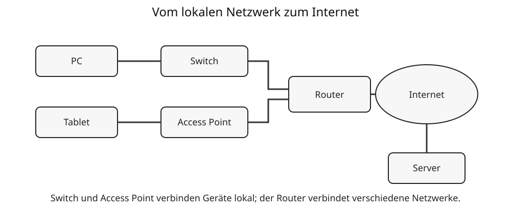

# 4 Netzwerke

## Was ist ein Netzwerk?

Ein **Netzwerk** verbindet mehrere Informatiksysteme, damit sie Daten austauschen und gemeinsame Dienste nutzen können. Beispiele sind ein Schulnetzwerk, ein Heimnetzwerk oder das Internet.

## Geräte im Netzwerk

Typische Komponenten sind:

- **Endgeräte** wie Computer, Tablets oder Smartphones,
- **Switches**, die Geräte in einem lokalen Netzwerk verbinden,
- **Router**, die verschiedene Netzwerke miteinander verbinden,
- **Server**, die Dienste oder Daten bereitstellen,
- **Access Points**, die WLAN-Verbindungen ermöglichen.



## Client und Server

Ein **Client** fordert einen Dienst an. Ein **Server** stellt einen Dienst bereit. Beim Aufruf einer Webseite sendet der Browser als Client eine Anfrage an einen Webserver, der eine Antwort zurückliefert.

```text
Client ── Anfrage ──► Server
Client ◄─ Antwort ─── Server
```

## Adressen im Netzwerk

Damit Daten an das richtige Ziel gelangen, müssen Netzwerkgeräte und Netzwerkanschlüsse adressierbar sein. Ähnlich wie eine Postsendung eine Zieladresse benötigt, brauchen Datenpakete Informationen darüber, wohin sie gesendet werden sollen.

### IP-Adressen

In Netzwerken, die das **Internet Protocol (IP)** verwenden, übernehmen **IP-Adressen** diese Aufgabe. Eine IP-Adresse bezeichnet einen Netzwerkanschluss beziehungsweise eine Schnittstelle in einem IP-Netzwerk.

Ein Beispiel für eine IPv4-Adresse ist:

```text
192.168.1.25
```

Eine IPv4-Adresse besteht aus **32 Bit**. Zur besseren Lesbarkeit werden diese Bits meist als vier Dezimalzahlen zwischen 0 und 255 geschrieben, die durch Punkte getrennt sind.

```text
192 . 168 . 1 . 25
```

Jeder dieser vier Teile entspricht 8 Bit, also einem Byte. Deshalb kann jeder Teil Werte von 0 bis 255 annehmen.

> **Merke:** Eine IP-Adresse ist nicht einfach der „Name eines Computers“. Sie adressiert einen Anschluss in einem IP-Netzwerk. Ein Gerät kann deshalb auch mehrere IP-Adressen besitzen.

### Private und öffentliche IP-Adressen

In einem Heim- oder Schulnetz werden häufig **private IPv4-Adressen** verwendet. Dazu gehören beispielsweise Adressen aus Bereichen wie `192.168.x.x` oder `10.x.x.x`. Diese Adressen werden nicht direkt im öffentlichen Internet weitergeleitet und können deshalb in vielen voneinander getrennten lokalen Netzen erneut vorkommen.

Ein Router verbindet das lokale Netz mit anderen Netzen beziehungsweise dem Internet. Nach außen wird dabei häufig eine öffentliche IP-Adresse verwendet.

### IPv4 und IPv6

IPv4 bietet nur eine begrenzte Anzahl möglicher Adressen. Deshalb wurde **IPv6** entwickelt. IPv6-Adressen besitzen **128 Bit** und werden üblicherweise in hexadezimaler Schreibweise dargestellt, zum Beispiel:

```text
2001:db8:1234:5678::25
```

Für das grundlegende Verständnis ist vor allem wichtig:

| IPv4 | IPv6 |
|---|---|
| 32 Bit | 128 Bit |
| meist vier Dezimalzahlen | hexadezimale Gruppen |
| zum Beispiel `192.168.1.25` | zum Beispiel `2001:db8:1234:5678::25` |
| wesentlich kleinerer Adressraum | sehr großer Adressraum |

### IP-Adressen können sich ändern

Ein Gerät muss nicht dauerhaft dieselbe IP-Adresse besitzen. In vielen Netzwerken werden Adressen automatisch vergeben und können sich später ändern. Dafür wird häufig **DHCP** verwendet. DHCP kann einem Gerät neben der IP-Adresse weitere Netzwerkeinstellungen mitteilen.

Das ist ein Grund dafür, warum Menschen beim Aufruf von Internetdiensten normalerweise nicht mit IP-Adressen arbeiten: Namen sind leichter zu merken und können gleich bleiben, obwohl sich die zugehörige Adresse ändert.

## Namen statt Zahlen: Domains und DNS

Menschen merken sich Namen wie `wikipedia.org` meist leichter als IP-Adressen. Computer benötigen für die Kommunikation über IP jedoch die passende IP-Adresse. Zwischen diesen beiden Formen vermittelt das **Domain Name System (DNS)**.

DNS kann man sich vereinfacht wie ein **verteiltes Namensverzeichnis des Internets** vorstellen. Es ordnet Domainnamen Informationen zu, unter anderem IP-Adressen.

> **Merke:** DNS transportiert nicht die Webseite. DNS hilft zunächst dabei herauszufinden, unter welcher IP-Adresse ein gewünschter Dienst erreichbar ist.

### Was passiert beim Aufruf einer Webseite?

Wenn im Browser beispielsweise eine Webadresse eingegeben wird, laufen vereinfacht mehrere Schritte ab:

1. Der Browser beziehungsweise das Betriebssystem benötigt zur Domain die passende IP-Adresse.
2. Zunächst wird geprüft, ob die Antwort bereits bekannt und zwischengespeichert ist.
3. Falls nicht, wird ein **DNS-Resolver** gefragt.
4. Der Resolver ermittelt die benötigte DNS-Information gegebenenfalls mithilfe weiterer DNS-Server.
5. Als Antwort erhält der Computer beispielsweise eine IPv4- oder IPv6-Adresse.
6. Erst danach kann der Client eine Verbindung zum Zielsystem beziehungsweise zum gewünschten Dienst aufbauen.
7. Über diese Verbindung können anschließend beispielsweise HTTP- beziehungsweise HTTPS-Anfragen für eine Webseite übertragen werden.

Vereinfacht:

```text
Domainname
   ↓
DNS-Anfrage
   ↓
IP-Adresse
   ↓
Verbindung zum Server
   ↓
Web-Anfrage und Antwort
```

DNS ist also ein wichtiger Schritt **vor** der eigentlichen Kommunikation mit einem Webserver.

### DNS ist ein verteiltes System

Es gibt nicht einen einzigen Computer, der eine vollständige Liste aller Internetnamen enthält. DNS ist **hierarchisch und verteilt** aufgebaut. Verschiedene Server sind für unterschiedliche Teile des Namensraums zuständig.

Bei einer vollständigen Namensauflösung können vereinfacht folgende Stellen beteiligt sein:

- ein **rekursiver Resolver**, der die Suche für den Client übernimmt,
- **Root-Nameserver**, die den Weg zu den zuständigen Servern für Top-Level-Domains weisen,
- Nameserver einer **Top-Level-Domain (TLD)** wie `.de`, `.org` oder `.com`,
- der **autoritative Nameserver**, der die maßgebliche DNS-Information für die gesuchte Domain kennt.

Für Schüler wichtig ist die Grundidee: Ein Resolver kann sich **schrittweise zur zuständigen Stelle durchfragen**, statt dass jeder DNS-Server alles wissen muss.

### Beispiel einer DNS-Auflösung

Gesucht sei die IP-Adresse zu:

```text
www.beispiel.de
```

Vereinfacht kann die Suche so gedacht werden:

```text
Client
  → DNS-Resolver
      → Wo finde ich .de?
      → Wer ist für beispiel.de zuständig?
      → Welche Adresse gehört zu www.beispiel.de?
  ← IP-Adresse
Client → Zielserver
```

In der Praxis können Zwischenspeicher viele dieser Schritte einsparen.

### DNS-Cache: Antworten merken

DNS-Antworten werden häufig für eine bestimmte Zeit **zwischengespeichert (gecacht)**. Fragt kurz danach ein weiterer Client nach demselben Namen, muss die gesamte Suche möglicherweise nicht erneut durchgeführt werden.

Wie lange eine DNS-Information zwischengespeichert werden darf, wird unter anderem durch einen Wert namens **TTL – Time to Live** bestimmt.

Caching hat zwei wichtige Vorteile:

- Namensauflösungen können schneller werden,
- DNS-Server müssen weniger Anfragen bearbeiten.

Nach einer Änderung eines DNS-Eintrags kann es deshalb allerdings eine Weile dauern, bis überall die neue Information verwendet wird.

## Domainnamen genauer betrachtet

Ein Domainname ist hierarchisch aufgebaut. Bei

```text
www.schule.example
```

kann man von rechts nach links verschiedene Ebenen betrachten:

- `.example` – Top-Level-Domain,
- `schule` – darunter registrierter beziehungsweise verwalteter Domainbereich,
- `www` – ein weiterer Name innerhalb dieses Bereichs, häufig als Subdomain beziehungsweise Hostname verwendet.

Der Punkt trennt die Ebenen voneinander.

### URL, Domain und IP-Adresse sind nicht dasselbe

Diese Begriffe werden leicht verwechselt:

| Begriff | Beispiel | Aufgabe |
|---|---|---|
| IP-Adresse | `192.0.2.25` | Adressierung bei der IP-Kommunikation |
| Domainname | `example.org` | menschenfreundlicher hierarchischer Name |
| Hostname/Subdomain | `www.example.org` | genauerer Name innerhalb einer Domainstruktur |
| URL | `https://www.example.org/info/index.html` | beschreibt, wie und wo eine bestimmte Ressource angesprochen wird |

Eine URL enthält also mehr als nur einen Domainnamen. `https` bezeichnet beispielsweise das verwendete Schema beziehungsweise Protokoll für den Zugriff, während `/info/index.html` einen Pfad zur Ressource beschreibt.

## DNS-Einträge

DNS kann unterschiedliche Arten von Informationen speichern. Solche Einträge werden **Resource Records** genannt. Für ein grundlegendes Nachschlagewerk sind besonders diese Typen nützlich:

| DNS-Eintrag | Bedeutung |
|---|---|
| `A` | ordnet einem Namen eine IPv4-Adresse zu |
| `AAAA` | ordnet einem Namen eine IPv6-Adresse zu |
| `CNAME` | verweist einen Namen auf einen anderen Namen |
| `MX` | nennt Mailserver, die E-Mails für eine Domain annehmen |
| `NS` | nennt zuständige Nameserver |

DNS ist deshalb mehr als ein einfaches Verzeichnis „Name → IP-Adresse“.

### Vorwärts- und Rückwärtsauflösung

Die übliche Suche von einem Namen zu einer IP-Adresse heißt **Vorwärtsauflösung (Forward Lookup)**.

```text
Name → IP-Adresse
```

Es gibt auch die umgekehrte Richtung, die **Rückwärtsauflösung (Reverse DNS / Reverse Lookup)**. Dabei wird zu einer IP-Adresse nach einem zugeordneten Namen gesucht. Dafür werden besondere DNS-Einträge verwendet.

```text
IP-Adresse → Name
```

Eine Rückwärtsauflösung muss nicht einfach die ursprüngliche Vorwärtsauflösung umkehren; die Zuordnungen werden getrennt verwaltet.

## DNS und Sicherheit

Weil DNS häufig am Anfang einer Internetverbindung steht, ist seine Zuverlässigkeit wichtig. Wird einem Namen eine falsche Adresse zugeordnet, könnte ein Benutzer zu einem falschen System geleitet werden.

Moderne Verfahren können DNS deshalb zusätzlich absichern oder die Übertragung von DNS-Anfragen schützen. Für Klasse 8 genügt zunächst die Erkenntnis:

> **Merke:** Ein vertrauter Domainname allein garantiert noch nicht, dass jede technische Namensauflösung automatisch sicher ist. Bei wichtigen Internetdiensten sind außerdem verschlüsselte Verbindungen wie HTTPS und die Prüfung des Zertifikats bedeutsam.

## DNS selbst beobachten

Auf vielen Betriebssystemen kann man Werkzeuge verwenden, um DNS-Abfragen sichtbar zu machen. Häufig gibt es beispielsweise Befehle wie:

```text
nslookup example.org
```

oder auf Systemen mit entsprechenden Werkzeugen:

```text
dig example.org
```

Die Ausgabe kann unter anderem zeigen, welcher DNS-Server geantwortet hat und welche Adressen zu einem Namen gefunden wurden. Die genaue Ausgabe hängt vom Betriebssystem, Netzwerk und verwendeten Werkzeug ab.

## Datenpakete

Große Datenmengen werden in Netzwerken häufig in kleinere Einheiten, sogenannte Pakete, zerlegt. Diese Pakete enthalten neben Nutzdaten auch Verwaltungsinformationen, etwa zu Absender und Ziel.

## LAN, WLAN und Internet

Ein **LAN** ist ein lokales Netzwerk, beispielsweise innerhalb einer Schule oder Wohnung. Ein **WLAN** ist ein lokales Netzwerk mit Funkübertragung. Das **Internet** verbindet sehr viele einzelne Netzwerke weltweit.

## Sicherheit

Netzwerke müssen geschützt werden. Dazu gehören unter anderem:

- sichere Passwörter,
- aktuelle Software,
- verschlüsselte Verbindungen,
- sinnvolle Zugriffsrechte,
- Vorsicht bei unbekannten Geräten und Nachrichten.

> **Merke:** Das Internet ist nicht ein einzelner Computer, sondern ein Verbund sehr vieler miteinander verbundener Netzwerke.

## Begriffe zum Nachschlagen

**A-Record:** DNS-Eintrag, der einem Namen eine IPv4-Adresse zuordnet.

**AAAA-Record:** DNS-Eintrag, der einem Namen eine IPv6-Adresse zuordnet.

**Autoritativer Nameserver:** DNS-Server, der für einen bestimmten Namensbereich maßgebliche DNS-Informationen bereitstellt.

**Client:** Gerät oder Programm, das einen Dienst anfordert.

**DHCP:** Verfahren zur automatischen Vergabe von Netzwerkeinstellungen an Clients, beispielsweise IP-Adressen.

**DNS:** Domain Name System; hierarchisches, verteiltes System zur Zuordnung von Domainnamen zu Informationen wie IP-Adressen.

**DNS-Resolver:** Dienst, der DNS-Anfragen entgegennimmt und die benötigten Informationen aus Cache oder DNS-System ermittelt.

**Domain:** hierarchisch organisierter Namensbereich im DNS.

**IP-Adresse:** Adresse eines Netzwerkanschlusses beziehungsweise einer Schnittstelle in einem IP-Netzwerk.

**IPv4:** Version des Internet Protocol mit 32-Bit-Adressen.

**IPv6:** Version des Internet Protocol mit 128-Bit-Adressen.

**Nameserver:** Server, der Informationen des Domain Name Systems bereitstellt.

**Router:** Gerät, das Daten zwischen verschiedenen Netzwerken weiterleitet.

**Server:** System, das Dienste oder Daten für andere Systeme bereitstellt.

**Switch:** Gerät zur Verbindung von Teilnehmern in einem lokalen Netzwerk.

**TTL (Time to Live):** bei DNS unter anderem Angabe dafür, wie lange eine Information zwischengespeichert werden darf.

**URL:** Adresse beziehungsweise Bezeichner einer Ressource mit Angaben wie Schema, Hostname und gegebenenfalls Pfad.
