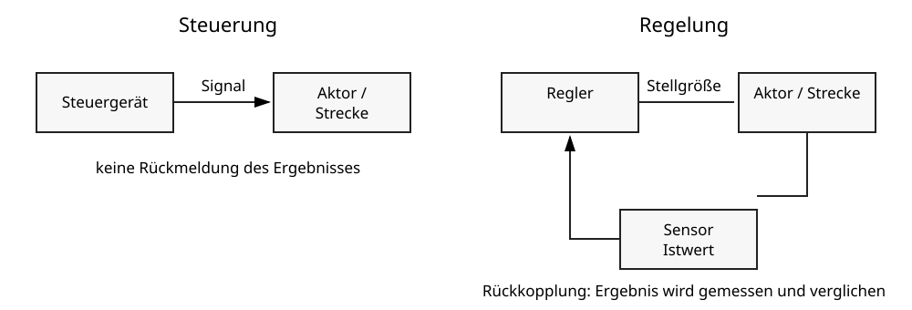

# 5 Steuern und Regeln

## Steuern und Regeln im Alltag

Technische Systeme reagieren häufig auf Eingaben oder Messwerte. Dabei unterscheidet man **Steuern** und **Regeln**.

Beim **Steuern** beeinflusst eine Eingabe einen Ablauf, ohne dass das Ergebnis ständig zurückgemessen werden muss. Beim **Regeln** wird ein Istwert gemessen und mit einem Sollwert verglichen. Das System passt sein Verhalten so an, dass die Abweichung kleiner wird.



## Steuerung

Beispiel Ampelprogramm:

```text
Rot → Rot-Gelb → Grün → Gelb → Rot
```

Der Ablauf folgt einer festgelegten Reihenfolge. Ein Rückmeldesignal ist für den Grundablauf nicht nötig.

## Regelung

Beispiel Raumtemperatur:

```text
Sollwert: 21 °C
Istwert: 19 °C
→ Heizung einschalten

Istwert: 21 °C
→ Heizung reduzieren oder ausschalten
```

Hier wird ständig gemessen und verglichen.

## Sensoren und Aktoren

Ein **Sensor** erfasst einen Zustand aus der Umgebung, beispielsweise Temperatur, Helligkeit oder Abstand. Ein **Aktor** setzt eine Aktion um, beispielsweise einen Motor bewegen, eine Lampe einschalten oder ein Ventil öffnen.

```text
Sensor → Verarbeitung → Aktor
```

Bei einer Regelung führt die Wirkung des Aktors zu einer Veränderung, die erneut vom Sensor gemessen wird. Es entsteht ein Rückkopplungskreis.

## Sollwert und Istwert

Der **Sollwert** beschreibt den gewünschten Zustand. Der **Istwert** beschreibt den gemessenen aktuellen Zustand. Die Differenz zwischen beiden beeinflusst die Reaktion des Systems.

## Automatisierung

Steuerungen und Regelungen sind wichtige Bestandteile automatisierter Systeme. Beispiele sind Heizungen, Aufzüge, Produktionsanlagen, Bewässerungssysteme oder Roboter.

> **Merke:** Regeln bedeutet: messen, vergleichen und nachsteuern. Steuern bedeutet: einen Ablauf gezielt beeinflussen, ohne zwingende Rückkopplung.

## Begriffe zum Nachschlagen

**Aktor:** Bauteil, das eine physische Aktion ausführt.

**Automatisierung:** selbstständiges Ausführen technischer Abläufe nach festgelegten Regeln.

**Istwert:** aktuell gemessener Wert.

**Regelung:** Beeinflussung eines Systems mithilfe einer Rückkopplung.

**Sensor:** Bauteil zur Erfassung einer physikalischen Größe.

**Sollwert:** gewünschter Zielwert.

**Steuerung:** gezielte Beeinflussung eines Ablaufs ohne notwendige Rückkopplung.
