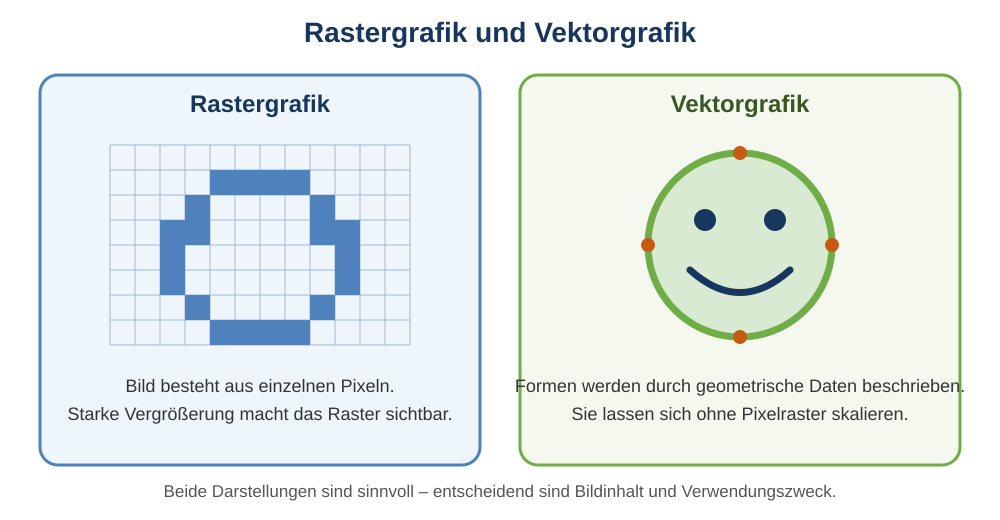

# 7 Computergrafik

## Von der Darstellung zur Bearbeitung

In Klasse 7 wurden digitale Bilder sowie Raster- und Vektorgrafiken eingeführt. In Klasse 8 geht es genauer darum, **wie Grafiken aufgebaut sind, wie sie bearbeitet werden und welches Format für welchen Zweck sinnvoll ist**.



> **Merke:** Raster- und Vektorgrafik sind keine Qualitätsstufen. Es sind unterschiedliche Arten, grafische Informationen zu speichern.

## Rastergrafiken

Eine **Rastergrafik** besteht aus einem rechteckigen Raster einzelner Bildpunkte, den **Pixeln**. Jeder Pixel besitzt einen Farbwert.

Fotos, Screenshots und gemalte digitale Bilder werden häufig als Rastergrafiken gespeichert.

### Auflösung

Die Bildgröße kann in Pixeln angegeben werden, beispielsweise:

```text
1920 × 1080 Pixel
```

Das bedeutet:

```text
1920 Pixel in der Breite
1080 Pixel in der Höhe
```

Die Gesamtzahl beträgt:

```text
1920 × 1080 = 2 073 600 Pixel
```

Das sind ungefähr 2,1 Megapixel.

### Was passiert beim Vergrößern?

Wird eine Rastergrafik stark vergrößert, müssen die vorhandenen Pixel auf eine größere Fläche verteilt beziehungsweise neue Zwischenwerte berechnet werden. Dadurch entstehen nicht automatisch neue echte Bilddetails.

Bei starker Vergrößerung können Pixel, unscharfe Kanten oder Interpolationsartefakte sichtbar werden.

### Farbtiefe

Die **Farbtiefe** beschreibt, wie viele Bits für Farbinformationen zur Verfügung stehen.

Bei 24 Bit RGB werden häufig 8 Bit für Rot, 8 Bit für Grün und 8 Bit für Blau verwendet:

```text
2^8 × 2^8 × 2^8 = 2^24
```

Damit sind rechnerisch über 16 Millionen Farbkombinationen möglich.

### Speicherbedarf ohne Kompression

Vereinfacht kann der unkomprimierte Speicherbedarf eines RGB-Bildes abgeschätzt werden:

```text
Breite × Höhe × Byte pro Pixel
```

Bei 24 Bit Farbe werden 3 Byte pro Pixel benötigt.

Beispiel:

```text
1000 × 1000 × 3 Byte
= 3 000 000 Byte
≈ 3 MB
```

Dateiformate können diese Daten anschließend komprimieren, sodass die tatsächliche Datei kleiner sein kann.

## Vektorgrafiken

Eine **Vektorgrafik** speichert nicht für jeden Bildpunkt einen Farbwert. Stattdessen werden grafische Objekte mathematisch beschrieben.

Typische Objekte sind:

- Linien,
- Rechtecke,
- Kreise,
- Vielecke,
- Kurven,
- Text.

Ein Kreis kann beispielsweise durch Mittelpunkt, Radius, Füllfarbe und Linienfarbe beschrieben werden.

### Skalierbarkeit

Beim Vergrößern einer Vektorgrafik werden die Formen für die neue Größe neu berechnet. Deshalb bleiben Kanten grundsätzlich scharf.

Das eignet sich besonders für:

- Logos,
- Symbole,
- Piktogramme,
- Diagramme,
- technische Zeichnungen,
- didaktische Grafiken.

### Wann ist Vektor ungeeignet?

Ein Foto enthält sehr viele unregelmäßige Farb- und Helligkeitsübergänge. Es vollständig als geometrische Formen zu beschreiben wäre meist unnötig kompliziert. Fotos werden deshalb normalerweise als Rasterbilder gespeichert.

## Raster und Vektor vergleichen

| Merkmal | Rastergrafik | Vektorgrafik |
|---|---|---|
| Grundelement | Pixel | geometrische Objekte |
| typische Inhalte | Fotos, Screenshots, Malerei | Logos, Symbole, Diagramme |
| starke Vergrößerung | Pixel/Unschärfe möglich | Formen werden neu berechnet |
| Bearbeitung | häufig pixelbezogen | objektbezogen |
| typische Formate | PNG, JPEG, WebP | SVG |

## Grafikformate

### PNG

**PNG** ist ein Rasterformat mit verlustfreier Kompression. Es unterstützt Transparenz und eignet sich gut für Screenshots, Diagramme, Benutzeroberflächen und Grafiken mit Schrift oder klaren Kanten.

### JPEG

**JPEG** verwendet typischerweise verlustbehaftete Kompression und eignet sich besonders für Fotografien. Bei starker Kompression können sichtbare Artefakte entstehen.

JPEG unterstützt keine normale transparente Fläche wie PNG.

### WebP

**WebP** ist ein modernes Rasterformat, das je nach Einstellung verlustbehaftete oder verlustfreie Kompression und Transparenz unterstützen kann. Es wird häufig im Web eingesetzt.

### SVG

**SVG** bedeutet **Scalable Vector Graphics**. Es ist ein Vektorformat, das grafische Objekte beschreibt und sich deshalb gut für skalierbare Diagramme, Logos und Symbole eignet.

SVG-Dateien sind textbasiert und können beispielsweise Rechtecke, Kreise, Linien, Pfade und Text enthalten.

## Kompression

Grafikdateien können sehr groß werden. **Kompression** versucht, die benötigte Datenmenge zu verringern.

### Verlustfreie Kompression

Die ursprünglichen Daten können vollständig wiederhergestellt werden.

Beispiel: PNG.

### Verlustbehaftete Kompression

Ein Teil der Bildinformation wird vereinfacht beziehungsweise entfernt. Dadurch kann die Datei deutlich kleiner werden, aber die ursprünglichen Daten lassen sich nicht vollständig rekonstruieren.

Beispiel: typische JPEG-Kompression.

> **Merke:** „Verlustbehaftet“ bedeutet nicht automatisch „schlecht“. Für Fotos kann eine passende Kompression sehr sinnvoll sein. Entscheidend ist der Verwendungszweck.

## Ebenen

Viele Grafikprogramme verwenden **Ebenen**. Man kann sie sich vereinfacht wie übereinanderliegende transparente Folien vorstellen.

Beispiel:

```text
Ebene 4: Text
Ebene 3: Logo
Ebene 2: Person
Ebene 1: Hintergrund
```

Ebenen ermöglichen es, Teile einer Grafik unabhängig voneinander zu bearbeiten, auszublenden, zu verschieben oder in ihrer Deckkraft zu verändern.

Eine sinnvolle Benennung wie `Hintergrund`, `Überschrift` oder `Logo` ist bei komplexeren Dateien besser als `Ebene 1`, `Ebene 2`, `Ebene 3`.

## Objektstruktur in Vektorgrafiken

Vektorprogramme verwalten einzelne Objekte. Ein Rechteck bleibt ein Rechteck und ein Textobjekt bleibt Text, solange es nicht in eine andere Form umgewandelt wird.

Dadurch lassen sich Eigenschaften gezielt verändern:

- Position,
- Breite und Höhe,
- Drehung,
- Füllfarbe,
- Linienfarbe,
- Linienstärke,
- Transparenz.

Mehrere Objekte können **gruppiert** werden, damit sie gemeinsam verschoben oder skaliert werden können.

## Transparenz und Alphakanal

Transparenz beschreibt, wie stark darunterliegende Inhalte sichtbar bleiben.

Ein zusätzlicher Wert kann neben Rot, Grün und Blau die Deckkraft angeben. Dieser Wert wird häufig als **Alpha** bezeichnet.

Vereinfacht:

```text
RGB  → Rot, Grün, Blau
RGBA → Rot, Grün, Blau, Alpha
```

Alpha kann beispielsweise zwischen vollständig transparent und vollständig deckend liegen.

## Auswahl und Masken

Bei Rastergrafiken soll häufig nur ein bestimmter Bildbereich bearbeitet werden. Dazu dienen **Auswahlen** oder **Masken**.

Eine Maske kann festlegen, welche Bereiche sichtbar oder bearbeitbar sind. Das ist oft besser als Bildteile endgültig zu löschen, weil die Bearbeitung später noch verändert werden kann.

## Zuschneiden und Skalieren sind nicht dasselbe

**Zuschneiden:** Teile am Rand werden entfernt; der sichtbare Bildausschnitt verändert sich.

**Skalieren:** Die Größe des gesamten Bildes beziehungsweise Objekts wird verändert.

Beispiel:

Ein Foto mit 4000 × 3000 Pixeln kann auf 2000 × 1500 Pixel skaliert werden. Dabei bleibt das Seitenverhältnis gleich, aber die Pixelanzahl sinkt.

Beim Zuschneiden auf einen quadratischen Ausschnitt dagegen wird ein Teil des ursprünglichen Bildes nicht mehr verwendet.

## Seitenverhältnis

Das **Seitenverhältnis** beschreibt das Verhältnis von Breite zu Höhe.

Beispiele:

- `16:9` – häufig bei Bildschirmen und Videos,
- `4:3` – älteres Bildschirm- und Fotoformat,
- `1:1` – quadratisch.

Wird nur die Breite verändert, aber die Höhe nicht passend angepasst, kann ein Bild verzerrt wirken.

## Auflösung beim Bildschirm und beim Druck

Bei einer Bilddatei ist die Pixelanzahl eindeutig. Beim Drucken kommt zusätzlich die physische Größe hinzu.

Dasselbe Bild mit 1200 Pixel Breite kann:

- klein gedruckt sehr scharf wirken,
- groß gedruckt sichtbar gröber werden.

Angaben wie **ppi** (pixels per inch) beschreiben den Zusammenhang zwischen Pixelzahl und Ausgabemaß. Für Klasse 8 ist vor allem wichtig:

> Je größer ein Rasterbild ausgegeben werden soll, desto mehr Pixel werden für eine scharfe Darstellung benötigt.

## Farbmodelle – kurze Einordnung

Bildschirme erzeugen Farben mit Licht. Häufig wird dafür das **RGB-Modell** verwendet:

- Rot,
- Grün,
- Blau.

Beim professionellen Farbdruck begegnet häufig **CMYK**:

- Cyan,
- Magenta,
- Yellow,
- Key/Schwarz.

RGB und CMYK beschreiben Farben für unterschiedliche technische Verfahren. Deshalb können Bildschirm- und Druckfarben voneinander abweichen.

## Metadaten

Bilddateien können zusätzliche Informationen enthalten, die nicht direkt als Bild sichtbar sind. Diese heißen **Metadaten**.

Mögliche Beispiele:

- Aufnahmezeit,
- Kameramodell,
- Bildabmessungen,
- verwendete Software,
- bei manchen Aufnahmen Standortinformationen.

Beim Weitergeben von Bildern können Metadaten deshalb relevant sein.

## Bearbeiten und Exportieren

Die **Arbeitsdatei** eines Grafikprogramms sollte möglichst so gespeichert werden, dass Ebenen und Objekte erhalten bleiben. Für die Veröffentlichung wird anschließend häufig in ein geeignetes Zielformat **exportiert**.

Beispiel:

```text
Arbeitsdatei mit Ebenen
        ↓
Bearbeitung abgeschlossen
        ↓
Export als PNG/JPEG/SVG
        ↓
Verwendung im Web, Dokument oder Druck
```

Wird nur die exportierte flache Bilddatei aufgehoben, können spätere Änderungen schwieriger werden.

## Welches Format für welchen Zweck?

| Zweck | häufig sinnvolle Wahl | warum? |
|---|---|---|
| Foto auf Webseite | JPEG oder WebP | gute Kompression für fotografische Inhalte |
| Screenshot mit Schrift | PNG | klare Kanten, verlustfrei |
| Logo | SVG | beliebig skalierbare Formen |
| Diagramm | SVG oder PNG | abhängig von Zielsystem und benötigter Skalierung |
| Bild mit transparentem Hintergrund | PNG, WebP oder SVG | Transparenz möglich |
| bearbeitbare Projektdatei | Format des Grafikprogramms | Ebenen/Objekte bleiben erhalten |

Die Tabelle beschreibt typische Fälle, keine unumstößlichen Regeln.

## Qualität und Dateigröße

Eine größere Datei ist nicht automatisch besser. Ebenso ist eine kleinere Datei nicht automatisch effizienter, wenn sichtbare Qualitätsverluste entstehen.

Eine passende Grafik berücksichtigt:

- benötigte Abmessungen,
- Bildinhalt,
- gewünschte Transparenz,
- Zielmedium,
- Dateigröße,
- spätere Bearbeitbarkeit.

## Begriffe zum Nachschlagen

**Alpha:** Wert zur Beschreibung der Transparenz beziehungsweise Deckkraft.

**Auflösung:** bei Rasterbildern insbesondere Anzahl der Pixel in Breite und Höhe.

**Ebene:** getrennt bearbeitbarer Bereich innerhalb einer Grafikdatei.

**Export:** Ausgabe einer Datei in ein für den Zielzweck bestimmtes Format.

**Farbtiefe:** Anzahl der Bits, die zur Beschreibung von Farbwerten verwendet werden.

**Kompression:** Verringerung der benötigten Datenmenge.

**Maske:** Struktur, die festlegt, welche Bildbereiche sichtbar oder von einer Bearbeitung betroffen sind.

**Metadaten:** zusätzliche beschreibende Daten über eine Datei beziehungsweise Aufnahme.

**Pixel:** einzelner Bildpunkt einer Rastergrafik.

**Rastergrafik:** Bilddarstellung als Raster einzelner Pixel.

**Skalieren:** Größe eines Bildes oder grafischen Objekts verändern.

**SVG:** textbasiertes Vektorgrafikformat für skalierbare grafische Objekte.

**Transparenz:** Eigenschaft, bei der darunterliegende Inhalte ganz oder teilweise sichtbar bleiben.

**Vektorgrafik:** Grafik aus mathematisch beschriebenen Formen und Objekten.

→ Wiederholung: Nachschlagewerk Klasse 7 zu digitalen Bildern und Computergrafik. In Klasse 9 werden Bildmanipulation, Authentizität und Metadaten weiter vertieft.