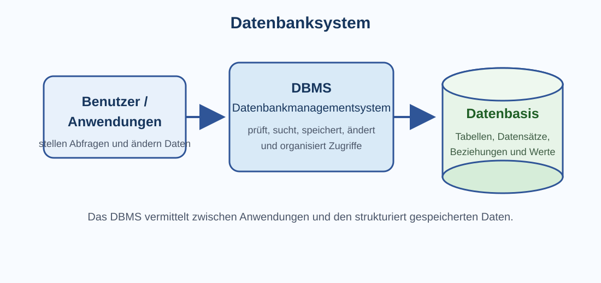

# 1 Informationen, Daten und Datenbanken

## Von einzelnen Daten zu großen Datensammlungen

In Klasse 7 wurden Daten als Darstellung von Informationen eingeführt. In Klasse 9 geht es nun darum, wie **große Mengen zusammengehöriger Daten strukturiert gespeichert, gesucht, verändert und ausgewertet** werden können.

Dafür werden **Datenbanken** verwendet. Beispiele finden sich fast überall:

- eine Schulbibliothek verwaltet Bücher und Ausleihen,
- ein Online-Shop verwaltet Artikel, Kunden und Bestellungen,
- eine Schule verwaltet Schüler, Klassen und Kurse,
- ein Streamingdienst speichert Inhalte, Nutzerkonten und Wiedergabelisten,
- ein Verkehrsunternehmen verwaltet Haltestellen, Linien und Fahrpläne.

Eine einfache Tabelle in einer Tabellenkalkulation kann für kleine Datenmengen ausreichen. Bei vielen Datensätzen, mehreren gleichzeitig arbeitenden Benutzern, Beziehungen zwischen verschiedenen Datenarten oder häufigen Abfragen wird ein Datenbanksystem jedoch deutlich geeigneter.

> **Merke:** Eine Datenbank speichert nicht einfach nur „viele Werte“. Sie organisiert zusammengehörige Daten nach einer festgelegten Struktur, damit sie zuverlässig verarbeitet werden können.

## Datenbank, DBMS und Datenbanksystem

Die Begriffe werden leicht verwechselt.

Eine **Datenbank** beziehungsweise **Datenbasis** enthält die strukturiert gespeicherten Daten. Das **Datenbankmanagementsystem (DBMS)** ist die Software, die diese Daten verwaltet. Zusammen bilden Datenbasis und DBMS ein **Datenbanksystem**.



Das DBMS übernimmt beispielsweise:

- Daten speichern, lesen, ändern und löschen,
- Abfragen ausführen,
- Datentypen und Regeln prüfen,
- Zugriffsrechte verwalten,
- gleichzeitige Zugriffe koordinieren,
- Beziehungen zwischen Daten berücksichtigen,
- Daten möglichst konsistent halten.

Bekannte relationale Datenbankmanagementsysteme sind beispielsweise SQLite, MariaDB/MySQL, PostgreSQL oder Microsoft SQL Server. Für das grundlegende Verständnis ist jedoch wichtiger, **welche Aufgaben ein DBMS übernimmt**, als ein bestimmtes Produkt auswendig zu kennen.

## Relationale Datenbanken

Eine häufig verwendete Form ist die **relationale Datenbank**. Daten werden dabei in Tabellen organisiert. Tabellen können über gemeinsame Schlüsselwerte miteinander verbunden werden.

Als durchgehendes Beispiel verwenden wir eine kleine Schulbibliothek.

### Tabelle `Buch`

| BuchID | Titel | Erscheinungsjahr | Verfügbar |
|---:|---|---:|---|
| 101 | Informatik entdecken | 2024 | ja |
| 102 | Daten verstehen | 2025 | nein |
| 103 | Netze und Dienste | 2023 | ja |

### Zeile, Datensatz, Spalte und Attribut

Eine **Zeile** enthält die zusammengehörigen Werte zu einem Objekt oder Sachverhalt und wird häufig als **Datensatz** bezeichnet.

Die Zeile

```text
101 | Informatik entdecken | 2024 | ja
```

beschreibt ein bestimmtes Buch.

Eine **Spalte** beschreibt eine Eigenschaft, zum Beispiel `Titel` oder `Erscheinungsjahr`. In der Datenbanktheorie wird eine solche Eigenschaft häufig **Attribut** genannt. Der konkrete Wert in einer Tabellenzelle ist ein **Attributwert**.

| Begriff | Beispiel |
|---|---|
| Tabelle / Relation | `Buch` |
| Datensatz / Tupel | die Zeile zu BuchID 101 |
| Attribut | `Titel` |
| Attributwert | `Informatik entdecken` |

> **Merke:** Im Unterricht werden häufig die anschaulichen Begriffe Tabelle, Zeile und Spalte verwendet. In relationalen Datenbanken begegnen außerdem die Fachbegriffe Relation, Tupel und Attribut.

## Datentypen

Ein **Datentyp** legt fest, welche Art von Werten in einem Feld gespeichert werden soll und welche Operationen damit sinnvoll sind.

Typische Datentypen sind:

| Datenart | mögliche Datenbanktypen | Beispiel |
|---|---|---|
| ganze Zahl | `INTEGER`, `INT` | `2025` |
| Dezimalzahl | `REAL`, `DECIMAL` | `19.95` |
| Text | `TEXT`, `VARCHAR` | `Daten verstehen` |
| Datum/Zeit | `DATE`, `DATETIME` | `2026-08-21` |
| Wahrheitswert | `BOOLEAN` oder entsprechende Ersatzdarstellung | wahr/falsch |

Die genaue Bezeichnung hängt vom verwendeten DBMS ab.

### Warum der passende Datentyp wichtig ist

Der Datentyp beeinflusst, welche Werte gespeichert und wie sie verarbeitet werden können. Eine Postleitzahl wird trotz ihrer Ziffern oft besser als **Text** behandelt, weil mit ihr normalerweise nicht gerechnet wird und führende Nullen erhalten bleiben müssen.

Auch Telefonnummern sind meist keine Zahlen im mathematischen Sinn. Zeichen wie `+`, Leerzeichen oder führende Nullen können dazugehören.

> **Merke:** Nur weil etwas aus Ziffern besteht, muss es nicht als Zahl gespeichert werden.

## Schlüssel: Datensätze eindeutig erkennen

### Primärschlüssel

Ein **Primärschlüssel (Primary Key)** identifiziert jeden Datensatz einer Tabelle eindeutig.

In unserer Tabelle `Buch` ist `BuchID` ein guter Primärschlüssel:

```text
BuchID = 101
```

Der Titel wäre ungeeignet, weil mehrere unterschiedliche Bücher denselben Titel besitzen könnten.

Ein Primärschlüssel sollte deshalb:

- eindeutig sein,
- für jeden Datensatz vorhanden sein,
- möglichst stabil bleiben.

### Künstliche und natürliche Schlüssel

Manchmal existiert bereits ein fachlich eindeutiger Wert, etwa eine bestimmte Kennnummer. Häufig wird jedoch bewusst eine zusätzliche ID verwendet, zum Beispiel `BuchID`, `KundenID` oder `BestellID`. Eine solche ID wird oft als **künstlicher Schlüssel** bezeichnet.

## Beziehungen zwischen Tabellen

In einer relationalen Datenbank wird nicht alles in eine einzige riesige Tabelle geschrieben. Unterschiedliche Arten von Objekten erhalten meist eigene Tabellen.

Zusätzlich zur Tabelle `Buch` könnte die Bibliothek eine Tabelle `Schueler` besitzen:

| SchuelerID | Name | Klasse |
|---:|---|---|
| 501 | Mia Berger | 9a |
| 502 | Leon Wolf | 9b |

Und eine Tabelle `Ausleihe`:

| AusleiheID | SchuelerID | BuchID | Ausleihdatum |
|---:|---:|---:|---|
| 9001 | 501 | 102 | 2026-08-20 |
| 9002 | 502 | 101 | 2026-08-21 |

### Fremdschlüssel

Ein **Fremdschlüssel (Foreign Key)** verweist auf einen Schlüsselwert einer anderen Tabelle.

In `Ausleihe` verweist:

- `SchuelerID = 501` auf Mia Berger in der Tabelle `Schueler`,
- `BuchID = 102` auf „Daten verstehen“ in der Tabelle `Buch`.

Dadurch muss der Schülername nicht bei jeder Ausleihe erneut gespeichert werden.

> **Merke:** Ein Primärschlüssel sagt: „Welcher Datensatz ist das?“ Ein Fremdschlüssel sagt: „Auf welchen Datensatz einer anderen Tabelle beziehe ich mich?“

## Kardinalitäten: 1:1, 1:n und n:m

Beziehungen können unterschiedlich aussehen.

### 1:1-Beziehung

Einem Datensatz der ersten Tabelle ist höchstens ein Datensatz der zweiten Tabelle zugeordnet und umgekehrt.

Beispiel: Eine Person besitzt in einem bestimmten System genau einen zugehörigen persönlichen Einstellungsdatensatz.

### 1:n-Beziehung

Ein Datensatz auf einer Seite kann mit vielen Datensätzen auf der anderen Seite verbunden sein.

Beispiel:

```text
Klasse 1 ─── n Schüler
```

Eine Klasse enthält viele Schüler, ein Schüler gehört in diesem vereinfachten Modell genau einer Klasse an.

### n:m-Beziehung

Viele Datensätze der einen Seite können mit vielen Datensätzen der anderen Seite verbunden sein.

In einer Bibliothek können viele Schüler im Laufe der Zeit viele Bücher ausleihen. Diese n:m-Beziehung wird in relationalen Datenbanken typischerweise über eine **Zwischentabelle** wie `Ausleihe` aufgelöst.

Die Zwischentabelle speichert dabei nicht nur die Verbindung, sondern kann zusätzliche Informationen enthalten, beispielsweise `Ausleihdatum` oder `Rueckgabedatum`.

## Redundanz und warum man Daten aufteilt

**Redundanz** bedeutet, dass dieselbe Information unnötig mehrfach gespeichert wird.

Angenommen, jede Ausleihe würde so gespeichert:

| Schülername | Klasse | Buchtitel | Ausleihdatum |
|---|---|---|---|
| Mia Berger | 9a | Daten verstehen | 20.08.2026 |
| Mia Berger | 9a | Netze und Dienste | 21.08.2026 |

Name und Klasse werden wiederholt. Wechselt Mia die Klasse oder wird ein Tippfehler korrigiert, müssten möglicherweise viele Zeilen geändert werden.

Durch getrennte Tabellen wird die Information nur an der dafür vorgesehenen Stelle gespeichert und über Schlüssel verbunden.

Das verringert unter anderem die Gefahr von:

- widersprüchlichen Daten,
- unnötigen Mehrfachspeicherungen,
- aufwendigen Änderungen.

Dieses strukturierte Zerlegen von Tabellen wird in höheren Stufen genauer als **Normalisierung** behandelt.

## Integrität und Konsistenz

Eine Datenbank soll nicht nur Werte speichern, sondern möglichst verhindern, dass widersprüchliche Zustände entstehen.

Beispiele für sinnvolle Regeln:

- jede `BuchID` ist eindeutig,
- ein Pflichtfeld darf nicht leer sein,
- ein Fremdschlüssel verweist nur auf einen vorhandenen Datensatz,
- ein Erscheinungsjahr muss als zulässiger Zahlenwert gespeichert werden.

Solche Regeln werden häufig als **Constraints** beziehungsweise Integritätsbedingungen umgesetzt.

### Referenzielle Integrität

Wenn eine Ausleihe auf `BuchID = 102` verweist, sollte ein Buch mit dieser ID tatsächlich existieren. Die Sicherung solcher gültigen Verweise heißt **referenzielle Integrität**.

## Daten suchen: Abfragen

Eine Datenbank wird besonders nützlich, wenn Daten gezielt abgefragt werden können.

Man kann beispielsweise fragen:

- Welche Bücher sind verfügbar?
- Welche Bücher erschienen ab 2024?
- Welche Bücher hat Mia ausgeliehen?
- Wie viele Bücher sind derzeit ausgeliehen?

Relationale Datenbanken verwenden dafür sehr häufig **SQL – Structured Query Language**.

## SQL-Grundlagen

SQL ist eine Sprache zur Arbeit mit relationalen Datenbanken. Verschiedene Datenbanksysteme verwenden weitgehend gemeinsame Grundideen, besitzen aber teilweise unterschiedliche Erweiterungen.

### Alle Datensätze anzeigen: `SELECT`

```sql
SELECT *
FROM Buch;
```

`SELECT` bestimmt, welche Spalten ausgegeben werden. `FROM` nennt die Tabelle. Der Stern `*` bedeutet hier: alle Spalten.

### Bestimmte Spalten auswählen

```sql
SELECT Titel, Erscheinungsjahr
FROM Buch;
```

Nun werden nur die beiden genannten Spalten ausgegeben.

### Datensätze filtern: `WHERE`

```sql
SELECT Titel
FROM Buch
WHERE Erscheinungsjahr >= 2024;
```

`WHERE` legt eine Bedingung fest. Nur Datensätze, für die sie erfüllt ist, erscheinen im Ergebnis.

### Bedingungen verbinden

```sql
SELECT Titel
FROM Buch
WHERE Erscheinungsjahr >= 2024
  AND Verfuegbar = TRUE;
```

Mit `AND` müssen beide Bedingungen erfüllt sein. Mit `OR` genügt mindestens eine der Bedingungen.

### Sortieren: `ORDER BY`

```sql
SELECT Titel, Erscheinungsjahr
FROM Buch
ORDER BY Erscheinungsjahr DESC;
```

`DESC` sortiert absteigend, `ASC` aufsteigend.

### Texte vergleichen

```sql
SELECT *
FROM Buch
WHERE Titel = 'Daten verstehen';
```

Textwerte werden in SQL typischerweise in einfachen Anführungszeichen geschrieben.

## SQL verändert nicht nur die Anzeige

Eine `SELECT`-Abfrage liest Daten. SQL kann aber auch Daten verändern.

### Datensatz einfügen: `INSERT`

```sql
INSERT INTO Buch (BuchID, Titel, Erscheinungsjahr, Verfuegbar)
VALUES (104, 'Programmieren lernen', 2026, TRUE);
```

### Datensatz ändern: `UPDATE`

```sql
UPDATE Buch
SET Verfuegbar = FALSE
WHERE BuchID = 101;
```

Die `WHERE`-Bedingung ist hier besonders wichtig. Ohne passende Einschränkung könnten mehrere oder sogar alle Datensätze geändert werden.

### Datensatz löschen: `DELETE`

```sql
DELETE FROM Buch
WHERE BuchID = 104;
```

Auch beim Löschen bestimmt `WHERE`, welche Datensätze betroffen sind.

> **Merke:** `SELECT` liest Daten. `INSERT` fügt Daten ein. `UPDATE` verändert Daten. `DELETE` löscht Daten.

## Tabellen verbinden: `JOIN`

Die Stärke relationaler Datenbanken liegt darin, zusammengehörige Daten aus mehreren Tabellen gemeinsam auszuwerten.

Gesucht seien die Namen der Schüler und die Titel ihrer ausgeliehenen Bücher.

Vereinfacht kann dies mit `JOIN` geschehen:

```sql
SELECT Schueler.Name, Buch.Titel
FROM Ausleihe
JOIN Schueler ON Ausleihe.SchuelerID = Schueler.SchuelerID
JOIN Buch ON Ausleihe.BuchID = Buch.BuchID;
```

Der `JOIN` verbindet Datensätze anhand zusammenpassender Schlüsselwerte.

Das Ergebnis könnte lauten:

| Name | Titel |
|---|---|
| Mia Berger | Daten verstehen |
| Leon Wolf | Informatik entdecken |

> **Merke:** Fremdschlüssel speichern Beziehungen. Ein `JOIN` kann diese Beziehungen bei einer Abfrage nutzen, um Informationen aus mehreren Tabellen zusammenzuführen.

## Aggregatfunktionen: Daten zusammenfassen

Datenbanken können Werte nicht nur auflisten, sondern auch zusammenfassen.

### Anzahl bestimmen

```sql
SELECT COUNT(*)
FROM Buch;
```

`COUNT(*)` zählt Datensätze.

### Gruppieren

Angenommen, zu jedem Buch wäre eine Kategorie gespeichert. Dann könnte man zählen, wie viele Bücher zu jeder Kategorie gehören:

```sql
SELECT Kategorie, COUNT(*)
FROM Buch
GROUP BY Kategorie;
```

Weitere häufige Aggregatfunktionen sind beispielsweise `SUM`, `AVG`, `MIN` und `MAX`.

## Sortieren, Filtern und Abfragen unterscheiden

**Sortieren** verändert nur die Reihenfolge des Ergebnisses. **Filtern** schränkt die angezeigten Datensätze ein. Eine **Abfrage** kann beides kombinieren und zusätzlich Spalten auswählen, Tabellen verbinden oder Werte zusammenfassen.

| Vorgang | Beispiel |
|---|---|
| Sortieren | Bücher nach Jahr ordnen |
| Filtern | nur verfügbare Bücher anzeigen |
| Abfragen | Titel verfügbarer Bücher ab 2024 anzeigen und nach Jahr sortieren |

## Datenmodellierung vor der Datenbank

Bevor eine Datenbank erstellt wird, sollte geklärt werden, **welche Daten überhaupt benötigt werden und wie sie zusammenhängen**.

Typische Fragen sind:

1. Welche Objekte beziehungsweise Sachverhalte sollen gespeichert werden?
2. Welche Eigenschaften besitzen diese Objekte?
3. Wodurch werden Datensätze eindeutig identifiziert?
4. Welche Beziehungen bestehen zwischen ihnen?
5. Welche Datentypen und Regeln sind sinnvoll?

Für eine Schulbibliothek ergeben sich beispielsweise die Entitäten `Buch`, `Schueler` und `Ausleihe`.

Solche Strukturen können in einem **Entity-Relationship-Modell (ER-Modell)** dargestellt werden. Dabei werden Entitäten, Attribute und Beziehungen sichtbar gemacht. In einer relationalen Datenbank werden diese Modelle anschließend in Tabellen, Schlüssel und Beziehungen umgesetzt.

## Datenbank und Tabellenkalkulation – nicht dasselbe

Eine Tabellenkalkulation und eine relationale Datenbank können beide Daten tabellarisch darstellen, verfolgen aber unterschiedliche Schwerpunkte.

| Tabellenkalkulation | relationale Datenbank |
|---|---|
| Zellen und Formeln stehen im Vordergrund | strukturierte Datensätze und Beziehungen stehen im Vordergrund |
| sehr flexibel für kleine Auswertungen | geeignet für umfangreiche und dauerhaft strukturierte Daten |
| Beziehungen zwischen Tabellen meist nicht zentral | Beziehungen über Schlüssel sind grundlegendes Konzept |
| Eingaben können sehr frei sein | Datentypen und Regeln können konsequent geprüft werden |
| häufig für Berechnungen und Diagramme | häufig für Speichern, Suchen und gleichzeitige Zugriffe |

Beide Werkzeuge haben sinnvolle Einsatzbereiche. Eine Datenbank ist nicht automatisch „besser“, sondern für bestimmte Aufgaben geeigneter.

## Datenqualität

Auswertungen können nur so zuverlässig sein wie die verwendeten Daten. Probleme entstehen beispielsweise durch:

- fehlende Werte,
- Tippfehler,
- doppelte Datensätze,
- unterschiedliche Schreibweisen,
- veraltete Daten,
- ungeeignete Datentypen,
- falsche Zuordnungen zwischen Tabellen.

Beispiel: Werden die Orte `Dresden`, `dresden` und `Dresdn` getrennt gespeichert, kann eine Auswertung sie fälschlich als unterschiedliche Orte behandeln.

### Plausibilitäts- und Gültigkeitsprüfungen

Ein Datenbanksystem kann manche Fehler bereits bei der Eingabe verhindern. Beispielsweise kann festgelegt werden:

- eine ID darf nicht doppelt vorkommen,
- ein bestimmtes Feld darf nicht leer bleiben,
- nur zulässige Werte oder Datentypen werden akzeptiert.

Trotzdem kann ein formal gültiger Wert inhaltlich falsch sein. Das Geburtsjahr `2011` kann technisch korrekt gespeichert sein, obwohl für eine konkrete Person eigentlich `2012` richtig wäre.

> **Merke:** Technisch gültige Daten sind nicht automatisch inhaltlich richtige Daten.

## Datenschutz, Zugriffsrechte und Sicherheit

Datenbanken enthalten häufig wertvolle oder personenbezogene Daten. Deshalb muss geregelt werden, **wer welche Daten lesen oder verändern darf**.

Ein DBMS kann beispielsweise unterschiedliche Benutzer und Rechte verwalten. Eine Person darf vielleicht Daten lesen, aber nicht löschen. Eine andere darf bestimmte Tabellen ändern, andere jedoch nicht sehen.

Wichtige Grundideen sind:

- nur notwendige Daten speichern,
- Zugriffsrechte begrenzen,
- regelmäßige Sicherungen erstellen,
- sensible Daten schützen,
- Änderungen nachvollziehbar und kontrolliert durchführen.

Besonders bei personenbezogenen Daten gelten zusätzlich rechtliche Datenschutzanforderungen.

## Daten sichern: Backup ist nicht dasselbe wie Datenbank

Auch eine gut strukturierte Datenbank kann durch Hardwarefehler, Bedienfehler oder Schadsoftware beschädigt werden. Deshalb werden **Backups** benötigt.

Ein Backup ist eine zusätzliche Sicherungskopie, aus der Daten im Notfall wiederhergestellt werden können. Es ersetzt nicht die Datenbank selbst.

## Typische Fehler beim Entwurf

### Kein eindeutiger Schlüssel

Ohne eindeutigen Schlüssel können gleich aussehende Datensätze schwer auseinandergehalten werden.

### Zu viele Informationen in einem Feld

Ein Feld wie

```text
"Mia Berger, Klasse 9a, Dresden"
```

enthält mehrere unterschiedliche Informationen. Separate Attribute wie `Name`, `Klasse` und `Ort` lassen sich gezielter suchen und auswerten.

### Mehrere Werte in einem Feld

Ein Feld `AusgelieheneBuecher` mit

```text
101, 102, 108, 115
```

ist für eine relationale Struktur ungünstig. Beziehungen sollten über eigene Tabellen und Datensätze dargestellt werden.

### Daten unnötig mehrfach speichern

Mehrfach gespeicherte Informationen können widersprüchlich werden. Deshalb werden Daten sinnvoll auf Tabellen verteilt und über Schlüssel verbunden.

## Von einer Fragestellung zur SQL-Abfrage

Beim Schreiben einer Abfrage hilft ein schrittweises Vorgehen:

1. **Welche Information soll ausgegeben werden?** → `SELECT`
2. **In welcher Tabelle beziehungsweise welchen Tabellen liegt sie?** → `FROM` / `JOIN`
3. **Welche Datensätze sollen berücksichtigt werden?** → `WHERE`
4. **Wie soll das Ergebnis geordnet werden?** → `ORDER BY`
5. **Müssen Werte zusammengefasst werden?** → z. B. `COUNT`, `GROUP BY`

Beispiel-Frage:

**Welche verfügbaren Bücher ab Erscheinungsjahr 2024 gibt es, sortiert vom neuesten zum ältesten?**

```sql
SELECT Titel, Erscheinungsjahr
FROM Buch
WHERE Erscheinungsjahr >= 2024
  AND Verfuegbar = TRUE
ORDER BY Erscheinungsjahr DESC;
```

So lässt sich die natürliche Fragestellung Schritt für Schritt in eine Datenbankabfrage übersetzen.

## Begriffe zum Nachschlagen

**Abfrage (Query):** gezielte Anforderung von Daten oder Auswertungen aus einer Datenbank.

**Attribut:** Eigenschaft eines Datensatzes beziehungsweise einer Entität; in einer Tabelle meist als Spalte dargestellt.

**Constraint:** Regel, die zulässige Daten und Beziehungen in einer Datenbank einschränkt.

**Datenbank:** strukturierte Sammlung zusammengehöriger Daten.

**Datenbankmanagementsystem (DBMS):** Software zum Verwalten, Abfragen und Ändern einer Datenbank.

**Datenbanksystem:** Datenbasis zusammen mit dem zugehörigen Datenbankmanagementsystem.

**Datenfeld:** Speicherstelle für eine einzelne Eigenschaft innerhalb eines Datensatzes.

**Datensatz:** zusammengehörige Werte zu einem Objekt oder Sachverhalt; in einer relationalen Tabelle typischerweise eine Zeile.

**Datentyp:** Festlegung der Art zulässiger Werte und möglicher Operationen.

**Entity-Relationship-Modell (ER-Modell):** Modell zur Darstellung von Entitäten, Eigenschaften und Beziehungen vor der Umsetzung in Tabellen.

**Entität:** unterscheidbares Objekt oder Sachverhalt, über das beziehungsweise den Daten gespeichert werden.

**Fremdschlüssel (Foreign Key):** Attribut, das auf einen Schlüsselwert eines Datensatzes in einer anderen oder derselben Tabelle verweist.

**Integrität:** Eigenschaft, dass Daten und Beziehungen vorgegebene Regeln erfüllen und konsistent sind.

**JOIN:** SQL-Operation zum Verbinden zusammengehöriger Datensätze aus mehreren Tabellen.

**Kardinalität:** beschreibt, wie viele Datensätze zweier Entitäten miteinander in Beziehung stehen können, beispielsweise 1:n oder n:m.

**Normalisierung:** systematisches Strukturieren relationaler Tabellen, um ungünstige Redundanzen und Abhängigkeiten zu verringern.

**Primärschlüssel (Primary Key):** Attribut oder Attributkombination, die einen Datensatz eindeutig identifiziert.

**Redundanz:** unnötige Mehrfachspeicherung derselben Information.

**Referenzielle Integrität:** Regel, dass Fremdschlüssel auf gültige Datensätze verweisen.

**Relation:** Fachbegriff für die tabellarische Struktur im relationalen Datenmodell.

**SQL:** Structured Query Language; Sprache zum Definieren, Abfragen und Verändern relationaler Datenbanken.

**Tupel:** Fachbegriff für einen Datensatz beziehungsweise eine Zeile einer Relation.

→ Vorwissen: Nachschlagewerk Klasse 7, **Informationen und Daten**.

→ Weiterführend: Kapitel 2, **Big Data und automatisierte Datenverarbeitung**.
