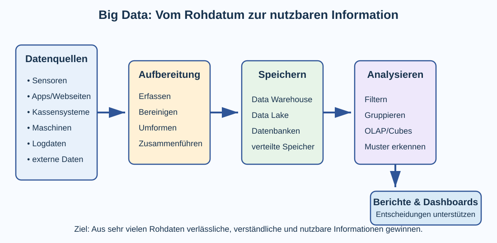
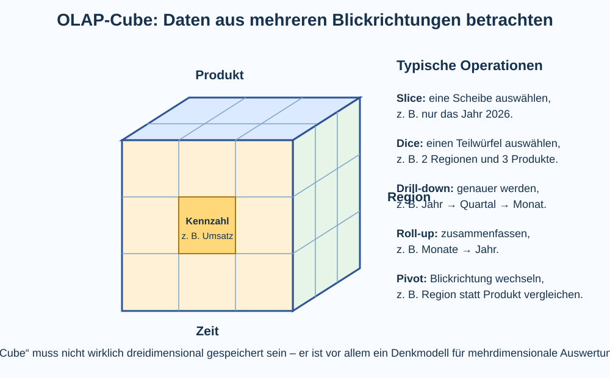

# 2 Big Data und automatisierte Datenverarbeitung

## Was bedeutet Big Data?

Smartphones, Webseiten, Sensoren, Fahrzeuge, Kassensysteme, Maschinen, soziale Netzwerke und viele andere Informatiksysteme erzeugen fortlaufend Daten. Werden Datenmengen so groß, schnell oder vielfältig, dass herkömmliche Verfahren für Speicherung, Verarbeitung und Auswertung an Grenzen stoßen, wird häufig der Begriff **Big Data** verwendet.

Big Data bedeutet deshalb nicht einfach nur „sehr viele Dateien“. Gemeint ist die Herausforderung, große und verschiedenartige Datenbestände so zu erfassen, zu speichern und auszuwerten, dass daraus nutzbare Informationen entstehen.

## Wozu dient Big Data?

Große Datenmengen werden nicht gesammelt, nur damit sie vorhanden sind. Sie sollen Fragen beantworten, Zusammenhänge sichtbar machen oder Entscheidungen unterstützen.

Beispiele:

- Ein Verkehrsunternehmen möchte erkennen, auf welchen Linien zu welchen Zeiten besonders viele Fahrgäste unterwegs sind.
- Ein Online-Shop möchte wissen, welche Produkte häufig gemeinsam gekauft werden.
- Eine Produktionsanlage soll ungewöhnliche Sensormuster erkennen, bevor eine Maschine ausfällt.
- Ein Energieversorger möchte Verbrauchsmuster auswerten und Lastspitzen besser planen.
- Eine Forschungseinrichtung möchte sehr große Messreihen untersuchen.
- Ein Unternehmen möchte Umsätze nach Zeitraum, Produktgruppe und Region vergleichen.

Aus Rohdaten sollen also **Informationen und Erkenntnisse** entstehen.

> **Merke:** Big Data ist kein Selbstzweck. Der Nutzen entsteht erst, wenn Daten zuverlässig ausgewertet und die Ergebnisse sinnvoll interpretiert werden.

## Die „V“ von Big Data

Big Data wird häufig anhand mehrerer Eigenschaften beschrieben. Besonders bekannt sind:

| Begriff | Bedeutung | Beispiel |
|---|---|---|
| **Volume** | große Datenmenge | Milliarden Messwerte oder Transaktionen |
| **Velocity** | hohe Entstehungs- und Verarbeitungsgeschwindigkeit | Sensordaten treffen jede Sekunde ein |
| **Variety** | unterschiedliche Datenarten und Formate | Tabellen, Texte, Bilder, Logdateien, Sensordaten |
| **Veracity** | Zuverlässigkeit und Qualität der Daten | fehlerhafte, doppelte oder unvollständige Werte |
| **Value** | nutzbarer Wert der Daten | Erkenntnisse, bessere Entscheidungen, Optimierung |

Nicht jede große Datensammlung erfüllt alle Eigenschaften gleich stark.

## Woher kommen die Daten?

Daten können manuell eingegeben oder automatisch erzeugt werden. Besonders bei Big Data spielt die **automatisierte Datenerfassung** eine große Rolle.

Typische Datenquellen sind:

- Sensoren und Messgeräte,
- Webseiten und Apps,
- Server- und Protokolldaten,
- Kassensysteme und Bestellungen,
- Maschinen und Produktionsanlagen,
- Fahrzeuge und Verkehrssysteme,
- Smartphones und andere mobile Endgeräte,
- soziale Netzwerke,
- externe Datensätze, zum Beispiel Wetter- oder Geodaten.

Dabei entstehen **strukturierte Daten** wie Tabellenwerte, **halbstrukturierte Daten** wie JSON- oder XML-Dokumente und **unstrukturierte Daten** wie Texte, Bilder, Audio oder Video.

## Vom Rohdatum zur Information

Eine typische Big-Data- oder Analyseumgebung besteht aus mehreren Schritten.



Vereinfacht gilt:

1. Daten werden **erfasst**.
2. Daten werden **bereinigt und vereinheitlicht**.
3. Daten aus verschiedenen Quellen werden **zusammengeführt**.
4. Die Daten werden für spätere Analysen **gespeichert**.
5. Analyseverfahren berechnen Kennzahlen oder suchen Muster.
6. Ergebnisse werden beispielsweise in **Berichten oder Dashboards** dargestellt.
7. Menschen nutzen diese Informationen für Entscheidungen oder weitere Untersuchungen.

### Datenbereinigung

Rohdaten enthalten häufig Fehler oder Uneinheitlichkeiten. Vor einer Auswertung können deshalb beispielsweise notwendig sein:

- Dubletten entfernen,
- fehlende Werte behandeln,
- unterschiedliche Datumsformate vereinheitlichen,
- fehlerhafte Messwerte erkennen,
- Schreibweisen vereinheitlichen,
- Daten aus unterschiedlichen Systemen zusammenführen.

Die in Kapitel 1 behandelte **Datenqualität** ist deshalb eine wichtige Voraussetzung für Big-Data-Auswertungen.

## ETL und ELT

Beim Überführen von Daten in Analyseplattformen begegnen häufig die Abkürzungen **ETL** und **ELT**.

**ETL** bedeutet:

1. **Extract** – Daten aus den Quellsystemen auslesen,
2. **Transform** – Daten bereinigen und in die gewünschte Struktur umformen,
3. **Load** – die aufbereiteten Daten in das Zielsystem laden.

Bei **ELT** werden die Rohdaten zunächst in das Zielsystem geladen und dort anschließend transformiert:

**Extract → Load → Transform**.

Welches Verfahren verwendet wird, hängt unter anderem von Datenmenge, Infrastruktur und Verwendungszweck ab.

## Operative Daten und Analysedaten

Eine wichtige Unterscheidung ist die zwischen Systemen für das tägliche Arbeiten und Systemen für umfangreiche Auswertungen.

Ein **operatives System** verarbeitet beispielsweise einzelne Bestellungen, Zahlungen oder Buchungen. Hier sind schnelle und korrekte Einzelvorgänge wichtig.

Ein **Analysesystem** untersucht dagegen große Mengen vergangener Daten, um Muster und Entwicklungen zu erkennen.

Beispiel:

- Kassensystem: „Buche diesen Einkauf jetzt.“
- Analysesystem: „Wie haben sich die Verkäufe dieser Produktgruppe in den letzten drei Jahren nach Region entwickelt?“

## Data Warehouse

Ein **Data Warehouse** ist ein zentraler Datenbestand, der speziell für Auswertungen und Berichte aufgebaut wird. Daten aus mehreren Quellsystemen werden dafür zusammengeführt und in einer geeigneten Form bereitgestellt.

Ein Data Warehouse enthält häufig **historische Daten**. Dadurch können Entwicklungen über längere Zeiträume untersucht werden.

Typische Fragen sind beispielsweise:

- Wie hat sich der Umsatz im Vergleich zum Vorjahr verändert?
- Welche Produktgruppen wachsen besonders stark?
- Welche Regionen unterscheiden sich voneinander?
- In welchen Monaten treten besonders viele Störungen auf?

Das Data Warehouse ersetzt nicht unbedingt die operativen Datenbanken. Es übernimmt einen anderen Schwerpunkt: **Analysieren statt einzelne Geschäftsvorgänge ausführen**.

## Data Lake

Ein **Data Lake** speichert häufig große Mengen von Rohdaten in unterschiedlichen Formaten. Die Daten müssen beim Speichern noch nicht vollständig in eine feste Tabellenstruktur gebracht werden.

Vereinfacht kann man unterscheiden:

| Data Warehouse | Data Lake |
|---|---|
| stark für Analysen aufbereitete Daten | häufig auch Rohdaten |
| definierte Strukturen | vielfältige Formate möglich |
| Berichte und Kennzahlen im Vordergrund | flexible spätere Verarbeitung im Vordergrund |
| Daten wurden meist bereits gezielt ausgewählt und vereinheitlicht | Daten können zunächst breiter gesammelt werden |

In modernen Systemen können sich beide Konzepte überschneiden oder kombiniert werden.

## OLAP – Daten mehrdimensional analysieren

Für umfangreiche betriebliche und statistische Auswertungen wird häufig der Begriff **OLAP – Online Analytical Processing** verwendet.

OLAP dient dazu, Daten schnell aus unterschiedlichen Blickrichtungen zu betrachten und zusammenzufassen.

Angenommen, ein Unternehmen möchte Verkäufe untersuchen. Interessante Blickrichtungen könnten sein:

- **Zeit** – Jahr, Quartal, Monat,
- **Produkt** – Produktgruppe oder einzelnes Produkt,
- **Region** – Land, Bundesland oder Filiale.

Dazu kommen **Kennzahlen**, beispielsweise:

- Umsatz,
- Anzahl verkaufter Produkte,
- Kosten,
- Gewinn,
- Anzahl Bestellungen.

## Der OLAP-Cube

Ein verbreitetes Denkmodell ist der **OLAP-Cube** beziehungsweise Datenwürfel.



Die Achsen des Würfels stehen für **Dimensionen**. In den Zellen befinden sich Kennzahlen.

Beispiel:

```text
Dimension Zeit:    Jahr → Quartal → Monat
Dimension Region:  Deutschland → Sachsen → Dresden
Dimension Produkt: Technik → Computer → Notebook
Kennzahl:          Umsatz
```

So lässt sich beispielsweise fragen:

**Wie hoch war der Notebook-Umsatz in Dresden im zweiten Quartal 2026?**

Ein Cube muss technisch nicht tatsächlich als dreidimensionaler Würfel gespeichert sein. Der Würfel hilft vor allem dabei, **mehrdimensionale Analysen anschaulich zu verstehen**. In realen Systemen können weit mehr als drei Dimensionen vorkommen.

## Dimensionen, Hierarchien und Kennzahlen

Eine **Dimension** beschreibt, nach welcher Eigenschaft Daten betrachtet werden.

Eine Dimension kann mehrere Ebenen besitzen. Das nennt man häufig eine **Hierarchie**.

Beispiel Zeit:

```text
Jahr
  ↓
Quartal
  ↓
Monat
  ↓
Tag
```

Eine **Kennzahl** ist ein numerischer Wert, der ausgewertet oder zusammengefasst werden kann, beispielsweise Umsatz oder Stückzahl.

> **Merke:** Dimensionen beantworten Fragen wie „wann?“, „wo?“ und „was?“. Kennzahlen beantworten Fragen wie „wie viel?“ oder „wie oft?“.

## Typische OLAP-Operationen

### Slice

Beim **Slice** wird eine einzelne Ebene beziehungsweise ein bestimmter Wert einer Dimension ausgewählt.

Beispiel:

```text
nur das Jahr 2026
```

Aus dem gesamten Datenwürfel wird gewissermaßen eine Scheibe betrachtet.

### Dice

Beim **Dice** wird ein kleinerer Teilbereich aus mehreren Dimensionen ausgewählt.

Beispiel:

```text
Jahre 2025–2026
nur Sachsen und Thüringen
nur Produktgruppen Computer und Tablets
```

### Drill-down

Beim **Drill-down** wird eine Auswertung detaillierter.

```text
Jahr → Quartal → Monat → Tag
```

Man „bohrt“ tiefer in die Daten hinein.

### Roll-up

**Roll-up** ist die Gegenrichtung: Daten werden stärker zusammengefasst.

```text
Tag → Monat → Quartal → Jahr
```

### Pivot

Beim **Pivot** wird die Blickrichtung verändert. Beispielsweise werden statt Produktgruppen nun Regionen in den Zeilen und Zeiträume in den Spalten dargestellt.

## Von Daten zu Berichten

Nicht jeder Nutzer arbeitet direkt mit Datenbanken oder OLAP-Systemen. Ergebnisse werden deshalb häufig in **Berichten (Reports)** aufbereitet.

Ein Bericht kann enthalten:

- Tabellen,
- Kennzahlen,
- Diagramme,
- Vergleiche mit Vorperioden,
- Abweichungen zu Zielwerten,
- Filter und Gruppierungen,
- Kommentare oder Zusammenfassungen.

Beispiel eines Monatsberichts:

| Kennzahl | Juli | August | Veränderung |
|---|---:|---:|---:|
| Bestellungen | 12 400 | 13 100 | +700 |
| Umsatz | 248 000 € | 263 000 € | +15 000 € |
| Rücksendungen | 510 | 620 | +110 |

Ein Bericht soll Rohdaten **verdichten**, damit wichtige Informationen schneller erkannt werden können.

## Dashboards

Ein **Dashboard** ist eine übersichtliche Darstellung wichtiger Kennzahlen und Entwicklungen. Es kann beispielsweise aktuelle Werte, Diagramme, Warnungen und Filter enthalten.

Typische Bestandteile sind:

- KPI-Kacheln,
- Zeitreihen,
- Balken- oder Kreisdiagramme,
- Tabellen,
- Ampelanzeigen,
- Filter nach Zeit, Region oder Produkt.

**KPI** steht für **Key Performance Indicator**, also eine besonders wichtige Kennzahl.

Beispiele für KPIs sind Umsatz, Fehlerquote, Lieferzeit oder Anzahl aktiver Nutzer.

> **Merke:** Ein Dashboard zeigt nicht möglichst viele Werte, sondern möglichst die **relevanten** Werte für eine bestimmte Aufgabe.

## Bericht, Dashboard und Ad-hoc-Analyse

Diese Formen haben unterschiedliche Zwecke.

| Form | Typischer Zweck |
|---|---|
| Bericht | regelmäßig vorbereitete Auswertung, beispielsweise Monatsbericht |
| Dashboard | schneller Überblick über wichtige Kennzahlen |
| Ad-hoc-Analyse | spontane Untersuchung einer konkreten Frage |

Bei einer Ad-hoc-Analyse könnte beispielsweise jemand feststellen, dass die Rücksendungen steigen, und anschließend gezielt nach Produktgruppe, Region und Zeitraum filtern.

## Data Mining

**Data Mining** bezeichnet Verfahren, mit denen in großen Datenbeständen nach Mustern, Zusammenhängen oder ungewöhnlichen Beobachtungen gesucht wird.

Mögliche Aufgaben sind:

- Gruppen ähnlicher Datensätze erkennen,
- häufig gemeinsam auftretende Ereignisse finden,
- ungewöhnliche Werte entdecken,
- zukünftige Entwicklungen abschätzen.

Beispiel: Ein Händler könnte untersuchen, welche Produkte häufig gemeinsam gekauft werden.

Ein gefundenes Muster muss anschließend **interpretiert** werden. Ein statistischer Zusammenhang ist nicht automatisch eine Erklärung für die Ursache.

## Korrelation und Kausalität

Eine **Korrelation** bedeutet, dass sich zwei Größen gemeinsam verändern oder statistisch zusammenhängen. Daraus folgt nicht automatisch eine **Kausalität**, also eine Ursache-Wirkungs-Beziehung.

Beispiel: Im Sommer steigen möglicherweise sowohl Eisverkäufe als auch die Zahl der Freibadbesuche. Daraus folgt nicht, dass Eisessen Freibadbesuche verursacht. Beide Größen hängen unter anderem mit warmem Wetter zusammen.

> **Merke:** „Diese Werte hängen zusammen“ ist nicht dasselbe wie „A verursacht B“.

## Batch- und Echtzeitverarbeitung

Daten können zu unterschiedlichen Zeitpunkten verarbeitet werden.

Bei der **Stapelverarbeitung (Batch Processing)** werden größere Datenmengen gesammelt und später gemeinsam verarbeitet, beispielsweise jede Nacht.

Bei **Streaming- beziehungsweise Echtzeitverarbeitung** werden eintreffende Daten möglichst unmittelbar ausgewertet.

Beispiele für Echtzeitanforderungen sind:

- Erkennung ungewöhnlicher Zahlungsvorgänge,
- Überwachung von Maschinensensoren,
- Verkehrsdaten,
- Systemüberwachung.

Nicht jede Aufgabe benötigt Echtzeit. Eine monatliche Statistik kann problemlos in einem Batch-Prozess entstehen.

## Verteilte Verarbeitung

Sehr große Datenbestände können auf mehrere Rechner verteilt gespeichert und verarbeitet werden. Dadurch lässt sich Arbeit parallelisieren.

Statt dass ein einzelner Computer beispielsweise Milliarden Datensätze nacheinander verarbeitet, können mehrere Systeme Teilaufgaben übernehmen und die Ergebnisse anschließend zusammenführen.

Das stellt zusätzliche Anforderungen, etwa an:

- Aufteilung der Daten,
- Koordination der Rechner,
- Umgang mit Ausfällen,
- Zusammenführen der Teilergebnisse.

## Personalisierung und Empfehlungssysteme

Dienste können große Datenmengen nutzen, um Inhalte an einzelne Nutzer anzupassen. Beispiele sind Produktempfehlungen, Streamingvorschläge, Werbung oder sortierte Nachrichtenfeeds.

Dabei können unter anderem frühere Interaktionen, ähnliche Nutzer oder Eigenschaften von Inhalten ausgewertet werden.

Personalisierung kann hilfreich sein, beeinflusst aber auch, welche Inhalte eine Person besonders häufig sieht.

## Chancen von Big Data

Big Data kann unter anderem helfen:

- große Datenmengen schneller auszuwerten,
- Entwicklungen frühzeitig zu erkennen,
- Prozesse zu optimieren,
- Fehler und ungewöhnliche Muster zu finden,
- Ressourcen besser zu planen,
- wissenschaftliche Erkenntnisse zu gewinnen,
- Entscheidungen mit Daten zu unterstützen,
- Angebote an Bedürfnisse anzupassen.

## Grenzen und Risiken

Große Datenmengen garantieren keine guten Ergebnisse. Typische Probleme sind:

- schlechte oder verzerrte Datenqualität,
- unvollständige Datensätze,
- falsche Interpretation statistischer Zusammenhänge,
- Datenschutzprobleme,
- Überwachung,
- Sicherheitsrisiken,
- Diskriminierung durch verzerrte Daten oder Modelle,
- fehlender Kontext,
- scheinbar präzise, aber sachlich falsche Kennzahlen.

### Garbage in – garbage out

Eine verbreitete Kurzform lautet:

**Garbage in – garbage out.**

Damit ist gemeint: Wenn ungeeignete, fehlerhafte oder verzerrte Daten eingegeben werden, kann auch eine sehr aufwendige Analyse zu schlechten Ergebnissen führen.

## Datenschutz und Zweckbindung

Besonders kritisch wird Big Data, wenn personenbezogene Daten zusammengeführt werden. Einzelne Datenpunkte wirken möglicherweise harmlos, können kombiniert aber detaillierte Profile ermöglichen.

Deshalb sind Fragen wichtig wie:

- Warum werden die Daten erhoben?
- Welche Daten sind wirklich notwendig?
- Wer darf auf sie zugreifen?
- Wie lange werden sie gespeichert?
- Können Personen identifiziert werden?
- Dürfen verschiedene Datensätze miteinander verbunden werden?

Technisch mögliche Auswertungen sind nicht automatisch rechtlich oder ethisch angemessen.

## Datenbasierte Entscheidungen sind nicht automatisch objektiv

Berichte und Kennzahlen wirken oft besonders sachlich. Trotzdem hängen Ergebnisse von vielen Entscheidungen ab:

- Welche Daten wurden ausgewählt?
- Welche Daten fehlen?
- Wie wurden Werte bereinigt?
- Welche Kennzahl wird gezeigt?
- Welcher Zeitraum wird verglichen?
- Welche Gruppen wurden zusammengefasst?
- Welche Darstellung wurde gewählt?

Auch ein korrekt berechnetes Diagramm kann dadurch einen irreführenden Eindruck erzeugen.

> **Merke:** Gute Datenanalyse umfasst nicht nur Rechnen, sondern auch das kritische Prüfen von Daten, Methoden und Interpretation.

## Begriffe zum Nachschlagen

**Ad-hoc-Analyse:** kurzfristig erstellte Auswertung für eine konkrete Fragestellung.

**Batch Processing:** Verarbeitung größerer gesammelter Datenmengen zu bestimmten Zeitpunkten.

**Big Data:** Datenmengen beziehungsweise Verarbeitungssituationen, die durch große Menge, Geschwindigkeit, Vielfalt oder weitere Anforderungen besondere Verfahren notwendig machen.

**Cube / OLAP-Cube:** Denkmodell für mehrdimensionale Analysen mit Dimensionen und Kennzahlen.

**Dashboard:** übersichtliche Darstellung wichtiger Kennzahlen und Entwicklungen.

**Data Lake:** Speicher für große Mengen unterschiedlich strukturierter Daten, häufig einschließlich Rohdaten.

**Data Mining:** Verfahren zum Finden von Mustern und Zusammenhängen in großen Datenbeständen.

**Data Warehouse:** zentraler, für Analysen aufbereiteter Datenbestand, häufig mit historischen Daten aus mehreren Quellen.

**Dimension:** Blickrichtung einer mehrdimensionalen Analyse, beispielsweise Zeit, Region oder Produkt.

**Drill-down:** Wechsel zu einer detaillierteren Ebene einer Auswertung.

**ELT:** Extract, Load, Transform – Daten auslesen, zunächst laden und anschließend im Zielsystem umformen.

**ETL:** Extract, Transform, Load – Daten auslesen, aufbereiten und anschließend in ein Zielsystem laden.

**Kausalität:** Ursache-Wirkungs-Beziehung.

**Kennzahl:** berechneter oder gemessener Wert zur Beschreibung eines Sachverhalts.

**Korrelation:** statistischer Zusammenhang zwischen Größen; beweist allein keine Ursache.

**KPI:** Key Performance Indicator; besonders wichtige Kennzahl zur Beurteilung eines Ziels oder Zustands.

**OLAP:** Online Analytical Processing; Verfahren und Systeme für mehrdimensionale, interaktive Datenanalysen.

**Pivot:** Änderung der Blickrichtung beziehungsweise Anordnung einer mehrdimensionalen Auswertung.

**Report/Bericht:** aufbereitete Darstellung von Daten und Kennzahlen für einen bestimmten Informationszweck.

**Roll-up:** Zusammenfassen von Detaildaten auf eine gröbere Ebene.

**Slice:** Auswahl eines bestimmten Wertes beziehungsweise einer Scheibe aus einer Dimension eines OLAP-Cubes.

**Streaming-Verarbeitung:** fortlaufende Verarbeitung eintreffender Daten mit möglichst geringer Verzögerung.

→ Siehe **Kapitel 1: Informationen, Daten und Datenbanken** sowie **Kapitel 5: Mobile Endgeräte, Daten und Rechte**.
