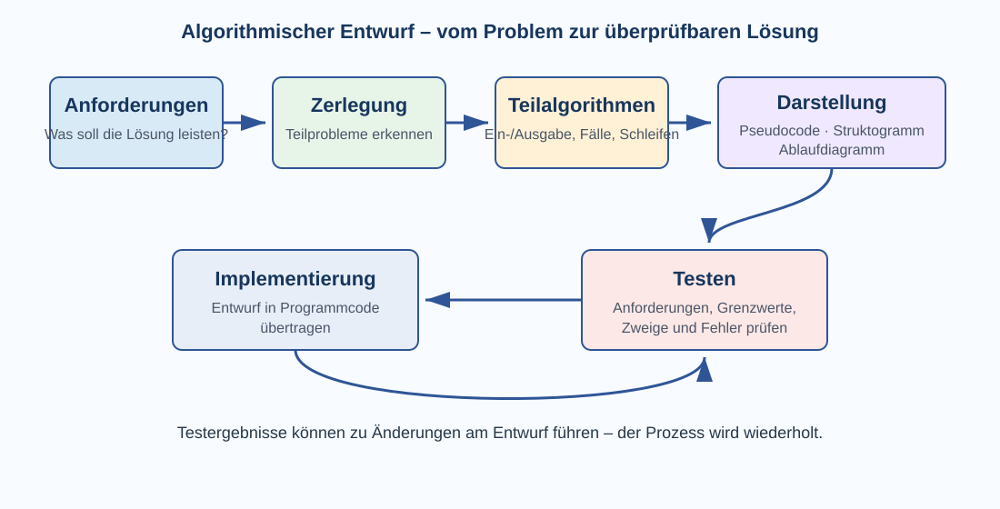
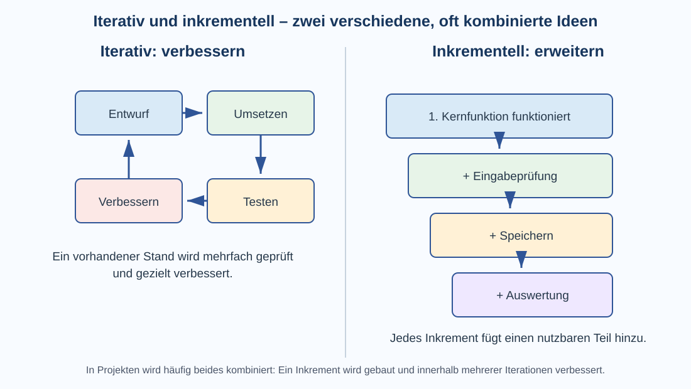

# 3 Algorithmische Projekte

## Von der Aufgabe zum Projekt

Komplexere Informatikprobleme lassen sich selten mit einer einzelnen Anweisung lösen. Sie müssen zunächst verstanden, in kleinere Teile zerlegt, geplant, umgesetzt, getestet und verbessert werden.

Ein Informatikprojekt besteht deshalb nicht nur aus Programmcode. Zum Projekt gehören unter anderem:

- Problem und Ziel verstehen,
- Anforderungen klären,
- Fachbegriffe und Daten verstehen,
- Teilprobleme und Verantwortlichkeiten erkennen,
- Algorithmen entwerfen,
- Software schrittweise umsetzen,
- testen und Fehler beheben,
- Ergebnisse dokumentieren und präsentieren.



Die Schritte laufen nicht immer genau einmal nacheinander. Neue Erkenntnisse aus Tests oder Rückmeldungen können dazu führen, dass Anforderungen oder Entwurf angepasst werden.

> **Merke:** Gute Software entsteht nicht dadurch, dass man möglichst schnell mit dem Programmieren beginnt. Zuerst muss klar sein, **welches Problem** gelöst werden soll und **woran man erkennt**, dass die Lösung richtig ist.

## Anforderungen: Was soll die Lösung leisten?

Eine **Anforderung** beschreibt, was ein System leisten oder welche Eigenschaft es besitzen soll. Anforderungen bilden die Grundlage für Entwurf und Tests.

Unklare Formulierungen wie

```text
Das Programm soll gut funktionieren.
```

helfen kaum weiter. Besser sind überprüfbare Aussagen:

```text
Das Programm soll drei Zahlen einlesen,
den größten Wert bestimmen
und das Ergebnis verständlich ausgeben.
```

### Funktionale Anforderungen

**Funktionale Anforderungen** beschreiben Funktionen und Verhalten des Systems.

Beispiele:

- Das Programm soll drei Zahlen einlesen.
- Das Programm soll den größten Wert bestimmen.
- Eine gespeicherte Aufgabe soll wieder geladen werden können.
- Ein Benutzer soll nach einem Titel suchen können.

Sie beantworten vor allem die Frage:

**Was soll das System tun?**

### Nichtfunktionale Anforderungen

**Nichtfunktionale Anforderungen** beschreiben Eigenschaften und Rahmenbedingungen.

Beispiele:

- Eine Eingabe soll innerhalb kurzer Zeit verarbeitet werden.
- Fehlermeldungen sollen verständlich formuliert sein.
- Daten sollen nach einem Neustart erhalten bleiben.
- Personenbezogene Daten sollen nur für berechtigte Benutzer sichtbar sein.

Sie beantworten eher Fragen wie:

**Wie gut, wie sicher oder unter welchen Bedingungen soll das System arbeiten?**

### Muss-, Soll- und Kann-Anforderungen

Bei größeren Projekten hilft eine Priorisierung:

| Priorität | Bedeutung | Beispiel |
|---|---|---|
| Muss | ohne diese Funktion erfüllt das Projekt sein Ziel nicht | größtes Element bestimmen |
| Soll | wichtig, aber notfalls später umsetzbar | Ergebnisse speichern |
| Kann | zusätzliche Verbesserung | verschiedene Farbschemata |

### Abnahmekriterium

Zu einer guten Anforderung gehört möglichst ein **Abnahmekriterium**: eine überprüfbare Bedingung, die zeigt, ob die Anforderung erfüllt ist.

Beispiel:

```text
Anforderung:
Das Programm soll die größte von drei eingegebenen Zahlen ausgeben.

Abnahmekriterium:
Für die Eingaben 4, 9 und 2 wird 9 ausgegeben.
```

Ein einzelnes Beispiel ersetzt noch keinen vollständigen Test, macht die Anforderung aber überprüfbarer.

## Anforderungen verstehen: die Fachdomäne

Programme lösen Aufgaben aus einem bestimmten **Fachbereich**. Dieser Fachbereich wird häufig als **Domäne** bezeichnet. Eine Bibliothekssoftware hat beispielsweise eine andere Domäne als eine Wetterstation oder ein Computerspiel.

Bevor ein Programm entworfen wird, sollte man verstehen:

- Welche Begriffe gibt es in diesem Fachbereich?
- Welche Objekte sind wichtig?
- Welche Regeln gelten?
- Welche Abläufe kommen vor?
- Welche Begriffe dürfen nicht verwechselt werden?

Bei einer Bibliothek könnten beispielsweise `Buch`, `Exemplar`, `Ausleihe`, `Leser` und `Rückgabe` wichtige Begriffe sein.

### Domain-Driven Design – ein kurzer Ausblick

**Domain-Driven Design (DDD)** ist ein Ansatz für größere Softwaresysteme, bei dem die Fachdomäne und ihre Begriffe besonders wichtig genommen werden. Entwickler und Fachleute versuchen dabei, eine gemeinsame, möglichst eindeutige Sprache für das Problemgebiet zu verwenden.

Für Klasse 9 genügt die Grundidee:

> **Merke:** Bevor man Software sinnvoll zerlegt, sollte man die **fachliche Welt** verstehen, die die Software abbildet.

Begriffe wie **Bounded Context**, Aggregate oder Domain Events gehören zur professionellen Vertiefung und müssen hier noch nicht beherrscht werden.

## Ein Problem zerlegen

Ein großes Problem wird in kleinere **Teilprobleme** zerlegt. Dieses Vorgehen nennt man auch **Dekomposition**.

Beispiel: Eine kleine Aufgabenverwaltung soll Aufgaben erfassen, anzeigen und als erledigt markieren können.

Mögliche Teilprobleme sind:

1. Aufgabe eingeben,
2. Eingabe prüfen,
3. Aufgabe speichern,
4. Aufgaben anzeigen,
5. Aufgabe auswählen,
6. Status ändern,
7. Daten dauerhaft sichern.

Jedes Teilproblem ist leichter zu verstehen und zu testen als das gesamte System auf einmal.

### Nach Funktionen zerlegen

Eine Möglichkeit ist die Zerlegung nach Tätigkeiten:

```text
Aufgabe erfassen
Aufgabe prüfen
Aufgabe speichern
Aufgabe anzeigen
Aufgabe ändern
```

### Nach Daten und Fachobjekten zerlegen

Man kann außerdem untersuchen, welche fachlichen Objekte vorkommen:

```text
Aufgabe
Benutzer
Kategorie
Status
```

Dadurch erkennt man häufig, welche Daten zusammengehören und welche Programmteile dafür verantwortlich sein sollten.

### Gute Teilprobleme

Ein gutes Teilproblem sollte möglichst:

- eine klar erkennbare Aufgabe besitzen,
- nicht unnötig viele andere Teilprobleme kennen müssen,
- verständliche Ein- und Ausgaben besitzen,
- getrennt testbar sein.

Das führt später zu Funktionen, Prozeduren, Klassen oder Modulen mit klarer Verantwortung.

## Schnittstellen zwischen Teilproblemen

Wer ein Problem zerlegt, muss auch festlegen, **wie die Teile zusammenarbeiten**.

Beispiel:

```text
Eingabe prüfen
    Eingabe: Text des Benutzers
    Ausgabe: gültige Zahl oder Fehlermeldung
```

Eine solche Beschreibung ist bereits eine einfache **Schnittstelle**.

Sie beantwortet Fragen wie:

- Welche Daten erhält ein Teil?
- Welche Daten liefert er zurück?
- Welche Fehler können auftreten?
- Welche Voraussetzungen gelten?

Klare Schnittstellen helfen besonders bei Teamarbeit, weil verschiedene Personen an unterschiedlichen Teilen arbeiten können.

## Algorithmischer Entwurf

Beim **algorithmischen Entwurf** wird aus der fachlichen Aufgabe ein genauer Lösungsweg.

Dazu gehören mehrere Schritte.

### 1. Eingaben und Ausgaben bestimmen

Zuerst wird geklärt:

- Welche Daten erhält der Algorithmus?
- Welche Ergebnisse soll er liefern?

Beispiel:

```text
Eingabe: drei Zahlen a, b, c
Ausgabe: größte Zahl
```

### 2. Sonderfälle und Bedingungen erkennen

Anschließend werden unterschiedliche Fälle betrachtet.

Beim größten Wert muss beispielsweise bedacht werden:

- alle Werte sind verschieden,
- zwei Werte sind gleich,
- alle drei Werte sind gleich,
- Werte können negativ sein.

### 3. Verarbeitungsschritte festlegen

Nun wird überlegt, welche Schritte notwendig sind und in welcher Reihenfolge sie stattfinden.

Ein möglicher Entwurf lautet:

```text
maximum := a

WENN b > maximum
    maximum := b

WENN c > maximum
    maximum := c

AUSGABE maximum
```

### 4. Kontrollstrukturen auswählen

Dabei werden die aus Klasse 8 bekannten Grundstrukturen verwendet:

- Sequenz,
- Auswahl,
- Wiederholung,
- Variablen,
- Bedingungen,
- Funktionen beziehungsweise Prozeduren.

### 5. Datenstrukturen auswählen

Nicht nur die Anweisungen sind wichtig. Auch die Frage, **wie Daten gespeichert werden**, gehört zum Entwurf.

Beispiele:

- einzelne Variable,
- Liste beziehungsweise Array,
- Tabelle,
- Datensatz/Objekt,
- Datenbank.

Für drei feste Zahlen genügen einzelne Variablen. Für tausend Messwerte wäre eine Liste deutlich geeigneter.

### 6. Teilalgorithmen bilden

Komplexe Lösungen werden häufig in Funktionen oder Prozeduren zerlegt.

Beispiel:

```text
liesEingabe()
pruefeEingabe()
berechneMaximum()
zeigeErgebnis()
```

Jeder Teil erhält eine klarere Verantwortung und kann gezielter getestet werden.

### 7. Entwurf darstellen

Ein Algorithmus kann vor der Implementierung beispielsweise dargestellt werden als:

- natürliche Sprache,
- Pseudocode,
- Struktogramm,
- Ablaufdiagramm.

→ Siehe Nachschlagewerk Klasse 8, **Algorithmen darstellen**.

> **Merke:** Ein algorithmischer Entwurf beschreibt nicht nur „welchen Code man schreiben will“. Er legt Eingaben, Ausgaben, Fälle, Datenstrukturen, Kontrollstrukturen und Teilalgorithmen fest.

## Vom Entwurf zum Programmcode

Bei der **Implementierung** wird der Entwurf in eine konkrete Programmiersprache übertragen.

Dabei entstehen zusätzliche Entscheidungen, zum Beispiel:

- konkrete Variablennamen,
- Datentypen,
- Funktionen und Parameter,
- Bibliotheken,
- Datenstrukturen,
- Fehlerbehandlung.

Die Programmiersprache verändert die Syntax, aber die Grundidee des Algorithmus bleibt erhalten.

## Iterativ und inkrementell arbeiten

Die Begriffe **iterativ** und **inkrementell** beschreiben zwei verschiedene Ideen, die häufig gemeinsam verwendet werden.



### Iterativ: einen Stand wiederholt verbessern

Bei **iterativem Arbeiten** wird eine vorhandene Lösung mehrfach überarbeitet.

Ein Zyklus kann beispielsweise lauten:

```text
entwerfen → umsetzen → testen → verbessern
```

Danach beginnt eine neue Iteration.

Beispiel:

- Version 1 erkennt nur gültige Zahleneingaben.
- Im Test fällt auf, dass Fehlermeldungen unverständlich sind.
- In der nächsten Iteration werden die Meldungen verbessert.

Das Produkt erhält nicht unbedingt eine völlig neue Funktion. Ein vorhandener Teil wird besser.

### Inkrementell: die Lösung schrittweise erweitern

Bei **inkrementellem Arbeiten** wächst die Lösung um weitere funktionsfähige Teile, die **Inkremente**.

Beispiel einer Aufgabenverwaltung:

1. Inkrement: Aufgaben können eingegeben und angezeigt werden.
2. Inkrement: Aufgaben können als erledigt markiert werden.
3. Inkrement: Aufgaben werden gespeichert.
4. Inkrement: Aufgaben können nach Status gefiltert werden.

Nach jedem Inkrement existiert ein nutzbarer Zwischenstand.

### Beides zusammen

In der Praxis werden beide Vorgehensweisen oft kombiniert:

- Ein neues Inkrement wird umgesetzt.
- Dieses Inkrement wird in mehreren Iterationen getestet und verbessert.
- Danach folgt das nächste Inkrement.

| Begriff | Kernidee | typische Frage |
|---|---|---|
| iterativ | Vorhandenes wiederholt verbessern | Wie können wir diesen Stand verbessern? |
| inkrementell | schrittweise neue Funktionalität ergänzen | Welcher nutzbare Teil kommt als Nächstes hinzu? |

> **Merke:** **Iteration = verbessern. Inkrement = erweitern.** Moderne Projekte kombinieren häufig beides.

## Prototypen

Ein **Prototyp** ist ein früher, vereinfachter Lösungsstand. Er dient dazu, Ideen auszuprobieren und Unsicherheiten zu verringern.

Ein Prototyp kann beispielsweise nur:

- eine Benutzereingabe simulieren,
- einen wichtigen Algorithmus ausprobieren,
- die Bedienoberfläche zeigen,
- eine technische Verbindung testen.

Ein Prototyp muss noch kein vollständiges oder fertiges Produkt sein.

## Testen in algorithmischen Projekten

Testen ist kein letzter Schritt nach dem Programmieren. Tests begleiten ein Projekt von den Anforderungen bis zur fertigen Lösung.

Ein **Testfall** enthält mindestens:

- Ausgangssituation beziehungsweise Eingabe,
- erwartetes Ergebnis,
- tatsächliches Ergebnis,
- Bewertung: bestanden oder nicht bestanden.

### Warum wird getestet?

Tests sollen beispielsweise zeigen:

- ob Anforderungen erfüllt werden,
- ob normale Eingaben richtig verarbeitet werden,
- ob Grenzfälle funktionieren,
- ob ungültige Eingaben behandelt werden,
- ob unterschiedliche Programmzweige ausgeführt werden,
- ob Änderungen ältere Funktionen beschädigt haben.

> **Merke:** Ein Programm, das ohne Fehlermeldung läuft, ist nicht automatisch korrekt.

## Tests aus Anforderungen ableiten

Angenommen, die Anforderung lautet:

```text
Das Programm soll die größte von drei ganzen Zahlen ausgeben.
```

Dann reicht ein Test wie `3, 8, 5 → 8` nicht aus.

Sinnvolle Testfälle sind beispielsweise:

| Fall | Eingabe | Erwartung | Zweck |
|---|---|---:|---|
| normal | 3, 8, 5 | 8 | typischer Fall |
| größter Wert zuerst | 9, 3, 2 | 9 | Reihenfolge prüfen |
| größter Wert zuletzt | 1, 4, 10 | 10 | letzten Vergleich prüfen |
| gleiche Maximalwerte | 8, 8, 2 | 8 | Gleichheit prüfen |
| alle gleich | 4, 4, 4 | 4 | Sonderfall |
| negative Werte | −2, −7, −1 | −1 | Vorzeichen prüfen |
| Nullwerte | 0, −2, −3 | 0 | Null korrekt behandeln |

## Grenzwerte und Grenzwertanalyse

Fehler treten häufig an Grenzen auf.

Ein **Grenzwert** ist ein Wert, an dem sich das Verhalten des Programms ändert oder ein erlaubter Bereich beginnt beziehungsweise endet.

Beispiel:

```text
Alter muss zwischen 12 und 16 einschließlich liegen.
```

Dann sind besonders interessant:

| Testwert | Bedeutung |
|---:|---|
| 11 | knapp unter unterer Grenze |
| 12 | genau untere Grenze |
| 13 | knapp über unterer Grenze |
| 15 | knapp unter oberer Grenze |
| 16 | genau obere Grenze |
| 17 | knapp über oberer Grenze |

Dadurch entdeckt man beispielsweise Fehler wie `<` statt `<=`.

> **Merke:** Bei Grenzen möglichst **knapp darunter, genau darauf und knapp darüber** testen.

## Gültige und ungültige Eingaben

Eine robuste Software muss nicht nur mit erwarteten Eingaben umgehen können.

Beispiel: Ein Programm erwartet eine ganze Zahl von 1 bis 100.

Zu testen wären etwa:

- `42` – gültig,
- `1` und `100` – Grenzwerte,
- `0` und `101` – außerhalb des Bereichs,
- `-5` – negativer Wert,
- `3.5` – falscher Zahlentyp,
- `Hallo` – keine Zahl,
- leere Eingabe – kein Wert.

Wie das Programm reagieren soll, muss bereits in den Anforderungen beziehungsweise Fehlerregeln festgelegt sein.

## Blackbox- und Whitebox-Tests

### Blackbox-Test

Beim **Blackbox-Test** wird das Programm von außen betrachtet. Die innere Implementierung ist für die Auswahl der Testfälle nicht entscheidend.

Man prüft:

```text
Eingabe → System → Ausgabe
```

Testfälle entstehen vor allem aus Anforderungen, zulässigen Bereichen und erwarteten Ergebnissen.

### Whitebox-Test

Beim **Whitebox-Test** ist die innere Programmstruktur bekannt. Testfälle werden so gewählt, dass bestimmte Anweisungen, Bedingungen und Zweige durchlaufen werden.

Beispiel:

```text
WENN punkte >= 50
    bestanden
SONST
    nicht bestanden
```

Mindestens ein Test sollte den `DANN`-Zweig und einer den `SONST`-Zweig ausführen.

Blackbox- und Whitebox-Tests ergänzen sich: Der erste prüft stärker **was** das Programm leistet, der zweite stärker **welche internen Wege** tatsächlich untersucht wurden.

## Testabdeckung

### Anweisungsabdeckung

Wurde jede wichtige Anweisung mindestens einmal ausgeführt?

### Zweigabdeckung

Wurde bei jeder Entscheidung jeder Zweig mindestens einmal ausgeführt?

### Pfadabdeckung

Wurden die betrachteten möglichen Wege durch das Programm ausgeführt?

Bei verschachtelten Bedingungen und Schleifen können sehr viele mögliche Pfade entstehen. Vollständige Pfadabdeckung ist deshalb bei größeren Programmen oft nicht praktisch erreichbar.

Eine hohe Abdeckung ist hilfreich, beweist aber nicht automatisch Fehlerfreiheit.

## Schleifen testen

Bei Schleifen sind typische Testfälle:

- kein Durchlauf, falls möglich,
- genau ein Durchlauf,
- mehrere Durchläufe,
- Wert direkt an der Abbruchgrenze,
- sehr viele Durchläufe.

Dadurch lassen sich **Off-by-one-Fehler** erkennen, bei denen eine Schleife einmal zu oft oder zu wenig ausgeführt wird.

## Unit-, Integrations- und Systemtests

In größeren Projekten werden unterschiedliche Ebenen getestet.

### Unit-Test

Ein **Unit-Test** prüft einen kleinen, möglichst abgegrenzten Programmteil, zum Beispiel eine Funktion.

Beispiel:

```text
maximum(3, 8, 5) → 8
```

### Integrationstest

Ein **Integrationstest** prüft, ob mehrere Teile korrekt zusammenarbeiten.

Beispiel:

```text
Eingabe einlesen
→ Eingabe prüfen
→ Maximum berechnen
→ Ergebnis anzeigen
```

### Systemtest

Ein **Systemtest** betrachtet das gesamte System aus Sicht der Anforderungen.

Damit kann überprüft werden, ob das komplette Programm die gewünschte Aufgabe erfüllt.

## Regressionstest

Ein bereits bestandener Test sollte nach Änderungen erneut ausgeführt werden.

Ein **Regressionstest** prüft, ob eine Änderung versehentlich eine bereits funktionierende Eigenschaft beschädigt hat.

Beispiel:

- Eingabeprüfung wird verbessert.
- Danach werden die alten Berechnungstests erneut ausgeführt.
- So wird geprüft, ob die Änderung unerwartete Nebenwirkungen hatte.

## Fehler systematisch untersuchen

Wenn ein Test fehlschlägt, hilft ein geordnetes Vorgehen:

1. Eingabe und Ausgangssituation notieren.
2. Erwartetes Ergebnis festhalten.
3. Tatsächliches Ergebnis beobachten.
4. Stelle suchen, an der der Ablauf erstmals abweicht.
5. Ursache bestimmen.
6. Fehler korrigieren.
7. ursprünglichen Test erneut ausführen.
8. bestehende Regressionstests erneut ausführen.

Das bloße Ändern von Code „bis es irgendwie funktioniert“ erschwert die Fehlersuche.

## Tests und Anforderungen gehören zusammen

Zwischen Anforderungen und Tests besteht eine direkte Beziehung.

| Anforderung | möglicher Test |
|---|---|
| drei Zahlen einlesen | drei gültige Eingaben werden akzeptiert |
| größte Zahl bestimmen | verschiedene Reihenfolgen und Gleichstände prüfen |
| nur ganze Zahlen zulassen | Dezimalzahl und Text werden abgewiesen |
| Fehlermeldung verständlich | ungültige Eingabe erzeugt festgelegte Meldung |

Wenn für eine Anforderung kein überprüfbarer Test denkbar ist, ist die Anforderung möglicherweise noch zu ungenau formuliert.

## Zusammenarbeit im Projekt

In einem Team müssen Aufgaben, Zuständigkeiten und Zwischenstände sichtbar sein.

Hilfreich sind beispielsweise:

- Aufgabenlisten,
- Kanban-Boards,
- Meilensteine,
- Versionsverwaltung,
- kurze Abstimmungen,
- dokumentierte Entscheidungen.

### Aufgaben sinnvoll schneiden

Eine Aufgabe wie

```text
Programm fertigstellen
```

ist zu groß und unklar.

Besser wären kleinere Aufgaben:

```text
Eingabeprüfung implementieren
Testfälle für Grenzwerte ergänzen
Speicherfunktion erstellen
Fehlermeldungen überarbeiten
```

Dadurch wird Fortschritt sichtbar und Arbeit lässt sich besser verteilen.

## Dokumentation

Eine gute Projektdokumentation erklärt mindestens:

- Problem und Ziel,
- funktionale und nichtfunktionale Anforderungen,
- Fachbegriffe und wichtige Regeln der Domäne,
- Zerlegung in Teilprobleme,
- algorithmischen Entwurf,
- Datenstrukturen und Schnittstellen,
- wichtige Entscheidungen,
- Tests und Ergebnisse,
- bekannte Grenzen,
- Arbeitsteilung,
- Änderungen und Verbesserungen.

Dokumentation soll nicht lediglich beschreiben, **dass** etwas gemacht wurde. Sie soll wichtige Entscheidungen nachvollziehbar machen.

## Begriffe zum Nachschlagen

**Abnahmekriterium:** überprüfbare Bedingung, anhand derer festgestellt werden kann, ob eine Anforderung erfüllt ist.

**Anforderung:** überprüfbare Beschreibung einer gewünschten Funktion, Eigenschaft oder Rahmenbedingung eines Systems.

**Anweisungsabdeckung:** Maß dafür, ob relevante Anweisungen durch Tests ausgeführt wurden.

**Blackbox-Test:** Test anhand von Eingaben und erwarteten Ergebnissen, ohne die interne Implementierung für die Testauswahl zu betrachten.

**Dekomposition:** Zerlegung eines großen Problems in kleinere Teilprobleme.

**Domäne:** Fachbereich beziehungsweise Problemgebiet, das eine Software abbildet oder unterstützt.

**Domain-Driven Design (DDD):** Ansatz für Softwareentwicklung, bei dem Fachdomäne und gemeinsame Fachsprache eine zentrale Rolle spielen.

**Grenzwert:** Wert an einer Grenze, an der sich zulässiger Bereich oder Programmverhalten ändert.

**Inkrement:** funktionsfähige Erweiterung eines bestehenden Systems.

**Inkrementell:** Vorgehen, bei dem ein System schrittweise um weitere nutzbare Teile erweitert wird.

**Integrationstest:** Test des Zusammenspiels mehrerer Programmteile.

**Iteration:** wiederholter Arbeitszyklus zur Prüfung und Verbesserung eines vorhandenen Standes.

**Iterativ:** Vorgehen, bei dem ein vorhandener Stand wiederholt überarbeitet und verbessert wird.

**Meilenstein:** wichtiger überprüfbarer Zwischenstand eines Projekts.

**Nichtfunktionale Anforderung:** Anforderung an Qualität oder Rahmenbedingungen, beispielsweise Sicherheit, Verständlichkeit oder Geschwindigkeit.

**Off-by-one-Fehler:** Fehler, bei dem ein Grenzwert oder eine Wiederholungsanzahl um eins falsch behandelt wird.

**Pfadabdeckung:** Maß dafür, welche möglichen Ausführungspfade durch Tests durchlaufen wurden.

**Prototyp:** früher vereinfachter Lösungsstand zum Prüfen einer Idee oder technischen Möglichkeit.

**Regressionstest:** erneuter Test bereits funktionierender Eigenschaften nach einer Änderung.

**Schnittstelle:** festgelegte Art, wie Programmteile Daten austauschen oder Dienste anbieten.

**Systemtest:** Test des vollständigen Systems gegenüber seinen Anforderungen.

**Testfall:** festgelegte Ausgangssituation beziehungsweise Eingabe mit erwartetem Ergebnis.

**Unit-Test:** Test eines kleinen abgegrenzten Programmteils, beispielsweise einer Funktion.

**Whitebox-Test:** Test, bei dem die interne Struktur des Programms für die Auswahl von Testfällen berücksichtigt wird.

**Zweigabdeckung:** Maß dafür, ob die möglichen Zweige von Entscheidungen durch Tests ausgeführt wurden.

→ Vorwissen: Nachschlagewerk Klasse 8, **Algorithmen** und **Algorithmen und Programme testen**.
