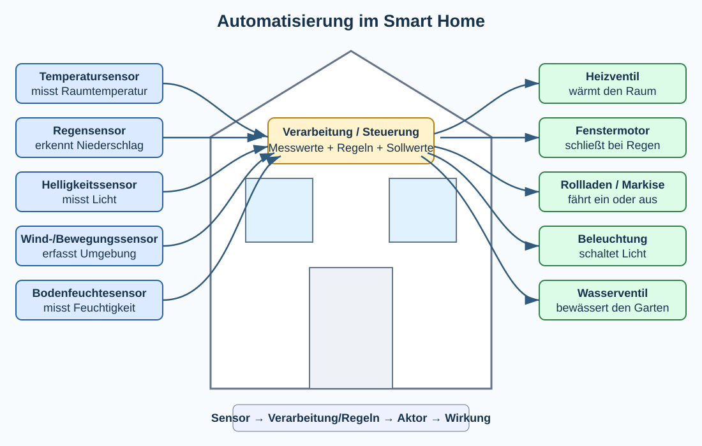
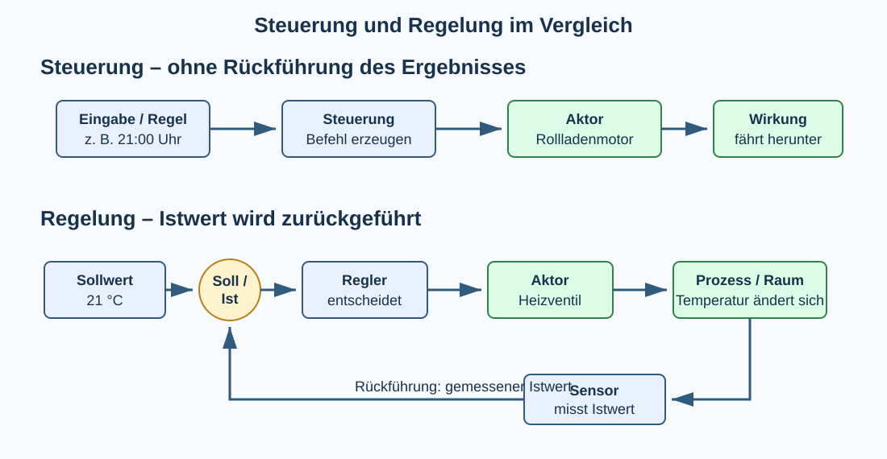

# 4 Informatik und Automatisierung

## Wozu Automatisierung?

Viele Tätigkeiten bestehen aus Abläufen, die sich wiederholen oder nach festgelegten Regeln ausgeführt werden. Menschen können solche Aufgaben übernehmen, aber bei sehr vielen Wiederholungen, hohen Geschwindigkeiten oder gefährlichen Situationen sind technische Systeme oft besser geeignet.

**Automatisierung** bedeutet, geeignete Abläufe so zu erfassen und zu beschreiben, dass technische Systeme sie ganz oder teilweise selbstständig ausführen können. Informatik ist dafür wichtig, weil Messwerte als Daten verarbeitet, Bedingungen geprüft, Algorithmen ausgeführt und Geräte miteinander vernetzt werden.

Automatisierung kann beispielsweise dazu dienen,

- wiederkehrende Tätigkeiten zu übernehmen,
- Prozesse schnell und gleichmäßig auszuführen,
- große Mengen von Messdaten auszuwerten,
- Menschen bei gefährlichen oder körperlich belastenden Arbeiten zu entlasten,
- Energie oder Material bedarfsgerecht einzusetzen,
- Zustände dauerhaft zu überwachen,
- bei bestimmten Ereignissen schnell zu reagieren.

Automatisierung bedeutet jedoch nicht einfach „Computer statt Mensch“. Zuerst muss verstanden werden, **welcher Prozess** beeinflusst werden soll, **welche Informationen** benötigt werden und **welche Regeln** gelten. Außerdem muss entschieden werden, wann ein Mensch eingreifen können oder müssen soll.

> **Merke:** Automatisierung verbindet einen realen Prozess mit Informatik: **erfassen → Daten verarbeiten → entscheiden → handeln → gegebenenfalls erneut erfassen**.

## Ein Haus als Beispiel für Automatisierung

In einem modernen Haus gibt es viele Abläufe, die automatisiert werden können. Dieses Beispiel zeigt gleichzeitig, dass Automatisierung aus unterschiedlichen Sensoren, Regeln und Aktoren besteht.



| Situation | Sensoren/Eingaben | Verarbeitung oder Regel | Aktor/Ausgabe |
|---|---|---|---|
| Heizung | Raumtemperatur, gewünschte Temperatur | Istwert mit Sollwert vergleichen | Heizventil öffnen/schließen |
| Regen und Dachfenster | Regensensor, Fensterzustand | `Regen UND Fenster offen?` | Fenstermotor schließt Fenster |
| Rollladen | Uhrzeit, Helligkeit | Zeit oder Helligkeitsgrenze prüfen | Rollladenmotor |
| Markise | Sonne, Wind | Sonnenschutz ausfahren; bei starkem Wind Sicherheit priorisieren | Markisenmotor |
| Beleuchtung | Bewegung, Helligkeit | `Bewegung UND zu dunkel?` | Lampe ein-/ausschalten |
| Gartenbewässerung | Bodenfeuchte, Regen | nur bei trockenem Boden und geeigneten Bedingungen bewässern | Wasserventil/Pumpe |
| Alarmanlage | Fenster-/Türkontakt, Bewegungsmelder, Anlagenzustand | unerlaubtes Ereignis erkennen | Sirene/Benachrichtigung |

Das Haus zeigt auch, dass mehrere Regeln miteinander in Konflikt geraten können. Eine Markise soll bei starker Sonne vielleicht ausgefahren werden. Meldet der Windsensor gleichzeitig Sturm, muss die **Sicherheitsregel** Vorrang haben und die Markise eingefahren werden.

## Bestandteile eines automatisierten Systems

Ein automatisiertes System kann vereinfacht in mehrere Bereiche zerlegt werden:

1. **Prozess/Umgebung:** der reale Vorgang, beispielsweise ein Raum, eine Maschine oder ein Gewächshaus.
2. **Sensoren:** erfassen Zustände und physikalische Größen.
3. **Signal- und Datenverarbeitung:** bereitet Messwerte auf und verarbeitet sie.
4. **Algorithmus/Logik:** entscheidet anhand von Regeln, Bedingungen und Sollwerten.
5. **Aktoren:** wirken auf den realen Prozess ein.
6. **Rückmeldung:** neue Messwerte zeigen gegebenenfalls, welche Wirkung erreicht wurde.

Dieses Modell erweitert das aus früheren Klassen bekannte **EVA-Prinzip**. Die Eingabe stammt nun häufig von Sensoren, die Ausgabe steuert Aktoren, und bei einer Regelung wird das Ergebnis wieder als neue Eingabe gemessen.

## Sensoren

Ein **Sensor** erfasst eine physikalische oder technische Größe und stellt daraus ein auswertbares Signal beziehungsweise Daten bereit.

| Sensor | erfasste Größe/Zustand | mögliches Beispiel |
|---|---|---|
| Temperatursensor | Temperatur | Heizungsregelung |
| Helligkeitssensor | Lichtstärke | Rollladen/Beleuchtung |
| Regensensor | Niederschlag/Feuchtigkeit | Dachfenster schließen |
| Bewegungsmelder | Bewegung/Anwesenheit | Beleuchtung/Alarm |
| Abstandssensor | Entfernung | Roboter/Hinderniserkennung |
| Bodenfeuchtesensor | Feuchtigkeit | Gartenbewässerung |
| Taster/Schalter | Benutzerzustand | manuelle Eingabe |

### Messwert ist nicht automatisch die Wirklichkeit

Sensoren liefern Messwerte, die ungenau, gestört oder fehlerhaft sein können. Deshalb sind bei automatisierten Systemen unter anderem **Messbereich**, **Genauigkeit**, **Auflösung** und Plausibilitätsprüfungen wichtig.

Beispiel: Meldet ein Temperatursensor plötzlich `180 °C` für ein Klassenzimmer, sollte ein System diesen Wert nicht unkritisch als normale Raumtemperatur behandeln.

## Aktoren

Ein **Aktor** setzt ein elektrisches Steuersignal in eine Wirkung auf die reale Umgebung um.

Typische Aktoren sind:

- Elektromotor,
- Heizventil,
- Pumpe,
- Lampe/LED,
- Lautsprecher oder Sirene,
- Relais beziehungsweise elektronischer Schalter,
- Fenster-, Tür- oder Rollladenantrieb.

Sensor und Aktor haben damit unterschiedliche Richtungen:

```text
Umgebung → Sensor → Datenverarbeitung
Datenverarbeitung → Aktor → Umgebung
```

## Steuern und Regeln

**Steuerung** und **Regelung** werden im Alltag häufig gleich verwendet, bezeichnen technisch aber unterschiedliche Prinzipien.



### Steuerung

Bei einer **Steuerung** wird eine Eingangsgröße beziehungsweise Regel verarbeitet und daraus eine Wirkung erzeugt. Das tatsächlich erreichte Ergebnis wird für die Entscheidung nicht fortlaufend zurückgeführt.

Beispiel Rollladen:

```text
21:00 Uhr
   ↓
Steuerung entscheidet: herunterfahren
   ↓
Motor
   ↓
Rollladen bewegt sich
```

Die Zeitsteuerung weiß dadurch noch nicht automatisch, ob der Rollladen tatsächlich vollständig geschlossen wurde. Dafür wäre eine zusätzliche Rückmeldung nötig.

Weitere Beispiele für Steuerungen können sein:

- Gartenbeleuchtung wird um 22:00 Uhr ausgeschaltet,
- eine Ampelanlage durchläuft einen fest programmierten Zeitablauf,
- eine Waschmaschine führt ein gewähltes Programm aus,
- ein Förderband läuft nach einem Startsignal für eine festgelegte Zeit.

### Regelung

Bei einer **Regelung** wird das Ergebnis fortlaufend oder wiederholt gemessen. Der gemessene **Istwert** wird mit einem gewünschten **Sollwert** verglichen. Aus der Abweichung wird eine neue Stellwirkung bestimmt.

Beispiel Heizung:

```text
Sollwert: 21 °C
Istwert:   18 °C
       ↓
Vergleich / Regler
       ↓
Heizung stärker wirken lassen
       ↓
Raum wird wärmer
       ↓
Temperatursensor misst erneut
       └──────────── Rückführung
```

Diese Rückführung bildet einen **Regelkreis**.

### Sollwert, Istwert, Stellgröße und Regelgröße

| Begriff | Bedeutung | Heizungsbeispiel |
|---|---|---|
| Sollwert | gewünschter Wert | 21 °C |
| Istwert | gemessener aktueller Wert | 18 °C |
| Regelgröße | Größe, die geregelt werden soll | Raumtemperatur |
| Stellgröße | Größe, mit der auf den Prozess eingewirkt wird | Ventilstellung/Heizleistung |
| Störgröße | äußerer Einfluss auf den Prozess | offenes Fenster, kalte Außenluft |

Eine Regelung kann auf **Störungen** reagieren. Wird ein Fenster geöffnet und die Temperatur sinkt, erkennt der Sensor die Veränderung und der Regler kann reagieren.

> **Merke:** Eine **Steuerung** arbeitet ohne notwendige Rückführung des Ergebnisses. Eine **Regelung** misst den erreichten Zustand und verwendet ihn wieder für die weitere Entscheidung.

## Einfache Zweipunktregelung und Hysterese

Ein einfacher Thermostat könnte so arbeiten:

```text
WENN temperatur < 21
    Heizung EIN
SONST
    Heizung AUS
```

Liegt die Temperatur genau um 21 °C, könnte die Heizung jedoch sehr häufig ein- und ausschalten. Deshalb verwendet man häufig zwei Grenzen, eine sogenannte **Hysterese**.

Beispiel:

```text
WENN temperatur < 20.5
    Heizung EIN

WENN temperatur > 21.5
    Heizung AUS
```

Zwischen 20,5 °C und 21,5 °C bleibt der bisherige Zustand bestehen. Das verhindert unnötig häufiges Schalten.

## Logische Bedingungen in Automatisierungen

Automatisierte Systeme müssen häufig mehrere Informationen verknüpfen.

### UND

```text
WENN bewegung erkannt UND helligkeit < grenzwert
    licht EIN
```

Beide Bedingungen müssen erfüllt sein.

### ODER

```text
WENN rauch erkannt ODER manuelle_alarmtaste gedrueckt
    alarm AUSLOESEN
```

Mindestens eine Bedingung genügt.

### NICHT

```text
WENN regen UND NICHT fenster_geschlossen
    fenster SCHLIESSEN
```

Solche Bedingungen verbinden Automatisierung unmittelbar mit den aus Algorithmen bekannten Kontrollstrukturen.

## Zustände und Zustandsautomaten

Manche automatisierten Systeme lassen sich besser durch **Zustände** beschreiben als durch einzelne unabhängige Bedingungen.

Eine Alarmanlage könnte beispielsweise die Zustände besitzen:

```text
UNSCHARF → SCHARF → ALARM
```

Ein Ereignis führt zu einem Zustandswechsel. Wird die Anlage scharf geschaltet, wechselt sie von `UNSCHARF` zu `SCHARF`. Erkennt sie dann einen Einbruch, wechselt sie zu `ALARM`.

Solche Modelle nennt man **Zustandsautomaten**. Sie helfen, Systeme mit klaren Betriebszuständen verständlich zu entwerfen.

## Automatisierung ist mehr als Smart Home

Automatisierung findet sich in vielen Bereichen:

| Bereich | Beispiele |
|---|---|
| Industrie | Roboter, Fertigungsstraßen, Qualitätskontrolle |
| Verkehr | Ampeln, Bahnsteuerung, Fahrerassistenz |
| Landwirtschaft | Bewässerung, Fütterung, Gewächshaussteuerung |
| Logistik | Sortieranlagen, Lagerverwaltung, Transportroboter |
| Medizin | Überwachung von Messwerten, Laborautomation |
| Gebäude | Heizung, Lüftung, Beleuchtung, Zugangssysteme |
| Verwaltung/Software | automatische Berichte, Datenverarbeitung, Benachrichtigungen |
| Internet | Bots, Suchmaschinen-Crawler, automatische Inhaltsauswahl |

## Vernetzte Automatisierung und IoT

Werden Sensoren, Aktoren und Steuerungen über Netzwerke verbunden, spricht man häufig vom **Internet of Things (IoT)** beziehungsweise von vernetzten Geräten.

Ein Smart-Home-Thermostat kann beispielsweise Messwerte an eine Zentrale senden und Befehle über ein lokales Netzwerk empfangen. Eine Smartphone-App kann Einstellungen anzeigen oder ändern.

Dabei muss unterschieden werden zwischen:

- **lokaler Automatisierung:** funktioniert innerhalb des Hauses ohne Internet,
- **Cloud-Dienst:** Daten oder Entscheidungen werden über externe Server verarbeitet,
- **Fernzugriff:** Benutzer greifen von außerhalb auf das System zu.

Für Sicherheit und Zuverlässigkeit ist diese Unterscheidung wichtig. Eine Heizung sollte beispielsweise nicht allein deshalb ausfallen, weil die Internetverbindung unterbrochen ist.

## Sicherheit und Ausfallsicherheit

Automatisierung kann reale Auswirkungen haben. Deshalb muss ein System auch mit Fehlern umgehen können.

Mögliche Fragen sind:

- Was passiert bei einem defekten Sensor?
- Was geschieht bei Strom- oder Netzausfall?
- Gibt es einen sicheren Zustand (**Fail-Safe**)?
- Kann ein Mensch die Automatik übersteuern?
- Was passiert bei widersprüchlichen Sensorwerten?
- Sind Grenzwerte sinnvoll gewählt?
- Werden Fehler erkannt und gemeldet?

Beispiel: Ein automatisches Fenster sollte bei einem Fehler nicht unkontrolliert weiterfahren. Ein Sicherheitssystem kann deshalb Endschalter, Kraftbegrenzungen oder weitere Sensoren verwenden.

### Prioritäten von Regeln

Nicht jede Regel ist gleich wichtig. Sicherheit muss häufig Vorrang vor Komfort haben.

```text
WENN starker_wind
    markise EINFAHREN
SONST WENN starke_sonne
    markise AUSFAHREN
```

Die Reihenfolge beziehungsweise Priorität der Regeln verändert hier das Verhalten des Systems.

## Datenschutz und IT-Sicherheit

Vernetzte Automatisierung verarbeitet teilweise sehr persönliche Daten. Bewegungsmelder, Türkontakte, Kameras oder Heizungsdaten können beispielsweise Rückschlüsse darauf zulassen, wann Personen zu Hause sind.

Deshalb sind unter anderem wichtig:

- sichere Passwörter und Zugriffsrechte,
- verschlüsselte Netzwerkverbindungen,
- regelmäßige Sicherheitsupdates,
- möglichst sparsame Datenspeicherung,
- Kenntnis darüber, welche Daten lokal und welche extern gespeichert werden,
- Trennung wichtiger Systeme von unnötigen Internetdiensten.

> **Merke:** Je stärker ein automatisiertes System die reale Welt beeinflussen kann, desto wichtiger werden Sicherheit, Fehlertoleranz und kontrollierte Zugriffsmöglichkeiten.

## Bots als Software-Automatisierung

Nicht jede Automatisierung benötigt Sensoren und Motoren. Ein **Bot** ist ein Programm, das bestimmte Aufgaben automatisch ausführt.

Nützliche Beispiele sind:

- Chatbots für häufige Fragen,
- automatische Benachrichtigungen,
- Suchmaschinen-Crawler,
- Überwachung von Serverdiensten,
- automatische Verarbeitung wiederkehrender Daten.

Bots können jedoch auch missbräuchlich eingesetzt werden, beispielsweise zum massenhaften Versenden unerwünschter Nachrichten, für automatisierte Täuschung oder zur künstlichen Verstärkung von Inhalten.

## Automatisierte Auswahl und Empfehlung von Inhalten

Plattformen verwenden Algorithmen, um Inhalte zu sortieren, zu filtern oder zu empfehlen. Dafür können beispielsweise bisheriges Nutzungsverhalten, Suchanfragen, Bewertungen oder Ähnlichkeiten zu anderen Inhalten ausgewertet werden.

Automatisierung bedeutet hier nicht, dass ein Motor bewegt wird. Der automatisierte Prozess besteht in der **Verarbeitung und Auswahl von Informationen**.

Dabei entstehen wichtige Fragen:

- Nach welchen Kriterien wird ausgewählt?
- Welche Daten werden verwendet?
- Können bestimmte Inhalte systematisch bevorzugt oder benachteiligt werden?
- Kann ein Benutzer die Auswahl beeinflussen oder nachvollziehen?
- Welche Folgen haben fehlerhafte oder einseitige Daten?

## Mensch und Automatisierung

Automatisierte Systeme können Menschen unterstützen, Entscheidungen vorbereiten oder Tätigkeiten vollständig übernehmen. Je größer mögliche Schäden bei einem Fehler sind, desto wichtiger ist die Frage, welche Rolle der Mensch behält.

Mögliche Formen sind:

- **Human in the Loop:** Ein Mensch muss eine wichtige Entscheidung bestätigen.
- **Human on the Loop:** Das System arbeitet selbstständig, ein Mensch überwacht und kann eingreifen.
- **vollautomatischer Ablauf:** Das System arbeitet im vorgesehenen Bereich ohne laufende menschliche Entscheidung.

Für Klasse 9 ist vor allem die Grundidee wichtig: Der sinnvolle Automatisierungsgrad hängt von Aufgabe, Risiko und Verantwortung ab.

## Automatisierte Systeme testen

Automatisierungen müssen nicht nur im Normalfall getestet werden. Wichtig sind auch Grenz- und Fehlerfälle.

Beim automatischen Dachfenster könnten beispielsweise folgende Fälle betrachtet werden:

| Regen | Fenster | erwartetes Verhalten |
|---|---|---|
| nein | geschlossen | nichts tun |
| nein | offen | offen lassen |
| ja | offen | schließen |
| ja | geschlossen | geschlossen lassen |

Zusätzlich sind Fragen wichtig wie:

- Was passiert genau am Grenzwert eines Sensors?
- Was passiert, wenn ein Sensor keine Daten liefert?
- Was geschieht bei widersprüchlichen Messwerten?
- Funktioniert der manuelle Eingriff?
- Wird nach einem Neustart ein sicherer Zustand erreicht?

Damit gelten viele Testprinzipien aus algorithmischen Projekten auch für Automatisierungssysteme.

→ Siehe Kapitel **Algorithmische Projekte**: Grenzwerttests, Blackbox-/Whitebox-Tests und Testabdeckung.

## Chancen und Grenzen der Automatisierung

| Chancen | Grenzen/Risiken |
|---|---|
| schnelle wiederholbare Abläufe | Fehler können sich automatisch wiederholen |
| Entlastung bei gefährlichen Arbeiten | technische Abhängigkeit |
| dauerhafte Überwachung | Sensoren können falsche Werte liefern |
| Energie- und Materialeinsparung | zusätzlicher technischer Aufwand |
| schnelle Reaktion auf Ereignisse | Angriffe oder Fehlkonfigurationen möglich |
| Verarbeitung großer Datenmengen | Datenschutzfragen |

Automatisierung ist deshalb kein Selbstzweck. Sie ist sinnvoll, wenn der automatisierte Ablauf einen nachvollziehbaren Nutzen besitzt und Risiken angemessen beherrscht werden.

## Begriffe zum Nachschlagen

**Aktor:** Bauteil, das aufgrund eines Steuersignals auf einen Prozess oder die Umgebung einwirkt.

**Automatisierung:** selbstständige beziehungsweise teilselbstständige Durchführung von Abläufen durch technische oder informationstechnische Systeme.

**Bot:** Programm zur automatisierten Ausführung bestimmter Aufgaben.

**Fail-Safe:** Prinzip, bei dem ein System bei einem Fehler möglichst in einen sicheren Zustand übergeht.

**Hysterese:** Bereich zwischen zwei Schaltgrenzen, der häufiges Hin- und Herschalten verhindert.

**Internet of Things (IoT):** Vernetzung physischer Geräte, die Daten erfassen, austauschen oder Aktionen ausführen können.

**Istwert:** aktuell gemessener Wert einer zu regelnden Größe.

**Prozess:** realer oder informationstechnischer Vorgang, der beobachtet oder beeinflusst wird.

**Regelgröße:** Größe, deren Wert durch eine Regelung beeinflusst werden soll.

**Regelkreis:** geschlossener Wirkungsablauf einer Regelung, bei dem das Ergebnis gemessen und zurückgeführt wird.

**Regelung:** Beeinflussung eines Prozesses unter Rückführung und Vergleich des Istwertes mit einem Sollwert.

**Sensor:** Bauteil beziehungsweise System zur Erfassung einer physikalischen oder technischen Größe.

**Sollwert:** gewünschter Zielwert einer Regelung.

**Stellgröße:** Größe, mit der ein Regler über einen Aktor auf den Prozess einwirkt.

**Steuerung:** Beeinflussung eines Ablaufs ohne notwendige laufende Rückführung des tatsächlich erreichten Ergebnisses.

**Störgröße:** äußerer Einfluss, der eine zu regelnde Größe verändert.

**Zustandsautomat:** Modell eines Systems mit definierten Zuständen und Übergängen zwischen diesen Zuständen.

→ Vorwissen: Nachschlagewerk Klasse 7, **EVA-Prinzip**.  
→ Siehe auch Klasse 8, **Algorithmen**, sowie Klasse 9, **Algorithmische Projekte**.
