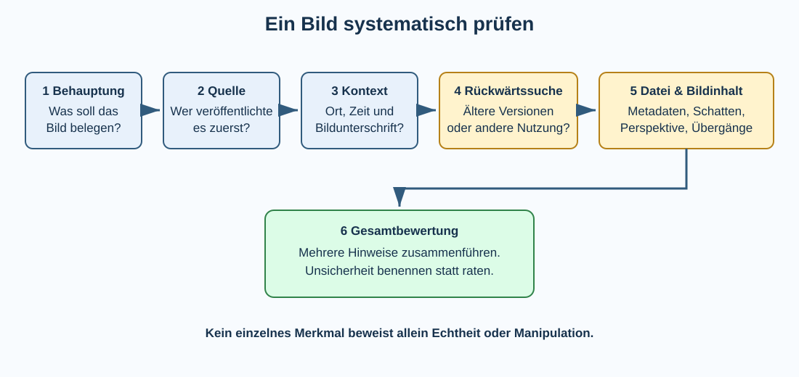

# 6 Computergrafik, Manipulation und Authentizität

## Warum muss man digitale Bilder verstehen?

Digitale Bilder sind nicht einfach ein unveränderliches Abbild der Wirklichkeit. Schon beim Aufnehmen entscheidet die Kamera über Belichtung, Schärfung, Rauschunterdrückung und Farbdarstellung. Danach kann ein Bild zugeschnitten, korrigiert, montiert oder vollständig künstlich erzeugt werden.

Das ist zunächst nichts Ungewöhnliches: Bildbearbeitung wird in Fotografie, Design, Werbung, Wissenschaft und Medien täglich eingesetzt. Problematisch wird sie vor allem dann, wenn durch Bearbeitung oder falschen Kontext ein Eindruck entsteht, der als unveränderte Wirklichkeit ausgegeben wird.

Um Bilder beurteilen zu können, braucht man deshalb zwei Arten von Wissen:

1. **technisches Wissen:** Wie sind digitale Bilder aufgebaut und wie können sie verändert werden?
2. **Medienkompetenz:** Woher stammt ein Bild, in welchem Zusammenhang steht es und welche Behauptung soll es stützen?

> **Merke:** Ein Bild kann technisch unverändert und trotzdem irreführend sein. Umgekehrt ist ein bearbeitetes Bild nicht automatisch eine Täuschung.

## Rastergrafik und Vektorgrafik

Aus Klasse 8 ist bekannt, dass Computergrafiken unterschiedlich dargestellt werden können.

Eine **Rastergrafik** besteht aus einzelnen Bildpunkten, den **Pixeln**. Fotografien sind typische Rasterbilder. Beim starken Vergrößern werden die einzelnen Pixel sichtbar.

Eine **Vektorgrafik** beschreibt dagegen geometrische Formen, Linien, Kurven und Flächen mathematisch. Logos, Symbole und technische Zeichnungen lassen sich dadurch häufig ohne sichtbare Pixelbildung skalieren.

Für die Untersuchung fotografischer Manipulationen sind vor allem Rastergrafiken wichtig, weil Fotos üblicherweise als Pixelbilder verarbeitet werden.

→ Vorwissen: Nachschlagewerk Klasse 8, **Computergrafik**.

## Pixel, Auflösung und Bildgröße

Ein Pixel besitzt einen Farbwert. Die Anzahl der Pixel wird häufig als **Auflösung** angegeben, beispielsweise:

```text
4000 × 3000 Pixel
```

Das sind insgesamt 12 Millionen Pixel, also ungefähr 12 Megapixel.

Die Pixelzahl darf nicht mit der Dateigröße verwechselt werden. Die Dateigröße hängt zusätzlich unter anderem von Farbmodell, Farbtiefe, Dateiformat, Kompression und Bildinhalt ab.

Wird ein kleines Rasterbild stark vergrößert, müssen fehlende Bildinformationen berechnet beziehungsweise interpoliert werden. Dadurch entstehen nicht automatisch echte neue Details.

## Farbmodelle und Farbkanäle

Digitale Bilder verwenden häufig das **RGB-Farbmodell**. Ein Pixel wird dabei durch Anteile von Rot, Grün und Blau beschrieben. Bildbearbeitungsprogramme können die Kanäle gemeinsam oder einzeln verändern.

Weitere Modelle sind beispielsweise **CMYK** für viele Druckanwendungen oder Farbmodelle wie HSV/HSL, die Farbe über Farbton, Sättigung und Helligkeit beschreiben.

Die Wahl des Farbmodells beeinflusst, wie Farben gespeichert, dargestellt und bearbeitet werden.

## Dateiformate und Kompression

Nicht jedes Bildformat speichert Bilder auf dieselbe Weise.

| Format | typische Eigenschaft | häufige Verwendung |
|---|---|---|
| JPEG/JPG | verlustbehaftete Kompression | Fotografien |
| PNG | verlustfreie Kompression, Transparenz möglich | Grafiken, Screenshots |
| GIF | begrenzte Farbpalette, einfache Animationen | kleine Webanimationen |
| WebP | moderne Kompression, je nach Variante verlustbehaftet oder verlustfrei | Webgrafiken/Fotos |
| SVG | Vektorgrafik auf Basis beschriebener Formen/Pfade | Logos, Diagramme, Symbole |
| RAW | weitgehend unverarbeitete Kameradaten, herstellerspezifische Varianten | professionelle Bildentwicklung |

### Verlustbehaftete Kompression

Bei verlustbehafteter Kompression werden Informationen so reduziert, dass die Datei kleiner wird. Bei starker JPEG-Kompression können sichtbare **Kompressionsartefakte** entstehen.

Solche Artefakte sind wichtig für die Bildanalyse: Ein ungewöhnlicher Bereich kann durch Bearbeitung entstanden sein, aber ebenso durch erneutes Speichern, Skalieren oder die Verarbeitung einer Plattform. Ein einzelnes Artefakt ist daher kein Manipulationsbeweis.

## Bildbearbeitung gehört zum normalen Arbeitsprozess

Typische Bearbeitungen sind:

- Zuschneiden und Drehen,
- Helligkeit und Kontrast verändern,
- Weißabgleich und Farben korrigieren,
- Schärfen oder Rauschen reduzieren,
- Retuschieren,
- Objekte entfernen oder hinzufügen,
- mehrere Aufnahmen zu einer Montage kombinieren,
- Hintergründe austauschen,
- Bildbereiche generativ ergänzen,
- ein Bild vollständig mit einem generativen Modell erzeugen.

Ob eine Bearbeitung problematisch ist, hängt von **Zweck und Aussage** ab. Bei einem Werbeplakat ist eine Montage erwartbar. Bei einem angeblichen dokumentarischen Beweis kann dieselbe Veränderung entscheidend sein.

## Ebenen und Masken

Bildbearbeitungsprogramme arbeiten häufig mit **Ebenen**. Man kann sie sich wie transparente Folien vorstellen, die übereinanderliegen. Text, Hintergrund und einzelne Bildelemente können auf getrennten Ebenen bearbeitet werden.

Eine **Maske** legt fest, welche Bereiche einer Ebene sichtbar oder von einer Bearbeitung betroffen sind. Dadurch lassen sich Änderungen gezielt auf bestimmte Bildbereiche beschränken, ohne andere Bereiche direkt zu verändern.

Ebenen und Masken ermöglichen **nichtdestruktives Arbeiten**: Der ursprüngliche Bildinhalt muss nicht bei jedem Bearbeitungsschritt dauerhaft überschrieben werden.

## Auswahl, Retusche, Klonen und Montage

Bei der **Retusche** werden bestimmte Bildbereiche gezielt verändert. Werkzeuge können beispielsweise Hautunreinheiten entfernen, störende Gegenstände beseitigen oder Bildbereiche ausbessern.

Beim **Klonen** werden Pixel aus einem Bereich in einen anderen kopiert. Dadurch kann beispielsweise ein Objekt mit einem Stück Hintergrund überdeckt werden.

Eine **Bildmontage** kombiniert Elemente aus mehreren Bildern. Damit eine Montage glaubwürdig wirkt, müssen unter anderem Perspektive, Größenverhältnisse, Licht, Schatten, Farbe, Schärfe und Bildrauschen zusammenpassen.

## Der Bildausschnitt verändert die Aussage

Manipulation benötigt nicht zwingend Bildbearbeitungssoftware. Schon **Cropping**, also das Zuschneiden eines Fotos, kann den Eindruck verändern.

Ein Foto einer kleinen Personengruppe kann beispielsweise durch engen Ausschnitt wie eine große Menschenmenge wirken. Ein weiter Ausschnitt könnte zeigen, dass daneben fast niemand steht.

Ebenso kann eine korrekte Aufnahme mit einer falschen Bildunterschrift versehen werden:

```text
echtes Foto + falscher Ort = irreführende Aussage

echtes Foto + falsches Datum = irreführende Aussage

echtes Foto + falsche Beschreibung = irreführende Aussage
```

> **Merke:** Bei der Prüfung eines Bildes muss nicht nur gefragt werden, **ob die Pixel verändert wurden**, sondern auch, **ob Kontext und Behauptung stimmen**.

## Generative Bildbearbeitung und KI-Bilder

Generative Modelle können heute Bilder aus Textbeschreibungen erzeugen und vorhandene Bilder verändern. Dazu gehören beispielsweise:

- vollständige Erzeugung eines Bildes,
- Ersetzen oder Entfernen von Objekten,
- Erweitern eines Bildes über seine ursprünglichen Grenzen hinaus,
- Ändern von Hintergrund, Kleidung oder Umgebung,
- Erzeugen realistischer Personen, die nicht existieren.

Früher verbreitete Hinweise wie ungewöhnliche Hände, fehlerhafte Schrift oder unlogische Spiegelungen können manchmal auffallen. Sie sind aber **kein zuverlässiges Erkennungsverfahren**. Generative Systeme werden besser, und auch echte Fotos können ungewöhnliche Details enthalten.

Deshalb sollte die Prüfung nicht mit „Sieht das nach KI aus?“ beginnen, sondern mit **Quelle, Kontext und überprüfbaren Informationen**.

## Deepfakes und synthetische Medien

Als **Deepfake** werden häufig mit KI-Verfahren erzeugte oder stark veränderte Medien bezeichnet, bei denen beispielsweise Gesicht, Stimme oder Bewegung einer Person synthetisch nachgebildet werden.

Der Begriff wird besonders bei täuschend wirkenden Bild-, Video- und Audioinhalten verwendet. Nicht jede KI-Bearbeitung ist automatisch ein Deepfake, und nicht jede klassische Fotomontage verwendet KI.

Mögliche Folgen sind beispielsweise Täuschung, Rufschädigung, Betrug oder die falsche Zuschreibung von Aussagen und Handlungen.

## Authentizität, Integrität und Herkunft

Bei digitalen Medien helfen drei unterschiedliche Fragen:

- **Authentizität:** Ist das Medium wirklich das, was es zu sein behauptet?
- **Integrität:** Wurde der Inhalt seit einem bestimmten Zeitpunkt verändert?
- **Provenienz/Herkunft:** Woher stammt das Medium und welche Bearbeitungsschritte sind nachvollziehbar?

Diese Begriffe dürfen nicht gleichgesetzt werden. Eine Datei kann unverändert übertragen worden sein und trotzdem ursprünglich eine künstlich erzeugte Darstellung enthalten.

## Ein Bild systematisch prüfen



### 1. Behauptung klären

Zuerst sollte klar sein, was das Bild angeblich zeigt und was damit bewiesen werden soll.

### 2. Quelle suchen

Wichtige Fragen sind:

- Wer veröffentlichte das Bild?
- Ist diese Person oder Organisation die ursprüngliche Quelle?
- Gibt es eine Originalveröffentlichung?
- Wird eine nachvollziehbare Urheberschaft genannt?

Ein Screenshot eines Social-Media-Beitrags ist beispielsweise noch keine zuverlässige Originalquelle.

### 3. Kontext prüfen

Zu prüfen sind insbesondere:

- Datum,
- Ort,
- dargestellte Personen oder Gegenstände,
- Bildunterschrift,
- Zusammenhang der Veröffentlichung.

### 4. Rückwärtssuche verwenden

Eine **Bildrückwärtssuche** kann ältere Veröffentlichungen oder ähnliche Versionen eines Bildes finden. Dadurch lässt sich beispielsweise entdecken, dass ein angeblich aktuelles Katastrophenfoto schon Jahre früher in einem anderen Zusammenhang veröffentlicht wurde.

Eine Rückwärtssuche ist ein Hilfsmittel, kein automatischer Wahrheitsbeweis.

### 5. Datei und Bildinhalt untersuchen

Erst danach können technische Hinweise betrachtet werden. Dazu gehören Metadaten und sichtbare Auffälligkeiten.

### 6. Hinweise zusammenführen

Ein einzelner Hinweis reicht selten für ein sicheres Urteil. Gute Prüfung verbindet mehrere unabhängige Informationen und benennt verbleibende Unsicherheit.

## Metadaten und EXIF

Bilddateien können **Metadaten** enthalten. Bei Fotos werden bestimmte Angaben häufig als **EXIF-Daten** gespeichert. Je nach Gerät und Einstellung können dazu gehören:

- Aufnahmezeit,
- Kameramodell,
- Belichtungsdaten,
- Brennweite,
- Bildorientierung,
- teilweise GPS-Koordinaten.

Metadaten können nützlich sein, sind aber kein Echtheitsbeweis. Sie lassen sich verändern, entfernen oder beim Hochladen durch Plattformen löschen.

### Metadaten als Datenschutzproblem

Metadaten können auch Informationen preisgeben, die im sichtbaren Bild nicht offensichtlich sind. Enthält ein privates Foto beispielsweise GPS-Koordinaten, kann daraus der Aufnahmeort hervorgehen.

Deshalb sollte vor dem Veröffentlichen sensibler Bilder geprüft werden, welche Metadaten enthalten sind beziehungsweise wie die verwendete Plattform damit umgeht.

## Sichtbare Hinweise auf Bearbeitung

Bei Montagen können manchmal Unstimmigkeiten auffallen:

- Licht kommt scheinbar aus unterschiedlichen Richtungen,
- Schatten passen nicht zur Beleuchtung,
- Perspektiven oder Größenverhältnisse widersprechen sich,
- Kanten wirken ungewöhnlich scharf oder weich,
- Bildrauschen unterscheidet sich zwischen Bereichen,
- Spiegelungen passen nicht zum dargestellten Objekt,
- sich wiederholende Strukturen können auf Kopieren/Klonen hindeuten.

Diese Merkmale sind **Hinweise, keine Beweise**. Kompression, HDR-Verarbeitung, Smartphone-Bildoptimierung, Unschärfe oder mehrfache Speicherung können ebenfalls ungewöhnliche Bildbereiche erzeugen.

## Fehlerstufenanalyse und andere forensische Verfahren

Im Internet werden Werkzeuge angeboten, die beispielsweise Kompressionsunterschiede oder andere statistische Eigenschaften eines Bildes sichtbar machen. Ein bekanntes Prinzip ist die **Error Level Analysis (ELA)**.

Solche Verfahren müssen vorsichtig interpretiert werden. Unterschiedliche Kompressionsstufen können viele Ursachen besitzen. Ohne Kenntnis von Dateiformat, Bearbeitungsgeschichte und Kompression kann eine auffällige Darstellung leicht falsch gedeutet werden.

Für die schulische Prüfung gilt deshalb:

> **Merke:** Bildforensische Werkzeuge liefern Hinweise. Sie ersetzen weder Quellenprüfung noch fachkundige Analyse.

## Hashwerte: Ist eine Datei unverändert?

Ein **kryptografischer Hashwert** ist ein kurzer digitaler Prüfwert, der aus den Daten einer Datei berechnet wird. Bereits eine kleine Änderung der Datei führt bei geeigneten Hashfunktionen mit sehr hoher Wahrscheinlichkeit zu einem anderen Hashwert.

Wenn zu einem vertrauenswürdigen Zeitpunkt ein Hashwert einer Originaldatei festgehalten wurde, kann später geprüft werden, ob die Datei bitgenau unverändert geblieben ist.

Ein Hashwert beantwortet jedoch nicht die Frage, ob das ursprüngliche Bild die Wirklichkeit korrekt zeigt. Auch ein künstlich erzeugtes Bild besitzt einen Hashwert.

## Digitale Signaturen und Herkunftsnachweise

Mit **digitalen Signaturen** kann kryptografisch geprüft werden, ob bestimmte Daten von einem Besitzer des zugehörigen privaten Schlüssels signiert wurden und seitdem unverändert sind.

Für digitale Medien existieren außerdem Ansätze, Herkunfts- und Bearbeitungsinformationen nachvollziehbar mit einem Medium zu verbinden. Solche **Provenienzangaben** können bei der Beurteilung helfen.

Aber auch hier gilt: Ein technischer Herkunftsnachweis kann Aussagen über Quelle und Bearbeitung unterstützen; er beweist nicht automatisch, dass die dargestellte Behauptung inhaltlich wahr ist.

## Wasserzeichen

Ein **Wasserzeichen** kann sichtbar oder unsichtbar in ein Bild eingebracht werden. Sichtbare Wasserzeichen kennzeichnen beispielsweise Urheber oder Anbieter. Unsichtbare Verfahren können zusätzliche Informationen in Bilddaten einbetten.

Wasserzeichen können Hinweise auf Herkunft geben, sind aber je nach Verfahren entfernbar, veränderbar oder nach starker Bearbeitung nicht mehr zuverlässig nachweisbar. Sie sind deshalb kein universeller Echtheitsbeweis.

## Screenshots sind besondere Fälle

Ein Screenshot zeigt, was zu einem bestimmten Zeitpunkt auf einem Bildschirm dargestellt wurde – oder zumindest so dargestellt werden sollte. Screenshots lassen sich jedoch leicht zuschneiden oder bearbeiten. Außerdem fehlen häufig ursprüngliche Metadaten und der vollständige Kontext.

Ein Screenshot von einer Nachricht beweist deshalb allein nicht sicher, dass die angebliche Person diese Nachricht tatsächlich versendet hat.

## Warum Bilder besonders überzeugend wirken

Bilder werden schnell wahrgenommen und können starke Emotionen auslösen. Ein eindrucksvolles Bild kann deshalb eine Behauptung überzeugend erscheinen lassen, bevor ihre Quelle geprüft wurde.

Das wird problematisch, wenn ein Bild gezielt ausgewählt, bearbeitet oder falsch eingeordnet wird, um Aufmerksamkeit, Empörung oder Zustimmung zu erzeugen.

## Manipulation ist nicht immer technisch

Ein besonders wichtiger Unterschied ist:

| technische Veränderung | inhaltliche/kontextuelle Irreführung |
|---|---|
| Objekt aus Foto entfernt | echtes Foto mit falschem Datum |
| zwei Fotos montiert | irreführender Bildausschnitt |
| Gesicht verändert | falsche Bildunterschrift |
| KI-generierter Hintergrund | echte Aufnahme einem anderen Ereignis zugeordnet |

Für Medienkompetenz müssen beide Seiten betrachtet werden.

## Umgang mit unsicheren Bildern

Wenn die Herkunft eines Bildes nicht zuverlässig geklärt werden kann, ist „Ich weiß es nicht“ eine fachlich sinnvolle Aussage. Fehlende Sicherheit sollte nicht durch Vermutungen ersetzt werden.

Vor dem Weiterverbreiten eines möglicherweise irreführenden Bildes sollte deshalb geprüft werden, ob die Behauptung durch zuverlässige Quellen bestätigt wird.

## Rechte an Bildern

Technische Bearbeitbarkeit bedeutet nicht, dass Bilder beliebig verwendet werden dürfen. Bei Bildern können unter anderem **Urheberrechte**, Nutzungsrechte und **Persönlichkeitsrechte** betroffen sein.

Ein technisch leicht kopierbares Bild ist deshalb nicht automatisch frei verwendbar. Auch bei KI-Bearbeitungen oder Montagen können Rechte realer Personen und Rechte an Ausgangsmaterial relevant sein.

Die genaue rechtliche Bewertung hängt vom Einzelfall ab; für das Nachschlagewerk ist vor allem die Grundregel wichtig:

> **Merke:** „Ich kann die Datei technisch bearbeiten oder kopieren“ bedeutet nicht automatisch „Ich darf sie beliebig verwenden oder veröffentlichen“.

## Begriffe zum Nachschlagen

**Authentizität:** Echtheit beziehungsweise Übereinstimmung mit der behaupteten Herkunft und Identität.

**Bildmontage:** Zusammenfügen von Elementen aus mehreren Bildern zu einer neuen Darstellung.

**Deepfake:** synthetisch erzeugtes oder stark verändertes Medium, häufig mit künstlich nachgebildeten Personen, Stimmen oder Bewegungen.

**Digitale Signatur:** kryptografisches Verfahren, mit dem Herkunft und Unverändertheit bestimmter Daten überprüft werden können.

**EXIF:** verbreitete Metadatenstruktur in Bilddateien, die beispielsweise Aufnahme- und Kamerainformationen enthalten kann.

**Hashwert:** aus Daten berechneter Prüfwert, mit dem unter anderem Veränderungen einer Datei erkannt werden können.

**Integrität:** Eigenschaft, dass Daten gegenüber einem betrachteten Ausgangszustand nicht unbemerkt verändert wurden.

**Kompressionsartefakt:** sichtbare oder messbare Veränderung, die durch Datenkompression entstehen kann.

**Maske:** Festlegung, welche Bereiche einer Ebene sichtbar oder von einer Bearbeitung betroffen sind.

**Metadaten:** zusätzliche beschreibende Informationen zu einer Datei.

**Nichtdestruktive Bearbeitung:** Arbeitsweise, bei der ursprüngliche Bildinformationen möglichst erhalten bleiben und Bearbeitungsschritte reversibel bleiben.

**Pixel:** einzelner Bildpunkt einer Rastergrafik.

**Provenienz:** nachvollziehbare Herkunft und Entstehungs- beziehungsweise Bearbeitungsgeschichte eines Mediums.

**Rastergrafik:** Bilddarstellung aus einzelnen Pixeln.

**Retusche:** gezielte Veränderung einzelner Bildbereiche.

**Rückwärtssuche:** Suche nach vorhandenen Veröffentlichungen anhand eines Bildes.

**Vektorgrafik:** Grafik, die geometrische Formen, Linien und Kurven mathematisch beschreibt.

**Wasserzeichen:** sichtbare oder unsichtbare Kennzeichnung, die Informationen in oder auf einem Medium trägt.

→ Vorwissen: Nachschlagewerk Klasse 8, **Computergrafik**.  
→ Siehe auch Klasse 9, **Mobile Endgeräte, Daten und Rechte** sowie **Algorithmische Projekte**.
